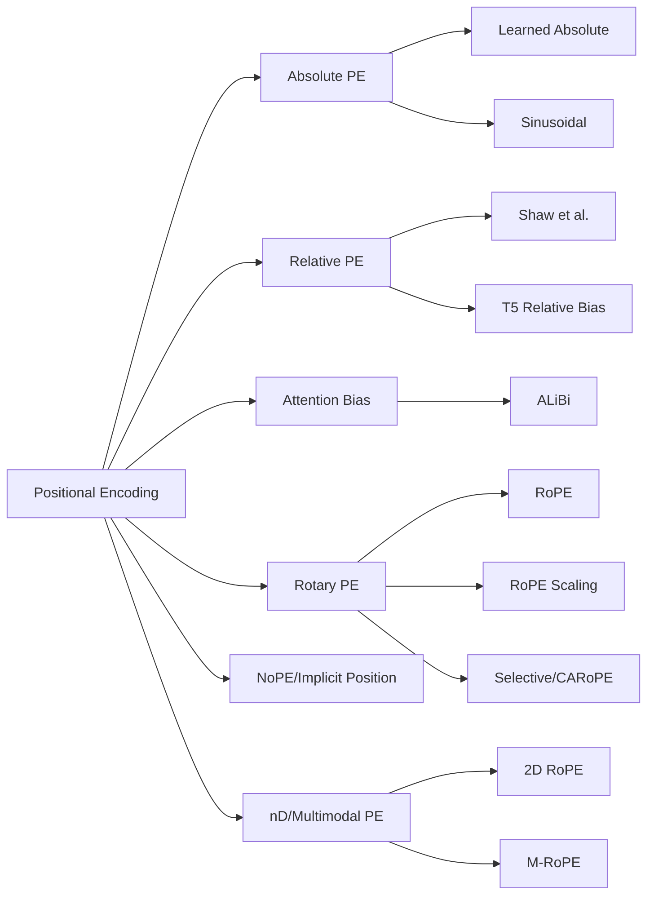

# Positional Encoding - 생태계/비교

> [[01-overview|이전: 개요]] | [[README|목차로 돌아가기]] | [[03-references|다음: 참고자료]]

---

## 1. 큰 분류



Positional encoding은 “어디에 주입하느냐”로 보면 이해하기 쉽다.

| 주입 위치 | 대표 방식 | 직관 |
|-----------|-----------|------|
| Input embedding | learned absolute PE, sinusoidal PE | token embedding에 position vector를 더한다. |
| Attention score | relative bias, ALiBi | `QK^T` score에 거리 bias를 더한다. |
| Q/K vector | RoPE | dot product 전에 `Q`, `K`를 위치별로 회전한다. |
| Architecture/caching | NoPE, sliding window, causal mask | 명시 PE를 줄이고 구조적 bias에 맡긴다. |
| Coordinate axes | 2D/nD RoPE, M-RoPE | x/y/t 같은 축별 position을 따로 encode한다. |

---

## 2. 방식별 비교

| 방식 | 주입 위치 | 장점 | 약점 | 현재 용도 |
|---|---|---|---|---|
| Learned absolute PE | input embedding | 단순, 학습 가능 | train length 밖 extrapolation 약함 | BERT/ViT 초기 계열 |
| Sinusoidal PE | input embedding | deterministic, smooth, shift 구조 | additive mixing, 현대 LLM에서는 덜 선호 | 교육/기초 구현 |
| Relative Position Encoding | attention score/value | 상대 거리 직접 모델링 | 구현 복잡도, memory cost | T5류, encoder/seq2seq |
| ALiBi | attention score bias | 매우 단순, length extrapolation 강함 | position 표현력이 제한적 | long-context baseline |
| RoPE | Q/K rotation | relative position, norm 보존, LLM 표준 | very long context에서 aliasing/precision 문제 | LLaMA, Mistral, Qwen 등 |
| Position Interpolation | RoPE index scaling | pretrained RoPE LLM context 확장 | fine-tuning 필요, scaling tradeoff | LLaMA context extension |
| YaRN | RoPE scaling | token/step 효율적 context 확장 | hyperparameter/implementation 주의 | open LLM long context |
| LongRoPE | non-uniform RoPE interpolation | 2M token급 확장 보고 | 복잡, 실제 useful context는 별도 검증 필요 | long-context 연구 |
| NoPE | 명시 PE 제거 | causal mask/window가 implicit position 제공 가능 | 일반적 안정성/성능은 과제 | 연구적 대안 |
| nD RoPE / M-RoPE | x/y/t축별 rotation | image/video/multimodal 좌표 보존 | 축 분할/방향성 설계 필요 | VLM, ViT, video LLM |

---

## 3. 선택 기준

| 상황 | 추천 후보 | 이유 |
|------|-----------|------|
| Transformer를 처음 구현하며 개념 학습 | Sinusoidal PE | 공식이 명확하고 시각화가 쉽다. |
| encoder/seq2seq에서 거리 bias가 중요 | Relative Position Encoding | absolute index보다 relative distance를 직접 다룬다. |
| decoder-only LLM 기본값 | RoPE | 현대 LLM 구현과 호환성이 높다. |
| 간단한 long-context extrapolation baseline | ALiBi | embedding table 없이 attention bias만 추가한다. |
| pretrained RoPE LLM context 확장 | Position Interpolation, YaRN, LongRoPE | 기존 weight를 유지하면서 position index/frequency를 조정한다. |
| image/video/multimodal coordinate 처리 | 2D/nD RoPE, M-RoPE | 축별 상대 위치를 유지할 수 있다. |
| RoPE의 long-context 한계 연구 | CARoPE, Selective RoPE, 2026 theory papers | static frequency와 fixed rotation의 한계를 다룬다. |

---

## 4. RoPE scaling 계열

### Position Interpolation

`Position Interpolation(PI)`은 긴 position index를 원래 학습한 범위 안으로 down-scale한다.

```text
position' = position * train_context / target_context
```

- LLaMA 계열 RoPE LLM을 32K context까지 확장하는 접근으로 제안됐다.
- 직접 extrapolation보다 attention score 폭주 위험을 줄인다.
- 보통 짧은 fine-tuning이 필요하다.

### YaRN

`YaRN(Yet another RoPE extensioN method)`은 RoPE extension을 더 token-efficient하고 step-efficient하게 만드는 방법이다.

- 기존 방식보다 적은 token과 training step으로 context extension을 목표로 한다.
- LLaMA 계열 open model의 64K/128K context extension 문맥에서 자주 언급된다.
- frequency scaling, temperature-like adjustment, implementation detail이 중요하다.

### LongRoPE

`LongRoPE`는 non-uniform interpolation과 progressive extension으로 2M token context window를 보고했다.

- dimension별/position별 non-uniformity를 활용한다.
- 먼저 중간 길이로 확장한 뒤 더 긴 길이로 progressive하게 확장한다.
- “context window가 길다”와 “모델이 모든 token을 유용하게 사용한다”는 별개라 평가가 중요하다.

---

## 5. 2025-2026 연구 쟁점

| 연구 방향 | 핵심 질문 | 의미 |
|-----------|-----------|------|
| CARoPE | static frequency 대신 context-dependent frequency를 만들 수 있는가? | RoPE를 token/context-aware하게 일반화 |
| Selective RoPE | input-dependent rotation으로 RoPE를 확장할 수 있는가? | softmax/linear transformer 모두에서 position selectivity 탐색 |
| Phase modulation theory | RoPE base의 lower/upper bound를 분석할 수 있는가? | aliasing, DC stability, floating-point precision 한계 |
| Long-context impossibility/limit | 긴 context에서 RoPE가 position/token을 계속 구분하는가? | locality bias 붕괴와 base tradeoff를 이론화 |

요약하면, RoPE는 현재 표준에 가깝지만 “무한 context의 완성형”은 아니다. 긴 context 모델에서는 architecture, data, training recipe, evaluation이 RoPE scaling만큼 중요하다.

---

## 6. 함께 봐야 할 구현 요소

| 구현 요소 | 설명 |
|-----------|------|
| `position_ids` | 각 token의 logical position. packing, KV cache, sliding window에서 중요하다. |
| `inv_freq` | RoPE dimension별 inverse frequency. base와 scaling이 여기에 반영된다. |
| `cos/sin cache` | position별 cos/sin 값을 미리 계산해 재사용한다. |
| `rotate_half` | feature pair를 `[-x2, x1]` 형태로 바꿔 rotation을 효율적으로 구현한다. |
| KV cache | decode 시 과거 K/V의 position과 새 token position이 일관되어야 한다. |
| Attention backend | FlashAttention, paged attention 등과 RoPE 적용 위치가 맞아야 한다. |

---

## 관련 노트

- [[study/tech/ai/ai-ecosystem]] - LLM architecture와 model family 비교의 배경
- [[study/tech/ai/litellm]] - long-context model routing과 비용/성능 tradeoff
- [[study/tech/ai/model-context-protocol-mcp]] - 긴 context에 모두 넣을지, tool/resource로 분리할지 비교

---

## 다음 단계

> [!tip] 다음으로
> [[03-references|참고자료]]에서 원문과 RoFormer/ALiBi/Position Interpolation/YaRN/LongRoPE 논문을 순서대로 확인한다.
