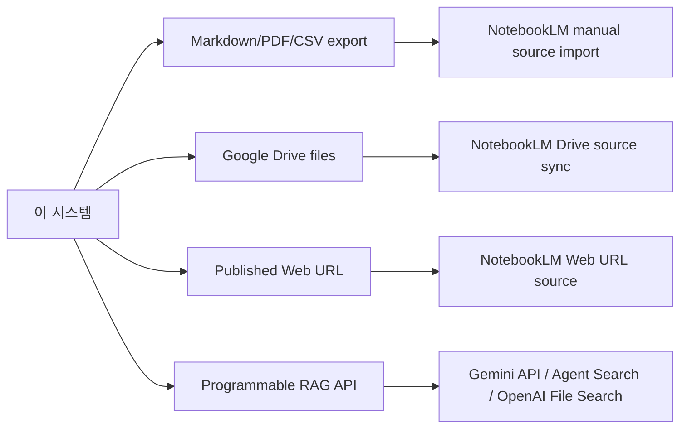

# NotebookLM 연동 가능성 - 생태계/비교

> [[01-overview|이전: 개요]] | [[README|목차로 돌아가기]] | [[03-references|다음: 참고자료]]

---

## 1. 선택지 맵



NotebookLM은 **사람이 쓰는 research workspace**에 강하고, Gemini API나 OpenAI File Search는 **애플리케이션에 넣는 backend API**에 강하다.

## 2. 경쟁/대안 비교

| 선택지 | 직접 API | NotebookLM 유사성 | 강점 | 한계/주의 |
|---|---:|---|---|---|
| NotebookLM | 낮음/공식 공개 API 미확인 | 원본 | UI 기반 research, citations, Audio/Video Overview, Drive sync | 완전 자동화 어려움, browser automation은 약관/안정성 리스크 |
| NotebookLM + Google Drive | 중간 | 원본 유지 | 시스템이 Docs/PDF/Markdown/CSV를 Drive에 쓰고 NotebookLM이 sync | 최초 notebook/source 연결은 수동 또는 비공식 자동화 필요 |
| Gemini API | 높음 | 일부 대체 | PDF/document understanding, Files API, structured outputs, agents/tools | NotebookLM Studio artifacts는 없음 |
| Google Cloud Agent Search | 높음 | Enterprise RAG 대체 | Discovery Engine API, data stores, semantic search, generated answers, access control | 구축 비용/Cloud 설계 필요 |
| OpenAI File Search | 높음 | RAG 대체 | Responses API + vector stores + citations, 개발자 친화 | NotebookLM의 podcast/study UI와 다름 |
| Claude Projects | 낮음~중간 | UI형 knowledge workspace | Projects, knowledge base, paid RAG, team sharing | API형 project 지식베이스 자동화는 제한적 |

## 3. 선택 기준

| 요구사항 | 권장 선택지 | 이유 |
|------|------|------|
| 사용자가 NotebookLM UI에서 탐색하고 요약/Audio Overview를 만들면 됨 | NotebookLM 느슨한 연동 | NotebookLM의 고유 UX를 그대로 사용 |
| 시스템 산출물이 매일 바뀌고 사용자가 NotebookLM에서 최신 자료를 보고 싶음 | NotebookLM + Google Drive | Drive source sync가 가장 공식적인 semi-automation 경로 |
| 앱에서 질문/답변/citation을 자동으로 처리해야 함 | Gemini API 또는 OpenAI File Search | 공개 API와 backend control 가능 |
| 조직 문서 검색, 권한, audit, enterprise access control이 중요함 | Google Cloud Agent Search | enterprise RAG 인프라와 IAM 통합 |
| 빠른 팀 지식공유와 onboarding이 목표 | NotebookLM shared notebook 또는 Claude Projects | UI형 knowledge workspace가 빠름 |

## 4. 연동 아키텍처 패턴

### Pattern A: Export-and-import

```text
System
  -> report.md / report.pdf / data.csv
  -> User uploads to NotebookLM
  -> NotebookLM generates answers and artifacts
```

장점:

- 구현이 단순하다.
- NotebookLM source type을 그대로 활용한다.
- 보안 검토가 비교적 쉽다.

한계:

- 매번 수동 업로드가 필요할 수 있다.
- 시스템이 NotebookLM 결과를 자동 회수하지 못한다.

### Pattern B: Drive-backed source

```text
System
  -> Google Drive API
      -> Google Docs/PDF/CSV update
          -> NotebookLM Drive source auto-sync
```

장점:

- 운영 자동화와 NotebookLM UX 사이의 균형이 좋다.
- 원본 문서를 Drive에서 관리할 수 있다.
- 최초 연결 후 source 갱신 부담이 줄어든다.

한계:

- NotebookLM notebook/source 생성 자체는 공식 API로 제어하기 어렵다.
- sync delay와 계정 권한 모델을 고려해야 한다.

### Pattern C: Programmable RAG replacement

```text
User app
  -> Upload documents
  -> RAG backend: Gemini API / Agent Search / OpenAI File Search
  -> Answer with citations
```

장점:

- 제품 기능으로 내장 가능하다.
- API, logging, evaluation, permission, observability를 설계할 수 있다.
- CI/CD와 automated test가 가능하다.

한계:

- NotebookLM의 Audio/Video Overview, study artifacts UX는 직접 재현해야 한다.
- retrieval quality, chunking, citation policy를 직접 관리해야 한다.

## 5. 이 시스템에 대한 권장안

| 단계 | 권장 | 산출물 |
|------|------|------|
| MVP | Markdown/PDF/CSV를 Drive에 저장하고 NotebookLM에서 Drive source로 import | `research-report.md`, `summary.pdf`, `data.csv` |
| 검증 | Drive sync, Web URL import, source limit, citation 품질 확인 | 테스트 notebook, sync 기록 |
| 자동화 필요 시 | Gemini API 또는 OpenAI File Search로 PoC | API 응답, citations, 평가 샘플 |
| 운영 | 개인/Workspace/Enterprise 계정별 privacy와 access control 확인 | 보안 체크리스트 |

## 관련 노트

- [[study/tech/ai/model-context-protocol-mcp]] - API/tool integration이 필요한 경우의 표준화 관점
- [[study/tech/ai/litellm]] - provider routing과 RAG backend 운영 관점
- [[study/tech/ai/ai-ecosystem]] - NotebookLM, Claude Projects, Gemini API 같은 AI 도구 분류

## 다음 단계

> [!tip] 다음으로
> [[03-references|참고자료]]에서 NotebookLM source limits, Drive sync, privacy 문서를 확인하고 [[04-learning/01-getting-started|시작하기]]에서 직접 sync를 검증한다.
