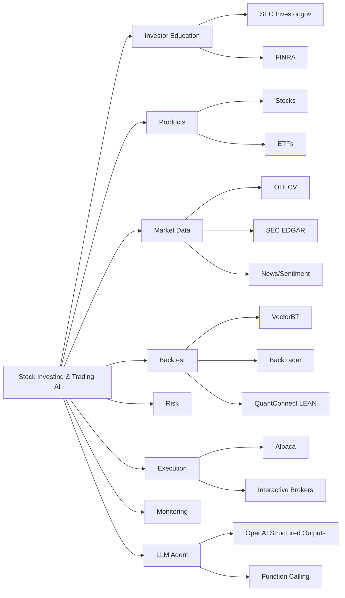

# 주식 투자와 자동화 AI - 생태계

> [[01-overview|이전: 개요]] | [[README|목차로 돌아가기]] | [[03-references|다음: 참고자료]]

---

## 1. 관련 기술 맵



---

## 2. 투자 학습/상품/도구 비교

| 영역 | 선택지 | 장점 | 단점 | 초보자 추천 |
|---|---|---|---|---|
| 투자 학습 | SEC Investor.gov, FINRA | 공식, 중립, 기초 설명이 좋음 | 실전 예제는 적음 | 가장 먼저 |
| 상품 | 개별 주식 | 기업 분석 학습에 좋음 | 단일 종목 리스크 큼 | 소액 관찰용 |
| 상품 | ETF | 분산이 쉽고 초보자 친화적 | 초과수익 욕심은 제한 | 핵심 추천 |
| 데이터 | SEC EDGAR | 무료 공식 공시 데이터 | 파싱 난도가 있음 | 재무제표 학습용 |
| 데이터/API | Alpaca Market Data API | market data와 paper/live trading 연계 | 지역, 요금, 데이터 범위 확인 필요 | 자동화 입문 |
| 백테스트 | VectorBT | 빠른 parameter search, pandas/NumPy 친화 | event-driven 현실성은 약할 수 있음 | 연구 초반 |
| 백테스트/운영 | QuantConnect LEAN | open-source, backtest/live 연결, event-driven | 학습량 큼 | 진지한 자동화 |
| Python 백테스트 | Backtrader | 전략 구조 이해가 쉬움 | 오래된 생태계 이슈가 있음 | 기초 실습 |
| AI/Agent | OpenAI function calling / Structured Outputs | 도구 호출, JSON schema 기반 자동화에 적합 | 투자 판단 검증은 별도 필요 | 보조 분석용 |
| 고급 연구 | FinRL-X, TradingGroup | AI-native quant architecture 참고 가능 | 논문 성능은 실거래 보장 아님 | 나중에 |

---

## 3. 선택 기준

### 초보자 학습 기준

| 목적 | 추천 선택 | 이유 |
|---|---|---|
| 주식 기초 배우기 | SEC Investor.gov, FINRA | 광고나 추천이 아니라 공식 설명에서 시작할 수 있다. |
| 분산 투자 이해 | ETF | 한 종목 리스크보다 전체 시장/섹터 흐름을 보기 좋다. |
| 가격 데이터 연습 | `SPY`, `QQQ`, 관심 기업 1개 | ETF와 개별 주식의 변동성 차이를 비교할 수 있다. |
| 첫 전략 실험 | 이동평균, 리밸런싱 | 규칙이 단순해서 오류를 찾기 쉽다. |
| 첫 자동화 | paper trading | 실제 돈 없이 주문 생성/취소/체결 로그를 검증한다. |

### 자동화 개발 기준

| 레이어 | 초보자 선택 | 진지한 운영 선택 |
|---|---|---|
| 데이터 저장 | CSV, Parquet | PostgreSQL/TimescaleDB, S3/Parquet |
| 백테스트 | VectorBT, Backtrader | QuantConnect LEAN, event-driven custom engine |
| 모델 | rule-based baseline | ML/DL/RL + risk overlay |
| LLM | 요약, 분류, JSON 검증 | tool calling agent + audit trail |
| 실행 | Alpaca paper trading | broker API + order validation + kill switch |
| 모니터링 | notebook/log file | dashboard, alerts, drift/data gap detection |

---

## 4. 데이터 생태계

### Market Data

- `OHLCV`: open, high, low, close, volume.
- `adjusted close`: split, dividend 같은 corporate action을 반영한 가격.
- `real-time quote`: 현재 bid/ask와 가격 정보.
- `trades`: 실제 체결 기록.

### Fundamental Data

- `SEC EDGAR`: 미국 상장사의 10-K, 10-Q, 8-K 같은 공식 공시를 검색할 수 있다.
- `financial statements`: 손익계산서, 재무상태표, 현금흐름표.
- `earnings calendar`: 실적 발표 일정.

### Alternative Data

- 뉴스 기사
- 애널리스트 리포트
- 소셜 sentiment
- 거시경제 지표

> [!warning]
> alternative data는 노이즈가 많고 편향될 수 있다. 초보자는 가격 데이터와 공식 공시부터 시작하는 편이 좋다.

---

## 5. Backtest 도구 비교

| 도구 | 성격 | 장점 | 주의점 |
|---|---|---|---|
| VectorBT | 벡터화된 빠른 실험 | 수많은 파라미터를 빠르게 비교 | 체결 현실성은 별도 점검 |
| Backtrader | Python 전략 프레임워크 | 전략 구조 학습에 좋음 | 최신 broker/API 연동은 확인 필요 |
| QuantConnect LEAN | event-driven algorithm engine | backtest와 live 연결, 운영 관점 학습 | 러닝커브 높음 |
| 직접 구현 | 학습용 | bias와 비용을 직접 이해 가능 | 실거래 수준으로 만들기 어려움 |

### event-driven backtest가 중요한 이유

```text
가격 데이터 도착 -> 전략 신호 생성 -> 주문 요청 -> 체결/미체결 처리 -> 포트폴리오 갱신
```

실제 시장은 "종가 기준으로 무조건 원하는 가격에 체결"되지 않는다. 따라서 live trading을 생각한다면 이벤트 기반으로 주문과 체결을 다루는 구조가 필요하다.

---

## 6. AI/Agent 생태계

LLM은 자동매매의 중심 판단자보다 `analysis assistant`와 `validation assistant`로 시작하는 것이 좋다.

| 기능 | 도구/방식 | 예시 |
|---|---|---|
| 공시 요약 | LLM summarization | 10-K의 risk factor 요약 |
| 뉴스 분류 | classification | 호재/악재/중립 라벨링 |
| 신호 형식 검증 | Structured Outputs | `{ticker, signal, confidence, rationale}` JSON 검증 |
| 도구 호출 | function calling | 가격 조회, 포트폴리오 조회, 주문 전 체크 |
| 운영 자동화 | Agent orchestration | 데이터 수집, 리포트 생성, 알림 |

관련 구현 노트:

- [[study/tech/ai/langchain-crewai/README]]
- [[study/tech/ai/codex/README]]
- [[study/tech/ai/litellm/README]]
- [[study/tech/ai/agent-orchestration/README]]

---

## 7. 트렌드와 주의점

- 2026년 AI trading 연구는 `data quality`, `look-ahead bias`, `survivorship bias`, `risk overlay`, `broker execution`을 핵심 문제로 다룬다.
- `FinRL-X`, `TradingGroup`, `BacktestBench` 같은 연구는 구조 참고용으로 좋지만, 논문 성능이 실거래 수익을 보장하지 않는다.
- live trading은 기술 문제가 아니라 운영 문제이기도 하다. 로그, 알림, 실패 복구, 규제 확인이 필요하다.
- 미국 시장에서는 FINRA/SEC 규칙과 broker별 margin/day-trading 정책을 계속 확인해야 한다.

---

## 다음 단계

> [!tip] 다음으로
> [[03-references|참고자료]]에서 공식 문서와 도구 문서를 확인하자.
