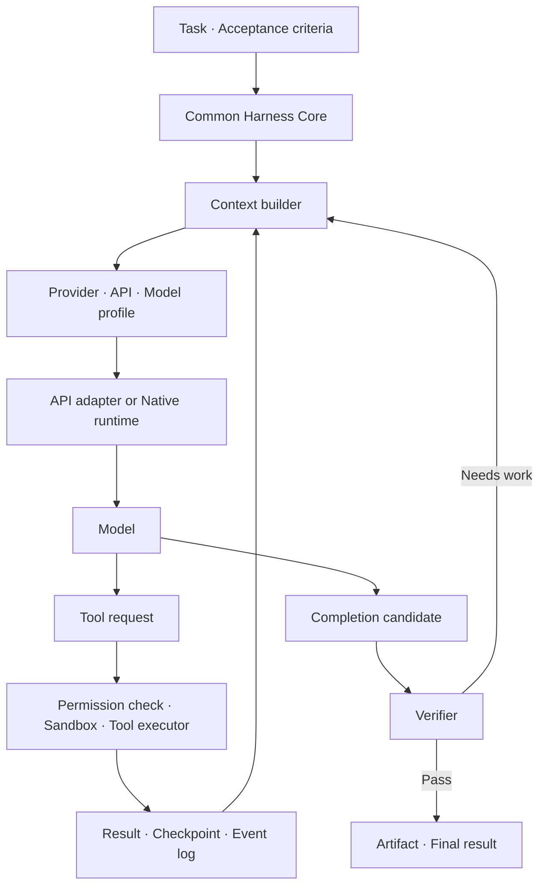

# Overview — What / Why / 특징

[학습 진입점](README.md) · 다음: [Ecosystem](02-ecosystem.md)

## What: Harness가 담당하는 것

Agent Harness는 prompt template이나 API wrapper를 넘어 **모델이 일을 끝낼 때까지 실행을 관리하는 계층**이다. 모델 호출, tool 실행, context 구성, 상태 저장, 중단·복구, 결과 검증을 연결한다. Deep Agents는 기본 tool-calling loop에 실행 기능을 더한 harness로 자신을 설명한다. [Overview](https://docs.langchain.com/oss/python/deepagents/overview)

- **Standardized Harness**: 목표·산출물·상태·권한·평가 계약을 공통으로 유지하는 설계 방향
- **Provider-adaptive Harness**: 공통 계약 안에서 모델별 행동과 API 요구사항을 반영하는 설계 방향
- 두 개의 경쟁 제품이나 공식 인증 규격이 아니다. 공통 코어와 적응 계층을 함께 사용할 수 있다.

## Why: 모델만 바꾸어서는 해결되지 않는 문제

모델이 충분히 좋아도 파일 일부를 전체로 오인하거나, context window가 바뀔 때 진행 사실을 잃거나, 테스트 전에 완료를 선언하면 작업은 실패한다. 반대로 오래된 모델을 위해 넣은 과도한 지시·reset이 새 모델의 실행을 방해할 수도 있다.

| 시점 | 공개된 변화 | 해석과 한계 |
|---|---|---|
| 2025-11-26 | Anthropic이 initializer, 진행 기록, Git history를 활용한 장기 실행 구조 소개 | 세션 밖에 작업 상태를 남기는 설계 사례 |
| 2026-02-17 | LangChain이 모델을 고정하고 Terminal-Bench 2.0 점수 **52.8% → 66.5%** 보고 | 해당 실험의 개선이며 범용 성공률이 아님 |
| 2026-03-24 | Anthropic이 모델 변경 후 기존 context reset을 제거한 사례 소개 | 모델 교체 시 workaround의 필요성도 재평가 |
| 2026-07-29 | Deep Agents v0.7이 **base input tokens 약 65% 감소** 보고 | 기본 prompt·tool 설명 등의 감소이며 전체 서비스 비용 절감률이 아님 |
| 2026-09-01 | HarnessDev가 harness 성능 이전의 모델 의존성 보고 | preprint의 실험 결과이며 보편 법칙으로 단정하지 않음 |

각 행의 원문은 아래 Sources에 날짜순으로 연결했다. 수치는 작성자 보고이며 이 노트에서 재현한 결과가 아니다.

## 특징: 공통 계약과 적응 계층

다음은 dossier와 공식 문서를 종합한 **설계 제안**이며 특정 제품의 공식 아키텍처가 아니다.

| 계층 | 공통화할 부분 | 적응시킬 부분 |
|---|---|---|
| Task contract | 목표·입력·산출물·acceptance criteria | 지시 표현 |
| Agent loop | 상태·취소·최대 시간·예산·종료 판정 | planning·verification 시점과 빈도 |
| Tool layer | 실제 동작·권한·결과 schema | 설명·노출 도구·native tool mapping |
| Context | 작업 사실·artifact 참조·checkpoint | truncation·compaction·cache 구성 |
| Model I/O | 공통 이벤트·오류 분류 | request format·streaming·reasoning 상태 |
| Evaluation | 동일 과제·채점기·기록 항목 | profile별 ablation·regression |

**표준화는 모든 모델에 동일한 JSON을 보내는 것이 아니다.** 공통 실행 계약을 유지하면서 각 API의 상태를 손실 없이 보존해야 한다. 공통 로그는 비교를 위한 것이며 원본 provider payload를 대체하지 않는다.

## 적응의 세 단계

다음 분류는 이 노트의 분석이며 공식 제품 단계가 아니다.

1. **Static adaptation**: 모델 선택 시 평가를 통과한 고정 profile을 적용한다.
2. **Runtime adaptation**: 남은 예산·실패 횟수 등을 보고 재시도나 검증 빈도를 조정한다.
3. **Offline optimization**: traces에서 실패 패턴을 찾아 후보 profile을 만들고 평가 후 채택한다.

처음에는 static profile 하나로 시작한다. runtime 정책도 권한·예산의 공통 한계를 넘어서는 안 된다. 모델이나 API 버전이 바뀌면 profile 추가뿐 아니라 기존 보정 제거도 실험한다.

## Sources

- [Deep Agents Overview](https://docs.langchain.com/oss/python/deepagents/overview)
- [Deep Agents Profiles](https://docs.langchain.com/oss/python/deepagents/profiles)
- [Anthropic — 2025-11-26](https://www.anthropic.com/engineering/effective-harnesses-for-long-running-agents)
- [LangChain — 2026-02-17](https://www.langchain.com/blog/improving-deep-agents-with-harness-engineering)
- [Anthropic — 2026-03-24](https://www.anthropic.com/engineering/harness-design-long-running-apps)
- [Deep Agents v0.7 — 2026-07-29](https://www.langchain.com/blog/deep-agents-v0-7)
- [HarnessDev — 2026-09-01, preprint](https://arxiv.org/abs/2609.01437)
