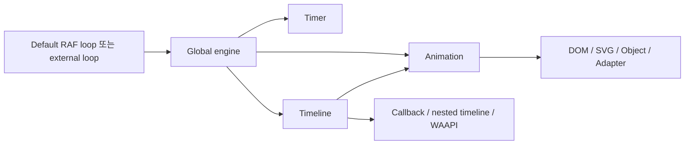

# Anime.js - Deep Dive

> [[01-getting-started|이전: Getting Started]] · [[../README|목차로 돌아가기]] · [[../05-projects|다음: Projects]]

## 1. Runtime 구조



- 전역 `engine`이 active instance의 시간을 갱신한다.
- instance는 engine에 추가된 순서와 `priority`에 따라 tick된다.
- `speed`, `fps`, `timeUnit`, `precision`, `pauseOnDocumentHidden`은 전역 시간 동작에 영향을 준다.
- global 설정 변경은 다른 component에도 파급되므로 app boundary에서 소유권을 명확히 한다.

## 2. External render loop

Three.js나 game engine이 이미 render loop를 가진다면 중복 RAF를 피하고 clock을 하나로 합칠 수 있다.

```js
import { engine } from 'animejs';

engine.useDefaultMainLoop = false;

function render() {
  engine.update();
  renderer.render(scene, camera);
  requestAnimationFrame(render);
}

requestAnimationFrame(render);
```

시간 인자의 단위와 engine 설정을 공식 문서에서 확인하고, pause/resume·background tab 동작을 함께 시험한다.

## 3. Scope와 lifecycle

`createScope()`는 root, defaults, media queries, registered methods와 생성된 animation을 하나의 cleanup boundary로 묶는다.

```js
import { createScope, animate } from 'animejs';

const root = document.querySelector('.feature');

const scope = createScope({
  root,
  mediaQueries: {
    reduceMotion: '(prefers-reduced-motion: reduce)',
  },
}).add((self) => {
  animate('.feature__item', {
    opacity: [0, 1],
    y: self.matches.reduceMotion ? 0 : [20, 0],
  });
});

// component unmount / route leave
scope.revert();
```

framework adapter를 쓰더라도 원칙은 같다.

1. mount 후 scope를 만든다.
2. selector는 root 안으로 제한한다.
3. event-driven animation method도 scope에 등록한다.
4. unmount에서 `revert()`를 호출한다.

## 4. Timeline composition

Timeline에는 animation, timer, callback, label, nested timeline과 WAAPI animation을 둘 수 있다.

| position 표현 | 용도 |
|---|---|
| 숫자 | playhead의 absolute time |
| `'+=...'`, `'-=...'` | 직전 종료점 기준 offset |
| `'<'` 계열 | 이전 child의 시작점 기준 overlap |
| label | 의미 있는 scene boundary |

복잡한 sequence는 `intro`, `data-ready`, `outro`처럼 domain label을 정하고, 개별 duration은 `defaults`로 통일한다. 이를 통해 seek/reverse test와 timing 조정이 쉬워진다.

## 5. Scroll과 Drag

### Scroll

`onScroll()`은 enter/leave trigger와 scroll progress 동기화를 구성한다. scrub effect는 input과 playhead가 강하게 결합되므로 다음을 확인한다.

- document가 아닌 container scroll인지
- horizontal/vertical axis와 overflow 설정이 맞는지
- resize 후 trigger geometry가 갱신되는지
- fast scroll과 touch momentum에서 callback이 안정적인지
- reduced motion에서 scrub/parallax를 비활성화하는지

### Drag

`createDraggable()`은 pointer drag, inertia, snapping, bounds를 다룬다.

- keyboard로 같은 조작 결과에 도달할 수 있어야 한다.
- drag affordance와 current state를 시각적으로 표시한다.
- bounds와 snap point를 responsive layout에서 다시 계산한다.
- unmount에서 listener와 style mutation을 정리한다.

## 6. Layout animation

`createLayout()`은 `display`, flex/grid 설정, DOM order처럼 숫자를 직접 interpolation하기 어려운 두 layout state 사이의 시각적 변화를 자동화한다.

실무 순서:

1. before state를 capture한다.
2. class·DOM order·layout property를 바꾼다.
3. after state와 차이를 animation한다.
4. resize, focus order, screen reader reading order를 확인한다.

layout animation은 DOM의 의미 순서를 대신하지 않는다. 시각적 reorder가 keyboard focus나 reading order와 충돌하지 않게 한다.

## 7. Adapters와 Three.js

v4.5.0의 `registerAdapter()`는 외부 object model의 property 읽기·쓰기 방식을 Anime.js에 연결한다. built-in Three.js adapter는 mesh, material, camera, light, uniform, instanced mesh 등을 일반 `animate()` workflow로 다루게 한다.

Adapter 선택 시 확인할 점:

- property가 scalar, vector, color 중 어떤 형태인지
- mutation 후 별도 dirty flag/update가 필요한지
- render loop와 Anime.js engine 시간이 하나로 동기화되는지
- 많은 instance를 animation할 때 allocation과 upload 비용이 어떤지
- seeded random/jitter로 test를 재현 가능하게 만들었는지

## 8. 성능과 upgrade 전략

| 위험 | 대응 |
|---|---|
| layout thrashing | read와 write phase를 분리하고 layout property를 줄임 |
| main-thread saturation | WAAPI/CSS와 비교하고 target·callback 수를 측정 |
| selector 범위 과다 | Scope root와 직접 element reference 사용 |
| background tab 시간 jump | `pauseOnDocumentHidden`과 resume behavior 검증 |
| transform composition 변화 | representative screenshot/visual regression test |
| non-deterministic creative test | seeded random 사용 |

v4.4에서 minor version임에도 transform order가 breaking change로 바뀌었다. upgrade는 lockfile 변경만으로 끝내지 말고 주요 scene의 initial/mid/final frame을 비교한다. 관련: [[../../../scraping/playwright/README|Playwright]].

## Sources

- [Engine documentation](https://animejs.com/documentation/engine/)
- [Timeline documentation](https://animejs.com/documentation/timeline/)
- [Scope documentation](https://animejs.com/documentation/scope/)
- [ScrollObserver settings](https://animejs.com/documentation/events/onscroll/scrollobserver-settings/)
- [Draggable documentation](https://animejs.com/documentation/draggable/)
- [Layout documentation](https://animejs.com/documentation/layout/)
- [Adapters documentation](https://animejs.com/documentation/adapters/)
- [v4.5.0 release](https://github.com/juliangarnier/anime/releases/tag/v4.5.0)
