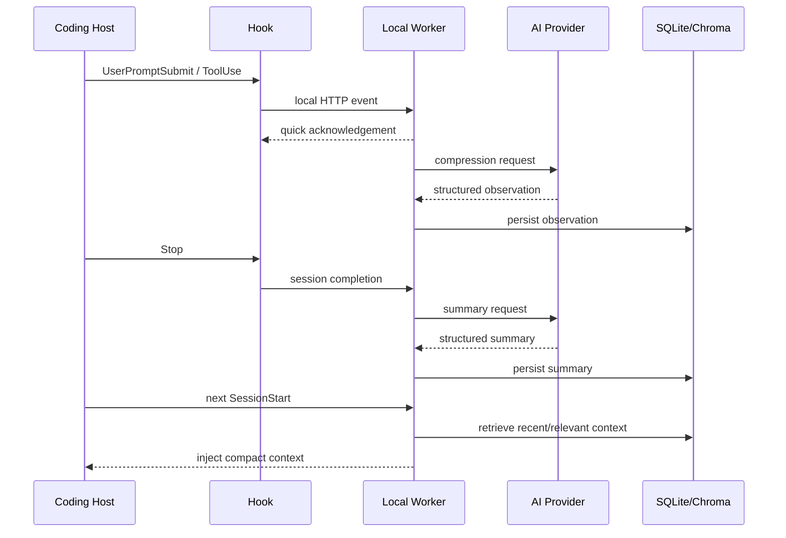

# Claude-Mem Deep Dive

> [[01-getting-started|이전: Getting Started]] | [[../README|목차]] | [[../05-projects|다음: Projects]]

## End-To-End Data Flow



가장 중요한 경계는 hook과 worker 사이의 빠른 handoff다. Heavy compression을 hook process에서 끝낼 때까지 기다리면 coding host가 느려지거나 멈출 수 있다. 반대로 비동기 queue는 process crash 시 아직 저장되지 않은 observation을 잃을 수 있다.

## Failure Model

| Failure | 기대 동작 | 운영 signal |
|---|---|---|
| Worker unavailable | host는 fail-open으로 계속 작업 | health check, missing observation, worker log |
| Provider timeout/quota | compression 지연 또는 실패 | queue depth, provider error, stale quota state |
| Chroma failure | SQLite FTS5-only 검색으로 degrade | semantic result 감소, Chroma error |
| Hook parse error | 특정 event 누락 가능 | hook stderr, observation gap |
| Sync conflict | local/cloud state 불일치 가능 | sync status와 conflict log |
| Log explosion | disk pressure | log size/rotation monitoring |

“Session이 계속된다”와 “Memory가 정상 기록된다”는 별개의 health condition이다. Host success만 보고 system이 정상이라고 판단하지 않는다.

## Storage Model

SQLite가 source of truth이고 Chroma는 optional semantic index다.

```text
sdk_sessions(session identity, lifecycle)
 ├─ user_prompts(user intent)
 ├─ observations(tool-derived compressed facts)
 └─ session_summaries(outcome and next steps)
```

이 분리는 다음 query를 가능하게 한다.

- 특정 prompt 이후 어떤 observation이 생겼는가?
- 한 decision 전후의 timeline은 무엇인가?
- 특정 file을 다룬 session의 outcome은 무엇인가?
- keyword match와 semantic similarity가 가리키는 observation은 같은가?

WAL mode는 worker write와 viewer read의 동시성을 돕지만 backup에서는 DB file 하나만 무심코 복사하지 말고 SQLite의 일관된 backup 절차를 사용해야 한다.

## Retrieval Economics

Progressive disclosure는 recall과 token cost를 단계별로 조절한다.

| 단계 | 반환 | 용도 |
|---|---|---|
| `search` | compact metadata/index | 후보를 넓게 찾기 |
| `timeline` | anchor 전후 맥락 | 인과와 작업 순서 복원 |
| `get_observations` | 선택 ID의 상세 | 실제 판단에 필요한 evidence 읽기 |

좋은 retrieval prompt는 먼저 project/time/type을 좁히고, ID를 얻은 뒤 detail을 요청한다. “과거 전부 보여줘”는 token 절약 구조를 무너뜨린다.

## Compression Quality

Compression은 lossless archive가 아니다. 다음 왜곡 가능성을 점검한다.

- tool output의 중요한 exception detail이 narrative에서 사라짐
- 시도와 최종 decision이 뒤섞임
- file을 “읽음”과 “수정함”이 혼동됨
- 실패한 가설이 확정 사실처럼 요약됨
- session 종료 전 queue가 flush되지 않아 summary가 불완전함

중요한 사실은 source file, test output, commit/issue/ADR로 다시 검증한다. Memory는 탐색 index이지 authoritative record가 아니다.

## Security Review

```text
Captured data
  ├─ local DB/log only
  ├─ compression provider request
  └─ optional Cloud Sync upload
```

검토 질문:

1. 어떤 hook payload가 worker에 도달하는가?
2. `<private>` filtering은 어느 단계에서 적용되는가?
3. Provider request에 raw prompt/tool output이 얼마나 포함되는가?
4. Sync를 켰을 때 full prompt와 narrative 중 무엇이 upload되는가?
5. DB, logs, backups의 retention과 filesystem permission은 무엇인가?
6. Worker port가 loopback에만 bind됐는가?

## Upgrade Strategy

2026-09-20 기준 빠른 release cadence와 channel lag가 있으므로 다음 순서를 권장한다.

```text
version 확인 → DB 일관 backup → disposable/pilot repo upgrade
→ capture/injection/search smoke test → log/sync 확인
→ 본 사용 환경 rollout → rollback window 유지
```

Auto-update 여부와 별개로 설치된 exact version, schema 변화, provider 설정을 기록한다. “latest”라는 label만으로 재현성을 확보할 수 없다.

## Sources

- https://github.com/thedotmack/claude-mem/blob/main/docs/public/architecture/hooks.mdx
- https://github.com/thedotmack/claude-mem/blob/main/docs/public/architecture/worker-service.mdx
- https://github.com/thedotmack/claude-mem/blob/main/docs/public/architecture/database.mdx
- https://github.com/thedotmack/claude-mem/blob/main/docs/public/architecture/search-architecture.mdx
- https://github.com/thedotmack/claude-mem/blob/main/docs/public/usage/search-tools.mdx
- https://github.com/thedotmack/claude-mem/issues

