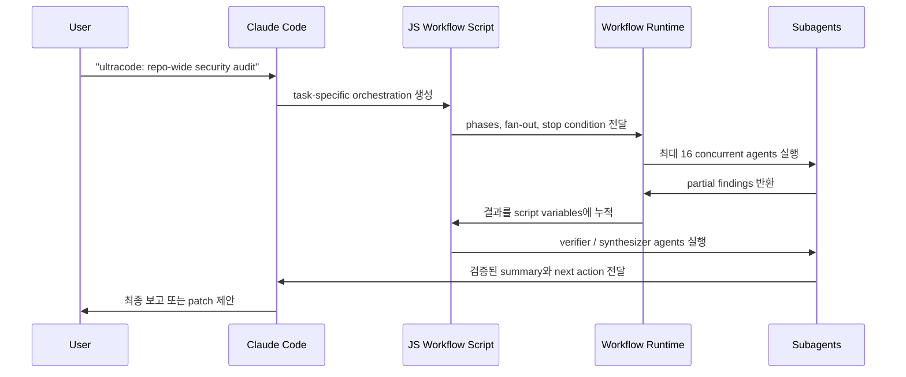

# Claude Dynamic Workflows - 개요

> [[README|목차로 돌아가기]] | [[02-ecosystem|다음: 생태계]]

---

## 1. What - Claude Dynamic Workflows란?

> **한 줄 정의**: Claude Code가 task-specific JavaScript orchestration script를 만들고, workflow runtime이 다수의 subagents를 병렬 실행해 대규모 작업을 검증·종합하는 multi-agent workflow 기능.

### 핵심 개념

Claude Code의 일반 agent loop는 하나의 context window 안에서 계획, 실행, 검증을 반복한다. Dynamic Workflows는 이 loop의 일부를 Claude 대화 context 밖의 JavaScript script와 runtime으로 이동시킨다.

- Claude: task를 분석하고 workflow script를 생성
- JavaScript workflow: task 분해, agent dispatch, 결과 저장, 검증 조건을 표현
- Runtime: subagents 실행, concurrency 제한, token usage, pause/resume/stop 관리
- Subagents: 작은 단위 작업을 수행하고 결과를 반환
- Synthesis: partial result를 종합해 최종 답변 또는 patch 계획 생성

### 주요 용어

| 용어 | 설명 |
|------|------|
| Dynamic Workflow | Claude가 task마다 생성하는 custom orchestration workflow |
| Script-as-orchestrator | orchestration plan을 대화 context가 아니라 JavaScript file로 표현하는 방식 |
| Harness | task 실행, 검증, 종합을 감싸는 custom 실행 구조 |
| Subagent fan-out | 큰 task를 작은 단위로 나눠 다수 agent를 병렬 실행하는 패턴 |
| Adversarial verification | 별도 verifier agent가 결과의 오류, 누락, false positive를 공격적으로 검증하는 방식 |
| `/workflows` | 실행 중인 workflow의 phase, agent count, token usage, elapsed time을 보는 UI |

### 동작 방식

---

## 2. Why - 왜 필요한가?

### 해결하려는 문제

기본 agent loop는 일반 coding task에는 충분하지만, 대규모 migration, repo-wide audit, security review, deep research에서는 다음 문제가 커진다.

- `goal drift`: 긴 작업 중 원래 목표와 다른 방향으로 이동
- `self-preferential bias`: 자신이 만든 중간 결과를 충분히 의심하지 않음
- context overload: 검색 결과, 로그, diff, 검증 결과가 한 context에 쌓여 판단 품질 저하
- premature completion: 실제로 끝나지 않았는데 완료 선언
- weak verification: 생성 agent와 검증 agent가 분리되지 않아 오류를 놓침

### 기존 방식과의 차이

| 문제 | 기본 Claude Code loop | Dynamic Workflows |
|------|------------------------|-------------------|
| 대규모 탐색 | 한 agent가 순차 탐색 | subagent fan-out으로 병렬 탐색 |
| 중간 결과 관리 | 대화 context에 누적 | script variables에 저장 |
| 검증 | 같은 agent가 자체 검토 | verifier/adversarial agents 분리 가능 |
| 완료 조건 | agent 판단에 의존 | stop condition, loop-until-done 표현 가능 |
| 재사용 | prompt 재입력 중심 | `.claude/workflows/`에 저장 후 slash command처럼 재실행 |

---

## 3. 핵심 특징

### Architecture

- **Script-as-orchestrator**: Claude가 workflow용 JavaScript file을 만들고 runtime이 실행한다.
- **Context offloading**: 중간 결과가 Claude 대화 context가 아니라 script variables에 남는다.
- **Subagent fan-out**: task를 작은 단위로 분해해 여러 subagents를 병렬 실행한다.
- **Verification patterns**: fan-out-and-synthesize, adversarial verification, generate-and-filter, tournament, loop-until-done을 workflow script로 표현한다.
- **Workflow UI**: `/workflows`에서 phase, agent count, token usage, elapsed time을 관찰하고 pause/resume/stop/restart/save할 수 있다.

### 제한과 주의

| 항목 | 내용 |
|------|------|
| 상태 | research preview |
| Trigger | prompt에 `use a workflow`, `ultracode`, 또는 `/effort ultracode` |
| Built-in | `/deep-research` workflow |
| 동시 실행 제한 | 한 run 최대 16 concurrent agents |
| 총 agent 제한 | 한 run 최대 1,000 agents |
| 비용 | 일반 Claude Code session보다 token 사용량이 훨씬 클 수 있음 |
| 권한 | first run approval, admin disable, managed settings 고려 |

---

## 4. 사용 사례

### 적합한 경우

| 사용 사례 | 설명 |
|----------|------|
| Repo-wide security sweep | route별 auth, input validation, SQL injection, secret leakage를 병렬 탐지 |
| Large migration | deprecated API callsite 탐색, 파일 단위 변환, test, review를 분리 |
| Deep research dossier | source search, claim extraction, source verification, cited report를 단계화 |
| Incident root cause mining | 로그, commit, alert, metric을 병렬 조사해 원인 후보를 검증 |
| Test gap audit | 모듈별 test coverage, missing edge case, flaky test 후보를 분리 분석 |

### 적합하지 않은 경우

- 단일 파일 수정처럼 context가 작고 검증 비용이 낮은 작업
- token budget이 엄격하고 fan-out 비용을 감당하기 어려운 작업
- subagent가 병렬로 읽어도 의미 있는 독립 단위가 없는 작업
- 보안상 multi-agent 실행 권한을 아직 승인하기 어려운 repository

---

## 5. 관련 노트

- [[study/tech/ai/claude/03-claude-code]] - Claude Code의 기본 agent loop
- [[study/tech/ai/claude/08-subagents]] - subagent 설계와 context isolation
- [[study/tech/ai/thin-harness-fat-skills]] - harness와 skill의 역할 분리
- [[study/tech/ai/multi-agent-platforms]] - multi-agent platform 관점

---

## References

- [Introducing Dynamic Workflows in Claude Code](https://claude.com/blog/introducing-dynamic-workflows-in-claude-code)
- [A harness for every task: Dynamic Workflows in Claude Code](https://claude.com/blog/a-harness-for-every-task-dynamic-workflows-in-claude-code)
- [Claude Code docs - Dynamic Workflows](https://code.claude.com/docs/en/workflows)
