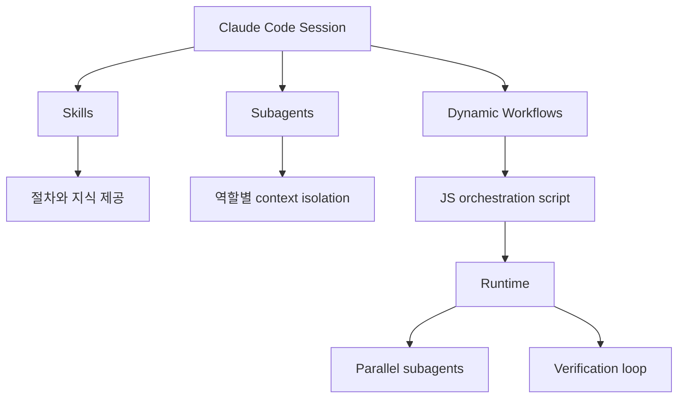

# Claude Dynamic Workflows - 생태계와 비교

> [[01-overview|이전: 개요]] | [[README|목차로 돌아가기]] | [[03-references|다음: 참고자료]]

---

## 1. 포지셔닝

Claude Dynamic Workflows는 "coding agent" 자체라기보다 Claude Code 안에서 대규모 작업을 조율하는 **runtime-backed orchestration layer**에 가깝다.

- [[study/tech/ai/claude/03-claude-code]]: 대화형 coding agent 기반
- [[study/tech/ai/claude/08-subagents]]: 개별 역할 agent 정의
- Dynamic Workflows: task-specific script가 agent들을 계획적으로 실행
- [[study/tech/ai/codex]]: cloud coding agent와 PR 중심 workflow
- [[study/tech/ai/langchain-crewai]]: application framework 관점의 agent orchestration

---

## 2. 경쟁/대안 비교

| 도구/프레임워크 | 성격 | 강점 | Dynamic Workflows와 차이 |
|---|---|---|---|
| **Claude Code Dynamic Workflows** | Claude Code 내장 multi-agent orchestration | Claude가 task-specific JS workflow를 즉석 생성, subagent 병렬화, 검증 loop, 저장/재실행 | Claude Code UX에 깊게 통합. 아직 research preview, token 비용 큼 |
| **Claude subagents / Agent SDK** | 개별 subagent 정의 및 SDK 기반 agent loop | context isolation, tool restriction, worktree isolation, programmatic embedding | orchestration plan은 보통 Claude context 또는 앱 코드가 들고 있음. Dynamic Workflows는 plan 자체를 runtime script로 이동 |
| **Claude Skills** | 반복 절차/지식 패키징 | `SKILL.md`, scripts, templates로 reusable instruction 제공 | Skill은 "방법/절차"를 제공, Dynamic Workflow는 "실행 orchestration"을 코드화 |
| **OpenAI Codex** | cloud coding agent | isolated cloud sandbox, parallel tasks, tests/log citations, GitHub PR flow | task 단위 cloud agent에 강함. Dynamic Workflows는 한 session 안에서 수십~수백 subagents를 script로 조율 |
| **GitHub Copilot coding agent** | GitHub-native async coding agent | GitHub issue/PR/Actions와 통합, enterprise control, MCP | GitHub workflow 중심. Dynamic Workflows는 Claude Code 내부 runtime + custom JS harness 중심 |
| **LangGraph** | open-source graph/state workflow framework | deterministic graph, stateful multi-agent app 구축에 적합 | 개발자가 graph를 설계. Dynamic Workflows는 Claude가 workflow script를 생성 |
| **Microsoft AutoGen** | multi-agent conversation framework | agent collaboration prototype, research/automation framework | framework-level 개발 도구. Dynamic Workflows는 Claude Code product feature |

---

## 3. 선택 기준

| 기준 | Dynamic Workflows가 유리 | 다른 도구가 유리 |
|------|--------------------------|------------------|
| 작업 위치 | 이미 Claude Code session에서 작업 중 | GitHub issue/PR 중심 async 작업 |
| orchestration 작성자 | Claude가 task마다 workflow를 생성 | 개발자가 명시적 graph/state machine을 설계 |
| 재사용 단위 | `.claude/workflows/` slash command | library, SDK, CI workflow, GitHub Actions |
| 검증 구조 | verifier agents, tournament, generate-and-filter | test suite, code review, deterministic workflow |
| 비용/통제 | token cap과 model routing을 직접 관리 가능할 때 | enterprise policy, cloud queue, audit trail이 더 중요할 때 |

---

## 4. Claude 내부 구성요소와의 관계

| 구성요소 | 질문 | 답 |
|----------|------|----|
| Skills | "어떻게 해야 하는가?" | 절차, 지식, scripts, templates를 제공 |
| Subagents | "누가 어떤 역할을 맡는가?" | reviewer, researcher, migrator 같은 역할을 분리 |
| Dynamic Workflows | "어떤 순서와 조건으로 실행할 것인가?" | fan-out, verification, loop, synthesis를 runtime script로 실행 |

---

## 5. 트렌드 해석

Dynamic Workflows는 coding agent가 단일 대화형 assistant에서 **task runtime**으로 이동하는 흐름을 보여준다.

- Context window 중심 설계에서 external state/script 중심 설계로 이동
- "agent가 잘 생각한다"보다 "agent들을 어떻게 검증하며 운영한다"가 중요해짐
- [[study/tech/ai/thin-harness-fat-skills]] 패턴처럼 harness, skill, subagent의 책임 분리가 중요해짐
- [[study/tech/ai/llm-wiki-study]] 같은 knowledge workflow에서는 source fan-out과 contradiction flagging에 잘 맞음

---

## References

- [Claude Code docs - Dynamic Workflows](https://code.claude.com/docs/en/workflows)
- [Claude Code docs - Subagents](https://code.claude.com/docs/en/sub-agents)
- [Claude Agent SDK subagents](https://code.claude.com/docs/en/agent-sdk/subagents)
- [Claude Code Skills](https://code.claude.com/docs/en/skills)
- [OpenAI Codex announcement](https://openai.com/index/introducing-codex/)
- [GitHub Copilot coding agent](https://github.com/newsroom/press-releases/coding-agent-for-github-copilot)
- [LangGraph multi-agent docs](https://langchain-ai.github.io/langgraph/tutorials/multi_agent/multi-agent-collaboration/)
