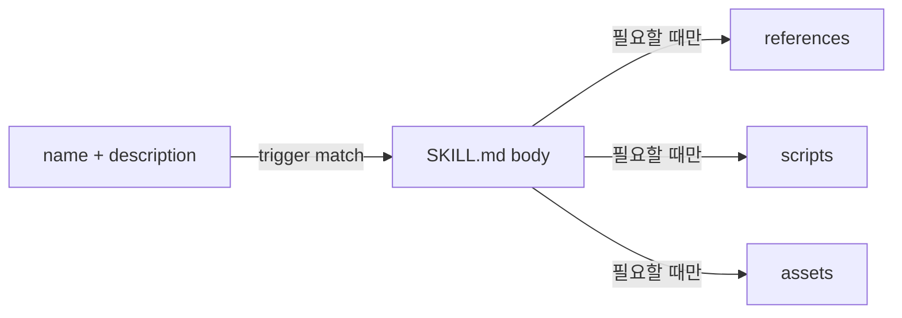

# Paperthin — Deep Dive

> [[01-getting-started|이전: Getting Started]] · [[../README|목차]] · [[../05-projects|다음: Projects]]

## Progressive disclosure

Agent Skills는 모든 instruction을 항상 context에 넣지 않는다.



1. discovery 단계에는 `name`과 `description`만 읽는다.
2. activation되면 `SKILL.md` 본문을 읽는다.
3. 본문이 route하는 resource만 추가로 읽는다.

따라서 `description`은 단순 소개가 아니라 activation policy다. trigger가 너무 넓으면 context와 비용이 늘고, 너무 좁으면 필요한 reflex가 실행되지 않는다.

## Invocation은 capability boundary다

| 유형 | 활성화 주체 | 예 | 이유 |
|---|---|---|---|
| model-invoked | agent가 trigger semantics로 선택 | `re0`, `readchk`, `factchk`, `sip` | 일상 QA에 조합 가능 |
| user-invoked | 사람의 명시 호출 | `re0-release`, `re0-merge`, `re0-upgrade` | publication/외부 변경/승인 필요 |
| user-invoked | 사람의 명시 호출 | `hate`, `macrothink`, `feynman`, `prism` | demolition bias, chronic doubt, multi-agent cost 제한 |

model-invoked skill은 다른 model-invoked skill을 route할 수 있지만 user-only skill을 임의 실행해서는 안 된다. 이는 편의 설정이 아니라 authority escalation을 막는 경계다.

## `sip`: post-generation router

`sip`은 artifact가 생성된 직후 필요한 검사만 선택한다.

```text
artifact
  ├─ 표현/구조가 흐린가?        → shower
  ├─ factual claim이 있는가?    → factchk
  ├─ evaluation이 순환적인가?   → mandela
  ├─ truth가 복제됐는가?        → ssotize
  ├─ vendor가 문서에 샜는가?    → detool
  └─ stale residue가 남았는가?  → re0
```

중요한 invariant는 QA routing과 Git publication을 분리하는 것이다. `sip` 자체는 commit이나 merge를 수행하지 않는다.

## `re0-loop`: evidence 중심 cycle

```text
FRAME → BUILD → DRIVE → RE0-MEMO → HATE → RE0-WORK → BUILD AGAIN
```

- `FRAME`: 성공 기준과 실제 surface를 정한다.
- `BUILD`: 최소한의 useful increment를 만든다.
- `DRIVE`: browser, HTTP, desktop computer-use 등 사용 surface에서 evidence를 얻는다.
- `RE0-MEMO`: 다음 cycle에 필요한 학습만 압축한다.
- `HATE`: load-bearing objection과 가장 싼 test를 찾는다.
- `RE0-WORK`: 다음 실행 단위를 다시 세운다.

unit test 통과만으로 user-visible behavior를 증명할 수 없는 경우 `DRIVE`가 핵심이다.

## Catalog SSOT와 drift guard

Node.js CommonJS catalog는 Claude Code/Codex command-hook adapter와 OpenCode adapter가 공유한다. CI는 Node.js 24에서 다음을 확인한다.

- skill catalog validation
- skill reference resolution
- relative link resolution
- plugin/catalog/upgrade roster 사이의 SSOT drift
- runtime state-directory drift

이 구조 자체가 `ssotize`의 원칙을 repository 운영에 dogfooding한 사례다. canonical catalog에서 adapter를 파생시키고 CI가 복제된 roster의 불일치를 막는다.

## Failure modes

| 실패 | 원인 | 대응 |
|---|---|---|
| 모든 작업에 모든 skill 적용 | trigger 과잉 | 최소 reflex만 route |
| evaluator를 늘렸지만 결론이 같음 | framing과 source가 공유됨 | `mandela`로 독립 ground truth 확인 |
| rewrite가 불필요한 churn 생성 | `re0`의 no-op invariant 무시 | 의미 있는 개선이 없으면 변경하지 않기 |
| upgrade가 조용히 권한 확대 | confirmation 생략 | plan과 add/remove target 검토 |
| skill instruction을 security boundary로 오해 | Markdown은 강제 sandbox가 아님 | host permission, code review, CI 병행 |

## Sources

- https://agentskills.io/specification
- https://github.com/LilMGenius/paperthin/blob/main/docs/invocation.md
- https://github.com/LilMGenius/paperthin/blob/main/scripts/catalog.cjs
- https://github.com/LilMGenius/paperthin/blob/main/.github/workflows/ci.yml
- https://github.com/LilMGenius/paperthin/blob/main/skills/coil/re0-loop/SKILL.md

