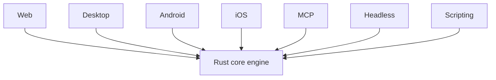

# OpenCut — Overview

[[tech/devtools/opencut/README|학습 진입점]] · 다음: [[tech/devtools/opencut/02-ecosystem|Ecosystem]]

## What

OpenCut은 타임라인 위에서 video, audio, text, image layer를 배치하는 non-linear editor(NLE)다. CapCut처럼 접근하기 쉬운 UX를 지향하지만, 소스와 라이선스는 공개되어 있고 MIT license를 사용한다.

현재 이름 아래에는 성격이 다른 두 codebase가 있다.

| 구분 | 현재 역할 | 도입 관점 |
|---|---|---|
| **classic** | `opencut.app`에서 동작하는 browser editor | 오늘 편집을 시작할 수 있는 surface |
| **rewrite** | Rust shared core 중심으로 재작성 중인 플랫폼 | 구조를 추적·학습하거나 향후 기여할 대상 |

따라서 OpenCut을 이미 완성된 cross-platform CapCut replacement라고 부르기보다, **usable classic에서 shared-core rewrite로 옮겨가는 프로젝트**로 이해해야 한다.

## Why

쉬운 video editor는 빠른 제작을 돕지만, 유료 feature paywall이나 cloud-first workflow는 비용·업로드 정책·제작물 통제의 제약이 될 수 있다. OpenCut은 이를 무료·open-source·local-first 경험으로 바꾸려 한다.

이 목표가 곧바로 모든 편집 요구를 만족한다는 뜻은 아니다. 특히 전환기에는 project format, 기능 범위, release cadence를 실제 workflow로 검증해야 한다. 민감한 media를 다룬다면 import·preview·export 중 어디에 데이터가 머무는지 별도로 확인한다.

## Classic의 핵심 기능

- **Timeline:** multi-track 배치, trim, split, ripple editing
- **Motion:** 위치·scale·opacity keyframe과 graph editor
- **Visual:** blur/effects, masks, stickers, canvas background, preview zoom/pan
- **Text:** text와 captions; transcript file import를 이용한 caption 생성
- **Media control:** video/audio speed와 volume 조절

`v0.3.0` release는 masks, keyframe curve graph editor, transcript import caption, speed·volume control 등을 소개한다. release 기능은 classic 경험을 설명하는 근거이며 rewrite 완성도를 뜻하지는 않는다.

## Rewrite의 설계 방향

엔진과 UI를 분리하면 platform별 business logic 중복을 줄이고, 같은 project model·rendering을 여러 UI와 automation entry point에서 재사용할 수 있다. 공식 roadmap은 Editor API, third-party plugin, MCP, headless batch rendering, scripting을 나열한다. 모두 **계획 또는 설계 진행 항목**으로 취급해야 한다.

## 학습 체크

- [ ] classic과 rewrite 중 현재 사용 가능한 surface를 구분할 수 있다.
- [ ] `plugin-first`가 기본 editor를 가볍게 두고 선택적 확장을 노리는 방향임을 설명할 수 있다.
- [ ] roadmap 기능과 현재 기능을 같은 문장에 섞지 않는다.

## Sources

- [OpenCut status and development commands](https://github.com/OpenCut-app/OpenCut)
- [Rewrite architecture tracking](https://github.com/OpenCut-app/OpenCut/issues/811)
- [v0.3.0 release](https://github.com/OpenCut-app/OpenCut/releases/tag/v0.3.0)
- [OpenCut classic](https://github.com/OpenCut-app/opencut-classic)
