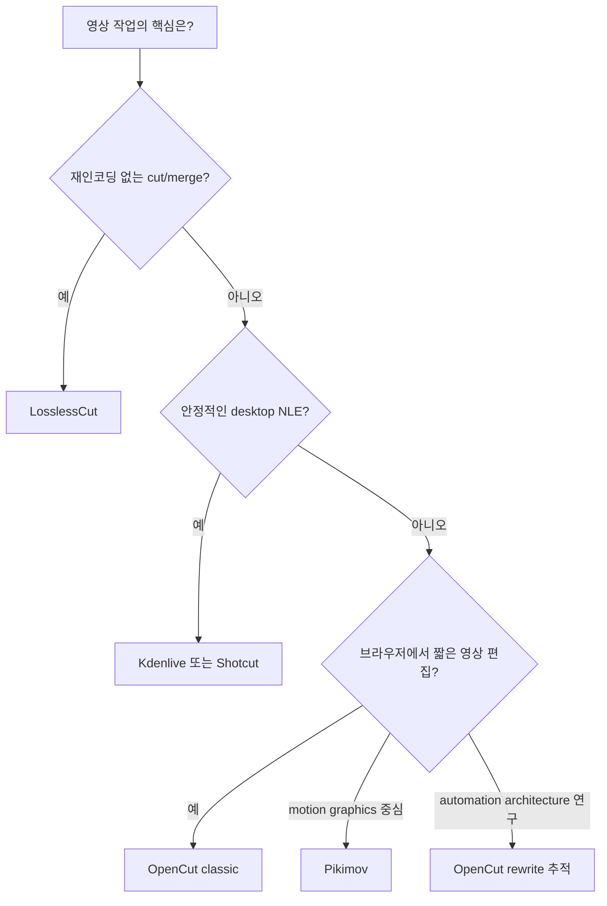

# OpenCut — Ecosystem

[[tech/devtools/opencut/README|학습 진입점]] · 이전: [[tech/devtools/opencut/01-overview|Overview]]

## 선택 기준

도구의 이름보다 작업의 병목을 먼저 고른다. short-form의 빠른 visual editing인지, 안정적인 multi-track desktop NLE인지, motion design인지, 무손실 cut인지에 따라 적합한 도구가 다르다.

| 도구 | 성격·강점 | OpenCut 대비 적합한 경우 |
|---|---|---|
| **OpenCut classic** | browser-first, CapCut형 간결 UX, caption·mask·keyframe | 짧은 social video와 가벼운 편집을 빠르게 시험할 때. 전환기 위험은 감수해야 한다. |
| **OpenCut rewrite** | Rust shared core, plugin/API/MCP/headless 지향 | editor automation·agent workflow의 구조를 추적하거나 기여를 준비할 때. production 도입 대상은 아니다. |
| **Kdenlive** | 성숙한 desktop NLE, 많은 track, subtitle·speech-to-text·nested timeline | 긴 영상과 다층 timeline, 안정적인 OSS desktop workflow가 필요할 때 |
| **Shotcut** | free/open-source cross-platform editor, format·codec·effect 폭넓음 | 설치형 범용 editor와 검증된 cross-platform 운용이 우선일 때 |
| **Pikimov** | browser-based motion design/video editor | 설치 없이 motion graphics 중심의 웹 작업이 필요할 때 |
| **LosslessCut** | FFmpeg GUI 기반의 fast, lossless trim/cut | 재인코딩 없이 구간 삭제·병합만 빨리 해야 할 때; full NLE 대체재는 아니다. |

## Decision Map

## 비교할 때 놓치기 쉬운 점

- **browser-first ≠ cloud-first:** 웹 UI라고 해서 media 처리·저장·export가 항상 같은 privacy 특성을 갖는 것은 아니다. 조직 정책에 맞게 실제 data flow를 POC로 확인한다.
- **open source ≠ workflow 안정성:** license와 source availability는 장점이지만, project migration·plugin API·support 수준까지 보장하지 않는다.
- **automation roadmap ≠ integration contract:** MCP와 headless mode가 목표에 있어도 stable public API가 되기 전에는 production dependency로 삼지 않는다.

## Sources

- [OpenCut current status](https://github.com/OpenCut-app/OpenCut)
- [Kdenlive introduction](https://docs.kdenlive.org/en/getting_started/introduction.html)
- [Shotcut features](https://www.shotcut.org/features/)
- [Pikimov](https://pikimov.com/)
- [LosslessCut](https://github.com/mifi/lossless-cut)
