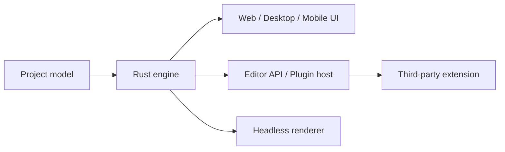

# OpenCut — Projects

[[tech/devtools/opencut/README|학습 진입점]]

## 1. Short-form content factory

브랜드 intro/outro, 자막 style, safe area, BGM을 template으로 정해 Reels·Shorts를 반복 제작한다.

- **입력:** source clips, headline, CTA, BGM
- **산출물:** 세로 video 1개와 template 규칙 문서
- **검증:** 3개 이상의 다른 source로 caption clipping, audio level, export time을 비교
- **한계:** classic의 project template·serialization 기능을 automation contract로 가정하지 않는다.

## 2. Local-first editing POC

cloud upload 제한이 있는 조직에서 browser-based editing workflow를 평가한다.

| 질문 | POC 방법 | 성공 기준 예시 |
|---|---|---|
| data residency | 더미·승인된 media로 import부터 export까지 흐름 기록 | 정책상 허용 가능한 처리·저장 경로 확인 |
| export performance | 동일 source 3개를 같은 canvas/length로 export | 팀의 목표 대기 시간 안에 완료 |
| usability | 편집자 2–3명이 기본 loop 수행 | 도움 없이 trim·caption·export 완료 |
| continuity | 저장·재개·browser 변경을 시험 | project recovery 위험이 문서화됨 |

실제 민감 media를 넣기 전, privacy/security 담당자의 승인과 서비스의 최신 data handling 설명을 확인한다.

## 3. Editor extensibility 연구

Rust core 위에 plugin host, project serialization, headless renderer가 붙는 설계를 reference로 삼는다. 이 프로젝트의 산출물은 product가 아니라 architecture note다.

연구 질문은 plugin permission과 lifecycle, deterministic render, asset path와 serialization, version migration이다. OpenCut에서는 이들이 완료 기능이 아니라 roadmap임을 note에 명시한다.

## 4. AI-agent video workflow 후보

장기 후보는 `script → asset insertion → caption → batch render` pipeline이다. MCP와 scripting이 stable API와 permission model을 갖춘 뒤에만 agent endpoint로 평가한다.

- **현재:** workflow requirement와 asset schema를 정의하고, classic으로 사람이 수행하는 loop를 관찰한다.
- **나중:** public MCP/headless API, auth, audit log, error recovery가 공개된 뒤 sandbox POC를 만든다.
- **중단 조건:** internal/unstable API에 의존하거나 project data 보호 조건을 충족하지 못하면 integration을 보류한다.

## Sources

- [OpenCut current status](https://github.com/OpenCut-app/OpenCut)
- [Rewrite architecture and progress](https://github.com/OpenCut-app/OpenCut/issues/811)
- [OpenCut classic](https://github.com/OpenCut-app/opencut-classic)
