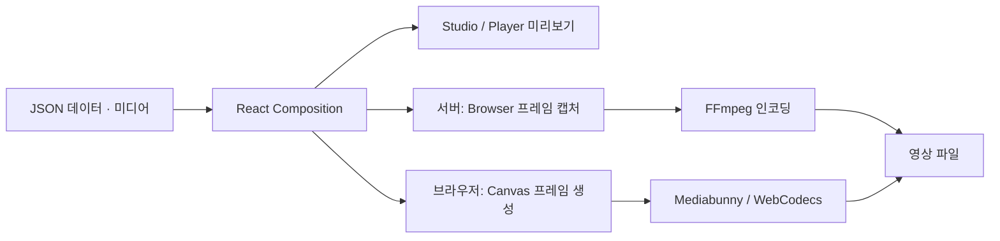

# Remotion — Overview

[[tech/devtools/remotion/README|학습 진입점]] · 다음: [[tech/devtools/remotion/02-ecosystem|Ecosystem]]

## What

Remotion은 영상의 장면을 React component로 표현하는 programmatic video framework다. component가 현재 frame을 입력받아 화면을 만들고, 렌더러가 이를 영상 파일로 출력한다. 예를 들어 30fps의 300 frames는 10초이며 frame 번호는 `0`부터 `299`까지다.

## Why

고객 이름·실적 수치·제품 사진이 바뀔 때마다 편집 파일을 복사하면 수정과 검수가 반복된다. Remotion에서는 디자인을 component로 고정하고 가변 데이터를 `props`로 분리한다. 디자인 수정은 템플릿에 한 번 적용하고, 데이터별 출력은 자동화할 수 있다.

개발 관점의 가치는 **영상 제작을 재사용 가능한 소프트웨어로 관리하는 것**이다. 입력에 따라 영상 내용뿐 아니라 길이와 해상도도 바꿀 수 있다. React 앱의 Player로 편집 결과를 보여주고 export는 별도 경로로 연결한다. [Parameterized videos](https://www.remotion.dev/docs/parameterized-rendering), [Player](https://www.remotion.dev/docs/player)

## 핵심 API와 시간 모델

| 개념 | 역할 | 기억할 점 |
|---|---|---|
| `<Composition>` | 출력 가능한 영상과 metadata 등록 | `fps`, `durationInFrames`, `width`, `height` 지정 |
| `useCurrentFrame()` | 현재 frame 조회 | 첫 frame은 `0` |
| `useVideoConfig()` | 영상 설정 조회 | fps를 이용해 초를 frame으로 환산 |
| `interpolate()` | frame을 숫자 속성으로 변환 | opacity 등에는 범위를 clamp |
| `spring()` | 물리 기반 motion 계산 | frame과 fps를 입력 |
| `<Sequence>` | 장면의 시작·길이 배치 | 내부 frame은 Sequence 시작 기준 |

`<Sequence from={60}>` 내부의 frame `0`은 바깥의 frame `60`에 해당한다. 30fps에서 2초 뒤 시작하는 장면이다. frame에서 상태를 계산하면 임의 시점으로 seek하거나 frame을 병렬 생성할 때도 일관된 화면을 만들기 쉽다. [Fundamentals](https://www.remotion.dev/docs/the-fundamentals), [Sequence](https://www.remotion.dev/docs/sequence)

## Preview와 export 아키텍처

- 서버의 `@remotion/renderer`는 `selectComposition()`, `renderMedia()`, `renderStill()` 같은 API를 제공한다. CLI와 Lambda도 이 렌더링 계층을 활용한다.
- 브라우저의 `@remotion/web-renderer`는 component와 영상 설정을 직접 받아 export한다. 서버용 bundle을 만드는 단계가 필요하지 않다.
- 기본 client renderer는 DOM의 배치·스타일을 Canvas에 재구성하므로 HTML/CSS 전체를 지원하지 않는다. `perspective`, `object-position` 등에 제약이 있다. 선택적인 HTML-in-canvas capture 방식은 별도 지원 조건을 확인한다.

실제 템플릿으로 preview와 export를 비교해야 한다. [Renderer](https://www.remotion.dev/docs/renderer), [Client-side 동작](https://www.remotion.dev/docs/client-side-rendering/how-it-works), [제약](https://www.remotion.dev/docs/client-side-rendering/limitations)

## 2025–2026 변화

조사 기준일은 **2026-09-09**다. 최신 버전이라는 표현은 이 날짜의 확인 결과다.

| 시점 | 변화 | 학습·도입 의미 |
|---|---|---|
| 2025-05-20 | Media Parser 공개 | 브라우저 미디어 처리로 영역 확장 |
| 2025-08-21 | 유료 Editor Starter 출시 | 자체 영상 편집기 개발의 출발점 제공 |
| 2025-09-01 | Mediabunny 지원·기존 라이브러리 전환 발표 | 신규 미디어 처리에서 Mediabunny 우선 검토 |
| 2026-02-01 | Media Parser deprecated | 과거 튜토리얼의 패키지를 그대로 채택하지 않고 Mediabunny 검토 |
| 2026년 확인 | Agent Skills 제공, web-renderer는 `v4.0.491`부터 stable | agent 활용과 브라우저 export가 공식 경로에 포함 |
| 2026-09-07 | GitHub Latest `v4.0.522` | Studio clip 분할·timeline 조작 등 편집 기능 개선 |

Mediabunny 전환 공지의 후속 note에서 2026-02-01 deprecated를 확인했다. 같은 글에 남아 있는 발표 당시의 “아직 deprecated 아님” 설명보다 이 후속 안내를 기준으로 읽는다. 과거 튜토리얼에서 해당 패키지가 등장하면 현재 문서와 비교한다. [전환 공지와 후속 안내](https://www.remotion.dev/blog/mediabunny)

## 학습 체크

- [ ] 30fps에서 5초와 마지막 frame 번호를 계산할 수 있다.
- [ ] 장면 component와 입력 데이터를 분리해 설명할 수 있다.
- [ ] Player, 서버 export, 브라우저 export의 역할을 구분할 수 있다.

## Sources

- [Fundamentals](https://www.remotion.dev/docs/the-fundamentals)
- [Animating properties](https://www.remotion.dev/docs/animating-properties)
- [Sequence](https://www.remotion.dev/docs/sequence)
- [Parameterized videos](https://www.remotion.dev/docs/parameterized-rendering)
- [Player](https://www.remotion.dev/docs/player)
- [Renderer](https://www.remotion.dev/docs/renderer)
- [Client-side rendering](https://www.remotion.dev/docs/client-side-rendering)
- [Client-side 동작](https://www.remotion.dev/docs/client-side-rendering/how-it-works)
- [Client-side limitations](https://www.remotion.dev/docs/client-side-rendering/limitations)
- [공식 Blog](https://www.remotion.dev/blog)
- [Mediabunny 전환 공지](https://www.remotion.dev/blog/mediabunny)
- [Media Parser 현재 안내](https://www.remotion.dev/docs/media-parser)
- [Agent Skills](https://www.remotion.dev/docs/ai/skills)
- [v4.0.522 Release](https://github.com/remotion-dev/remotion/releases/tag/v4.0.522)
