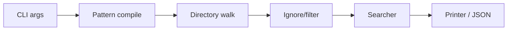

# ripgrep - Deep Dive

> [[01-getting-started|이전: 시작하기]] | [[../README|목차로 돌아가기]] | [[../05-projects|다음: 프로젝트]]

## 1. 검색 pipeline



| 단계 | 역할 |
|---|---|
| Pattern compile | Rust `regex` 또는 PCRE2 engine으로 pattern 준비 |
| Directory walk | recursive iterator로 후보 file 탐색 |
| Ignore/filter | `.gitignore`, glob, file type, hidden/binary rule 적용 |
| Searcher | mmap 또는 buffered incremental search 선택 |
| Printer | human-readable output 또는 `--json` event stream 출력 |

## 2. Regex engine trade-off

### 기본 engine

- Rust `regex` crate 기반이다.
- look-around와 backreference는 기본 engine에서 지원하지 않는다.
- 대신 catastrophic backtracking을 피하고 worst-case `O(m * n)`을 보장한다.

```bash
rg 'user_[0-9]+'
rg '\b[A-Z][A-Za-z0-9_]+\b'
```

### PCRE2 opt-in

- look-around/backreference가 꼭 필요할 때 사용한다.
- `-P`는 PCRE2 engine을 명시적으로 켠다.
- `--auto-hybrid-regex`는 기본 engine으로 가능한 경우 기본 engine을 쓰고, 필요하면 PCRE2로 전환한다.

```bash
rg -P '(?<=Authorization: Bearer )[A-Za-z0-9._-]+'
rg --auto-hybrid-regex '(?<=token=)[A-Za-z0-9._-]+'
```

## 3. Ignore/file walk 구조

`ignore` crate가 처리하는 대표 기능:

- `.gitignore` compatible rule
- `.ignore`, `.rgignore`
- glob filtering
- file type filtering
- hidden file filtering
- parallel recursive iterator

```bash
# 왜 skip됐는지 확인
rg --debug "needle"

# hidden 포함
rg --hidden "needle"

# ignore rule 무시
rg -u "needle"
rg -uu "needle"
rg -uuu "needle"
```

| 옵션 | 감각적 의미 |
|---|---|
| `-u` | ignore rule 일부 완화 |
| `-uu` | hidden file까지 더 포함 |
| `-uuu` | binary 포함 등 자동 필터를 최대한 해제 |

## 4. Output automation

### 파일 목록

```bash
rg -l "OldComponent"
rg --files
rg --files -g '*.ts'
```

### Match만 출력

```bash
rg -o 'AKIA[0-9A-Z]{16}'
```

### 위치 정보

```bash
rg -n --column "PaymentService"
```

### JSON event stream

```bash
rg --json -n --column "PaymentService" src
```

`--json`은 AI agent나 script가 parsing하기 좋다. [[../../../../tech/ai/llm-wiki-study/README|LLM Wiki study]]처럼 검색 결과를 후속 context로 넘기는 workflow에서 유용하다.

## 5. 성능을 해치기 쉬운 패턴

| 상황 | 주의 | 대안 |
|---|---|---|
| 너무 넓은 search root | repo 전체 + vendor 포함 | path와 `-g`로 범위 제한 |
| PCRE2 남용 | 기본 engine 최적화 이점 감소 | 기본 regex로 가능한지 먼저 확인 |
| multiline search | 비용 증가 가능 | 필요한 경우에만 `-U` 사용 |
| generated/vendor 검색 | noise와 시간 증가 | 기본 ignore를 유지하고 예외만 추가 |

## 6. Agent workflow 패턴

```bash
# 1. issue keyword로 후보 찾기
rg -n --context 2 "payment timeout|retry exhausted" src tests

# 2. symbol로 좁히기
rg -n --column "PaymentRetryPolicy"

# 3. structured output으로 넘기기
rg --json -n --column "PaymentRetryPolicy" src
```

- exact keyword는 `rg`가 강하다.
- semantic ambiguity는 vector retrieval과 함께 쓰는 hybrid 전략이 유리하다.
- agent에게는 "먼저 `rg`, 부족하면 broader search" 순서를 주면 비용과 latency를 줄일 수 있다.

## 관련 노트

- [[../../../../tech/ai/codex/README|Codex tool-study]]
- [[../../../../tech/ai/agent-orchestration/cli-agents|CLI agents]]
- [[../../../../tech/ai/llm-wiki-study/README|LLM Wiki study]]

