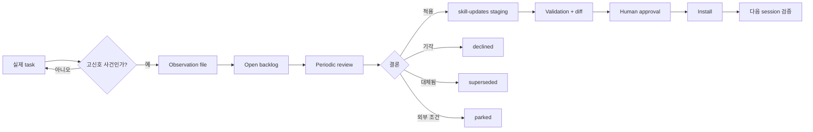

# Task Observer — Deep Dive

> [[01-getting-started|이전: Getting Started]] · [[../README|목차로 돌아가기]] · [[../05-projects|다음: Projects]]

## Lifecycle



이 구조의 핵심은 **capture와 mutation을 분리**하는 것이다. Agent가 관찰을 기록할 수 있어도 live skill 변경은 staging과 승인 단계를 거친다.

## Per-observation event store

v3.0 이전의 단일 `log.md`는 여러 session이 같은 문서를 read-modify-write할 때 overwrite 가능성이 있었다. v3.0부터 observation 하나당 파일 하나를 생성해 쓰기 충돌 범위를 줄였다.

| 설계 요소 | 목적 |
|---|---|
| `NNNN-slug.md` | 사람이 읽을 수 있는 stable identity |
| YAML frontmatter | body를 읽지 않고 index/filter 가능 |
| `archive/` | resolved entry를 active scan에서 분리 |
| `.id-floor` 등 ID 규칙 | archive 포함 ID 재사용 방지 |
| `checkpoints.log` | skill load와 protocol 실행을 구분하는 trace |

파일 단위 구조가 모든 concurrency 문제를 없애는 것은 아니다. 두 session이 같은 max ID를 동시에 읽으면 collision할 수 있으므로, 해당 release의 ID allocation procedure를 그대로 따라야 한다. 목표는 shared-document overwrite를 줄이고 충돌을 작고 탐지 가능하게 만드는 것이다.

## Frontmatter scan과 context economy

Session Start에서 모든 observation body를 읽으면 backlog가 커질수록 context와 latency가 선형 증가한다. Task Observer는 우선 다음 index field만 scan한다.

- `status`
- `skill`
- `title`
- `type` 또는 `proposes_skill`
- review에 필요한 관계 field

본문의 `Issue`, `Improvement`, `Principle`은 해당 observation을 실제 review할 때 읽는다. 이는 Agent Skills의 metadata → instruction → on-demand resources와 유사한 progressive disclosure를 observation store에도 적용한 것이다.

빈 query 결과는 두 가지 의미를 가질 수 있다.

1. 실제 open observation이 없다.
2. path, glob, YAML parse, shell quoting 문제로 scan이 실패했다.

따라서 중요한 retrieval은 독립적인 existence/count check와 함께 검증해야 한다.

## 상태 모델

| 상태 | 의미 | 다음 행동 |
|---|---|---|
| `open` | 아직 review/action 필요 | backlog에 유지 |
| `actioned` | 개선이 적용되거나 staging과 연결됨 | resolution/provenance 확인 후 archive |
| `declined` | 검토 후 적용하지 않기로 결정 | 이유 보존 |
| `superseded` | 더 나은 observation이나 이미 반영된 변화로 대체 | 대체 대상 연결 |
| `parked` | 명시된 외부 선행조건 때문에 보류 | `parked_until` 같은 조건 필요, 일반 backlog와 분리 |

단순히 “나중에 생각하자”는 `parked`의 근거가 아니다. 어떤 외부 조건이 충족되어야 결정이 달라지는지 명시해야 한다.

## Cross-cutting principles

개별 skill을 넘어서는 교훈은 `cross-cutting-principles.md`로 승격한다.

- 규칙이 있으면 pre-flight verification도 있어야 한다.
- pointer는 다음 session에서도 해석 가능한 durable path여야 한다.
- empty result와 broken query를 구분해야 한다.
- confidential context를 open-source skill의 일반 원칙에 포함하지 않는다.

새 skill 작성이나 기존 skill restructuring 시 이를 mandatory checklist처럼 적용하면 전체 library의 quality floor가 올라간다. 다만 한 사건을 지나치게 일반화하면 모든 skill에 불필요한 규칙을 퍼뜨릴 수 있으므로 반복 증거와 적용 범위를 함께 검토한다.

## Review와 staging

```text
open observations
  + current target skill
  + cross-cutting principles
  + confidentiality boundary
  → deduplicate / reconcile
  → additive vs restructuring 분류
  → staged bundle
  → validate
  → diff
  → human approval
```

Review에서 확인할 질문:

- observation의 문제가 아직 현재 skill에 존재하는가?
- 같은 원인이 여러 observation으로 중복 기록됐는가?
- 어느 skill family까지 전파해야 하는가?
- 공개 가능한 일반 원칙과 internal detail을 분리했는가?
- rule 추가가 실제 enforcement를 만드는가, 문장만 늘리는가?
- 더 작은 additive fix로 해결할 수 있는가?
- 설치 후 어떤 실제 task가 regression test가 되는가?

## Activation의 구조적 한계

Agent Skills specification에서 description은 agent가 관련 skill을 식별하도록 돕지만, 강제 activation contract는 아니다. Task Observer는 session 전체를 관찰해야 하므로 under-trigger의 비용이 특히 크다.

```text
description matching
       +
client/project instruction
       +
가능하면 harness hook
       ↓
새 session에서 실행 흔적 검증
```

이 구성도 client별 behavior에 의존한다. 따라서 portability를 주장하기보다 환경별 activation tier와 검증 방법을 문서화해야 한다.

## v3.2.0에서 강화된 지점

- 여러 observation log를 대상으로 한 opt-in aggregate review
- prose value quoting과 suspect-header count를 통한 YAML parsing 검증
- Unicode NFC normalization을 포함한 non-Latin title slug 보존
- session-start scan의 `checkpoints.log` trace
- path에 공백이 있어도 word splitting을 피하는 shell discipline
- release branch의 natural exercise 또는 synthetic check 기록

## Sources

- [Task Observer SKILL.md](https://github.com/rebelytics/one-skill-to-rule-them-all/blob/main/SKILL.md)
- [Observation log reference](https://github.com/rebelytics/one-skill-to-rule-them-all/blob/main/references/observation-log.md)
- [Weekly review reference](https://github.com/rebelytics/one-skill-to-rule-them-all/blob/main/references/weekly-review.md)
- [v3.0.0 release notes](https://github.com/rebelytics/one-skill-to-rule-them-all/releases/tag/v3.0.0)
- [v3.2.0 release notes](https://github.com/rebelytics/one-skill-to-rule-them-all/releases/tag/v3.2.0)
- [RFC: Skill Activation Mechanisms](https://github.com/agentskills/agentskills/issues/57)

