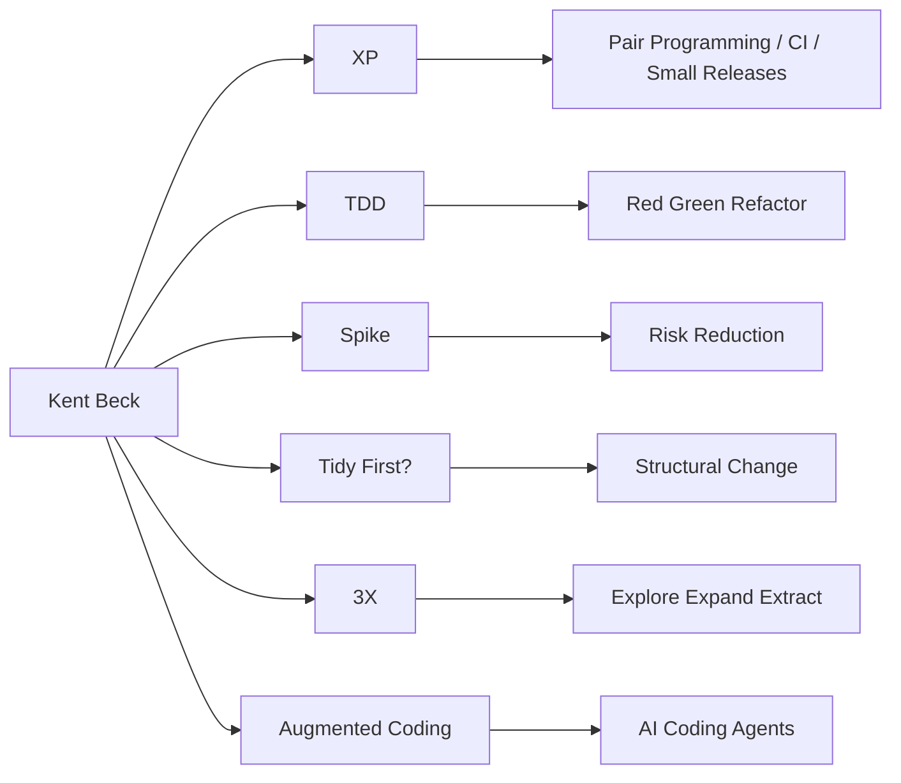

# Kent Beck의 지론들 - 생태계

> [[01-overview|이전: 개요]] | [[README|목차로 돌아가기]] | [[03-references|다음: 참고자료]]

---

## 1. 관련 접근 지도



Beck식 관점은 process framework 하나로 환원되지 않는다. `XP`는 engineering practice와 team culture가 결합된 원류이고, `TDD`, `spike`, `tidying`, `3X`는 불확실성을 다루는 구체적 lens다.

---

## 2. 경쟁/대안 비교

| 접근 | 핵심 관점 | Beck식 관점과의 차이 | 언제 적합 |
|---|---|---|---|
| `XP` | 짧은 feedback, pair programming, TDD, CI, small releases | Beck의 원류. 기술 실천과 팀 문화가 결합됨 | 불확실성 높고 고객 피드백이 빠른 제품 |
| `Scrum` | sprint, role, ceremony, backlog 관리 | process framework에 가깝고 engineering practice는 별도 보완 필요 | 조직 운영 리듬과 우선순위 관리 |
| `Kanban` | flow, WIP limit, lead time | XP보다 개발 기법 처방이 약함 | 운영, 유지보수, continuous delivery |
| `Lean Startup` | build-measure-learn, MVP | product discovery 쪽에 강함. Beck의 spike/Explore와 잘 맞음 | 시장/가설 검증 |
| `TDD/BDD` | 테스트로 behavior 명세 | TDD는 개발자 피드백 루프, BDD는 협업 언어에 더 초점 | 회귀 위험이 큰 코드베이스 |
| `Tidy First?` | 작은 structural change와 경제성 | Clean Code류보다 "언제 정리할 것인가"와 optionality에 초점 | 레거시 개선, AI-generated code 검토 |
| `AI coding agents` | 구현 비용 감소, 자동화 | Beck은 더 많은 실험과 더 많은 주의가 동시에 필요하다고 봄 | spike, prototype, repetitive coding, refactor 보조 |

---

## 3. 선택 기준

| 상황 | 먼저 볼 lens | 이유 |
|------|-------------|------|
| 새 기술을 써야 하는데 risk가 큼 | `Spike` | implementation 전에 모르는 것을 줄여야 함 |
| 코드 변경이 무섭고 회귀가 잦음 | `TDD` | 작은 test feedback loop가 필요함 |
| PR마다 refactor와 기능이 섞임 | `Tidy First?` | structural change와 behavioral change를 분리해야 함 |
| 팀이 회의는 많은데 학습이 느림 | `XP values` | ceremony보다 communication/feedback/simplicity 점검이 중요함 |
| 제품 단계가 자주 바뀜 | `3X` | Explore/Expand/Extract별 metric과 운영 방식이 다름 |
| AI agent 결과물이 커지고 불안정함 | `Augmented Coding` | task breakdown, test-first, review discipline이 필요함 |

---

## 4. Scrum/Kanban과 함께 쓰기

Beck식 practice는 Scrum이나 Kanban을 대체하기보다 보완하는 경우가 많다.

| 운영 방식 | 보완 practice | 예 |
|-----------|---------------|----|
| Scrum sprint | spike ticket, TDD acceptance slice | sprint 초반 uncertainty를 spike로 줄임 |
| Kanban flow | WIP limit + small batch + Tidy First | 작업이 오래 묶이지 않도록 structural change를 작게 분리 |
| Product discovery | Lean Startup + spike | MVP 전에 technical feasibility를 빠르게 확인 |
| Continuous delivery | XP small releases + CI | deploy 가능한 단위로 feedback loop 단축 |

### Ticket 구분 예시

```text
Feature ticket:
  - 사용자에게 보이는 behavior를 바꾼다.
  - acceptance criteria와 regression test가 중요하다.

Spike ticket:
  - 모르는 것을 줄인다.
  - 산출물은 decision log, risk, estimate, runnable proof다.
  - production merge가 목표가 아니다.
```

---

## 5. AI Coding Agents 맥락

AI coding agents는 구현 비용을 낮춘다. 하지만 Beck식 관점에서는 "코드를 더 많이 만들 수 있다"는 사실보다 "더 많은 실험을 더 빨리 할 수 있고, 그만큼 검증과 정리가 중요해진다"는 사실이 핵심이다.

| Agent 사용 방식 | Beck식 운영 원칙 |
|-----------------|------------------|
| 새 API 조사 | `spike`로 timebox와 decision criteria를 먼저 정함 |
| 기능 구현 | test list와 작은 task로 나눔 |
| refactor | behavior-preserving tidy commit부터 요구 |
| 대량 코드 생성 | human review와 rollback 가능한 commit 단위 유지 |
| 실패 분석 | "왜 실패했는가"보다 "feedback loop가 어디서 늦었는가"를 봄 |

---

## 6. 함께 읽을 노트

- [[study/tech/ai/lazy-codex]] - agent에게 맡긴 작업을 검증 완료 상태로 닫는 방식
- [[study/tech/ai/agent-orchestration/cli-agents]] - CLI agent 여러 개를 작은 task로 운영하는 관점
- [[study/tech/ai/model-context-protocol-mcp]] - agent tool integration 자체를 spike 대상으로 삼기 좋음
- [[study/tech/ai/mitchellh-ai-adoption-study]] - AI가 개발 workflow를 바꾸는 단계적 관찰

---

## 다음 단계

> [!tip] 다음으로
> [[03-references|참고자료]]에서 `Canon TDD`, `Tidy First?`, Agile Manifesto, Still Burning podcast를 확인한다.
