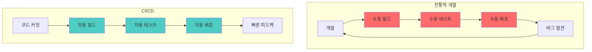
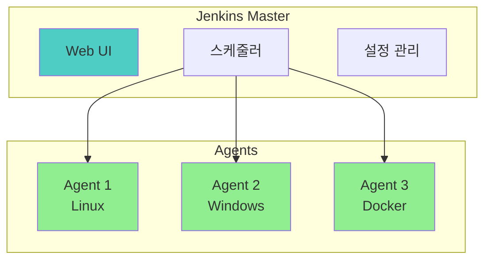
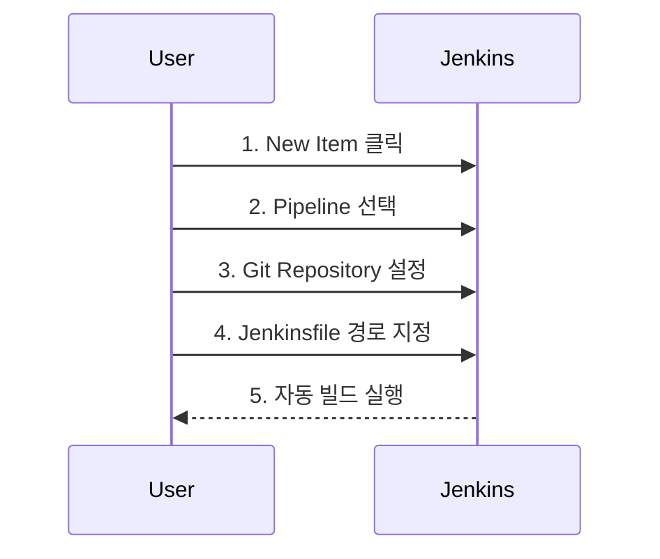

# Jenkins - 기초

> ⬅️ [[README|목차로 돌아가기]] | ➡️ [[02-core|다음: 핵심]]

---

## 1. What - 개념 정의

> **한 줄 정의**: Jenkins는 빌드, 테스트, 배포를 자동화하는 오픈소스 자동화 서버

### Jenkins 특징

| 특징 | 설명 |
|------|------|
| **오픈소스** | 무료, 커뮤니티 지원 |
| **플러그인 생태계** | 1800+ 플러그인 |
| **Pipeline as Code** | Jenkinsfile로 버전 관리 |
| **분산 빌드** | Master-Agent 아키텍처 |

### 핵심 용어

| 용어 | 설명 |
|------|------|
| **Job/Project** | 실행할 작업 단위 |
| **Build** | Job의 단일 실행 인스턴스 |
| **Pipeline** | 빌드-테스트-배포 전체 흐름 |
| **Stage** | 파이프라인의 논리적 단계 |
| **Step** | 단일 실행 명령 |
| **Agent** | 빌드를 실행하는 노드 |
| **Workspace** | 빌드 작업 디렉토리 |

---

## 2. Why - CI/CD가 필요한 이유

### 전통적인 개발 vs CI/CD



### CI/CD 정의

| 용어 | 의미 | 목표 |
|------|------|------|
| **CI** | Continuous Integration | 코드 통합 자동화 |
| **CD** | Continuous Delivery | 릴리스 준비 자동화 |
| **CD** | Continuous Deployment | 프로덕션 배포 자동화 |

---

## 3. 아키텍처

### Master-Agent 구조



### 구성 요소 역할

| 구성 요소 | 역할 |
|----------|------|
| **Master** | UI, 스케줄링, 설정 관리 |
| **Agent** | 실제 빌드 실행 |
| **Executor** | Agent 내 병렬 실행 단위 |

---

## 4. 설치

### Docker 설치 (권장)

```bash
# Jenkins LTS 실행
docker run -d \
  --name jenkins \
  -p 8080:8080 \
  -p 50000:50000 \
  -v jenkins_home:/var/jenkins_home \
  -v /var/run/docker.sock:/var/run/docker.sock \
  jenkins/jenkins:lts

# 초기 비밀번호 확인
docker exec jenkins cat /var/jenkins_home/secrets/initialAdminPassword
```

### Docker Compose

```yaml
version: '3.8'
services:
  jenkins:
    image: jenkins/jenkins:lts
    ports:
      - "8080:8080"
      - "50000:50000"
    volumes:
      - jenkins_home:/var/jenkins_home
      - /var/run/docker.sock:/var/run/docker.sock
    environment:
      - JAVA_OPTS=-Djenkins.install.runSetupWizard=false

volumes:
  jenkins_home:
```

### Kubernetes 설치 (Helm)

```bash
helm repo add jenkins https://charts.jenkins.io
helm install jenkins jenkins/jenkins \
  --set controller.serviceType=LoadBalancer
```

---

## 5. 초기 설정

### 필수 플러그인

| 플러그인 | 용도 |
|---------|------|
| **Pipeline** | Jenkinsfile 지원 |
| **Git** | Git 연동 |
| **Docker Pipeline** | Docker 빌드 |
| **Blue Ocean** | 현대적 UI |
| **Credentials Binding** | 자격 증명 관리 |
| **Kubernetes** | K8s Agent |

### 첫 번째 Job 생성



---

## 6. 간단한 Pipeline 예시

### Hello World

```groovy
pipeline {
    agent any

    stages {
        stage('Hello') {
            steps {
                echo 'Hello, Jenkins!'
            }
        }
    }
}
```

### 실제 빌드 예시

```groovy
pipeline {
    agent any

    stages {
        stage('Checkout') {
            steps {
                git branch: 'main',
                    url: 'https://github.com/user/repo.git'
            }
        }

        stage('Build') {
            steps {
                sh './gradlew build'
            }
        }

        stage('Test') {
            steps {
                sh './gradlew test'
            }
            post {
                always {
                    junit 'build/test-results/**/*.xml'
                }
            }
        }
    }

    post {
        success {
            echo '빌드 성공!'
        }
        failure {
            echo '빌드 실패!'
        }
    }
}
```

---

## 7. 체크리스트

### 이해도 확인

- [ ] CI/CD 개념 설명 가능
- [ ] Jenkins Master-Agent 구조 이해
- [ ] Docker로 Jenkins 설치 가능
- [ ] 간단한 Pipeline 작성 가능
- [ ] 필수 플러그인 5개 이상 알고 있음

---

## 다음 단계

> [!tip] 다음으로
> 기초를 이해했다면 [[02-core|핵심 기능]]에서 Pipeline 문법을 학습하세요.

---

## References

- [Jenkins 공식 문서](https://www.jenkins.io/doc/)
- [Jenkins Pipeline 문법](https://www.jenkins.io/doc/book/pipeline/syntax/)
- [Jenkins Docker Hub](https://hub.docker.com/r/jenkins/jenkins)
