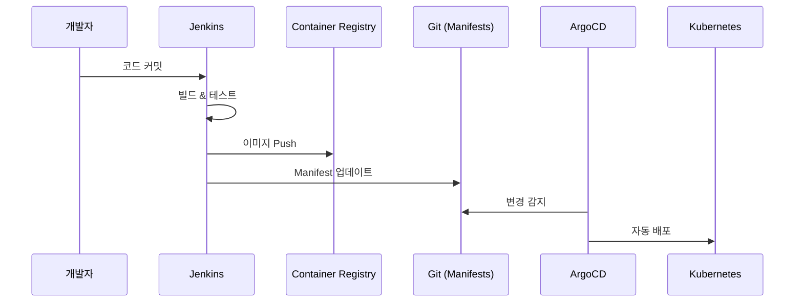

# Jenkins - 실무

> ⬅️ [[02-core|이전: 핵심]] | ➡️ [[04-advanced|다음: 고급]]

---

## 1. 실전 파이프라인

### Spring Boot 프로젝트

```groovy
pipeline {
    agent any

    tools {
        jdk 'JDK-17'
        maven 'Maven-3.9'
    }

    environment {
        DOCKER_REGISTRY = 'registry.example.com'
        IMAGE_NAME = 'myapp'
    }

    stages {
        stage('Checkout') {
            steps {
                checkout scm
            }
        }

        stage('Build') {
            steps {
                sh 'mvn clean package -DskipTests'
            }
        }

        stage('Test') {
            parallel {
                stage('Unit Tests') {
                    steps {
                        sh 'mvn test'
                    }
                    post {
                        always {
                            junit 'target/surefire-reports/*.xml'
                        }
                    }
                }
                stage('Integration Tests') {
                    steps {
                        sh 'mvn verify -Pintegration-test'
                    }
                }
            }
        }

        stage('Code Quality') {
            steps {
                withSonarQubeEnv('SonarQube') {
                    sh 'mvn sonar:sonar'
                }
            }
        }

        stage('Build Image') {
            steps {
                script {
                    def version = readMavenPom().getVersion()
                    docker.build("${DOCKER_REGISTRY}/${IMAGE_NAME}:${version}")
                }
            }
        }

        stage('Push Image') {
            steps {
                script {
                    def version = readMavenPom().getVersion()
                    docker.withRegistry("https://${DOCKER_REGISTRY}", 'docker-creds') {
                        docker.image("${DOCKER_REGISTRY}/${IMAGE_NAME}:${version}").push()
                        docker.image("${DOCKER_REGISTRY}/${IMAGE_NAME}:${version}").push('latest')
                    }
                }
            }
        }

        stage('Deploy to Staging') {
            when {
                branch 'develop'
            }
            steps {
                sh 'kubectl apply -f k8s/staging/'
            }
        }

        stage('Deploy to Production') {
            when {
                branch 'main'
            }
            input {
                message "프로덕션 배포를 승인하시겠습니까?"
                ok "배포"
            }
            steps {
                sh 'kubectl apply -f k8s/production/'
            }
        }
    }

    post {
        success {
            slackSend(color: 'good', message: "✅ ${JOB_NAME} #${BUILD_NUMBER} 성공")
        }
        failure {
            slackSend(color: 'danger', message: "❌ ${JOB_NAME} #${BUILD_NUMBER} 실패")
        }
    }
}
```

---

## 2. Docker 연동

### Dockerfile

```dockerfile
FROM eclipse-temurin:17-jre-alpine
WORKDIR /app
COPY target/*.jar app.jar
EXPOSE 8080
ENTRYPOINT ["java", "-jar", "app.jar"]
```

### Multi-Stage Build

```groovy
stage('Build & Push') {
    agent {
        docker {
            image 'docker:20.10-dind'
            args '-v /var/run/docker.sock:/var/run/docker.sock'
        }
    }
    steps {
        script {
            def image = docker.build(
                "myapp:${BUILD_NUMBER}",
                "--build-arg VERSION=${BUILD_NUMBER} -f Dockerfile ."
            )

            docker.withRegistry('https://ghcr.io', 'github-token') {
                image.push()
                image.push('latest')
            }
        }
    }
}
```

### Docker Compose 테스트

```groovy
stage('Integration Test') {
    steps {
        sh '''
            docker-compose -f docker-compose.test.yml up -d
            sleep 10
            ./run-integration-tests.sh
        '''
    }
    post {
        always {
            sh 'docker-compose -f docker-compose.test.yml down -v'
        }
    }
}
```

---

## 3. Kubernetes 연동

### Kubernetes Agent

```groovy
pipeline {
    agent {
        kubernetes {
            yaml '''
apiVersion: v1
kind: Pod
spec:
  containers:
  - name: maven
    image: maven:3.9-eclipse-temurin-17
    command:
    - sleep
    args:
    - infinity
  - name: docker
    image: docker:20.10-dind
    securityContext:
      privileged: true
  - name: kubectl
    image: bitnami/kubectl:latest
    command:
    - sleep
    args:
    - infinity
'''
        }
    }

    stages {
        stage('Build') {
            steps {
                container('maven') {
                    sh 'mvn clean package'
                }
            }
        }

        stage('Build Image') {
            steps {
                container('docker') {
                    sh 'docker build -t myapp:${BUILD_NUMBER} .'
                }
            }
        }

        stage('Deploy') {
            steps {
                container('kubectl') {
                    sh '''
                        kubectl set image deployment/myapp \
                            myapp=myapp:${BUILD_NUMBER}
                    '''
                }
            }
        }
    }
}
```

### Helm 배포

```groovy
stage('Deploy with Helm') {
    steps {
        container('helm') {
            withCredentials([file(credentialsId: 'kubeconfig', variable: 'KUBECONFIG')]) {
                sh '''
                    helm upgrade --install myapp ./charts/myapp \
                        --namespace production \
                        --set image.tag=${BUILD_NUMBER} \
                        --wait
                '''
            }
        }
    }
}
```

---

## 4. GitOps 패턴

### ArgoCD 연동

```groovy
pipeline {
    agent any

    stages {
        stage('Build & Push Image') {
            steps {
                script {
                    docker.withRegistry('https://ghcr.io', 'github-token') {
                        def image = docker.build("myapp:${BUILD_NUMBER}")
                        image.push()
                    }
                }
            }
        }

        stage('Update Manifest') {
            steps {
                withCredentials([gitUsernamePassword(credentialsId: 'github-pat')]) {
                    sh '''
                        git clone https://github.com/org/k8s-manifests.git
                        cd k8s-manifests

                        # 이미지 태그 업데이트
                        sed -i "s|image: myapp:.*|image: myapp:${BUILD_NUMBER}|" \
                            apps/myapp/deployment.yaml

                        git add .
                        git commit -m "Update myapp to ${BUILD_NUMBER}"
                        git push
                    '''
                }
            }
        }
    }
}
```



---

## 5. 보안 베스트 프랙티스

### Secret 관리

```groovy
// ❌ Bad - 하드코딩
environment {
    DB_PASSWORD = 'secret123'
}

// ✅ Good - Credentials 사용
environment {
    DB_PASSWORD = credentials('db-password')
}

// ✅ Good - withCredentials 블록
withCredentials([
    string(credentialsId: 'api-key', variable: 'API_KEY')
]) {
    sh 'curl -H "Authorization: Bearer $API_KEY" ...'
}
```

### 권한 관리

```groovy
// Role-Based Access Control 플러그인 활용
// Folder 기반 권한 분리
// Pipeline에서 권한 체크

stage('Deploy') {
    when {
        expression {
            currentBuild.rawBuild.getCauses().any {
                it instanceof hudson.model.Cause.UserIdCause &&
                ['admin', 'deploy-team'].contains(it.userId)
            }
        }
    }
    steps {
        sh 'deploy.sh'
    }
}
```

---

## 6. 성능 최적화

### 캐시 활용

```groovy
pipeline {
    agent any

    options {
        // 빌드 이력 제한
        buildDiscarder(logRotator(numToKeepStr: '10'))
    }

    stages {
        stage('Build') {
            steps {
                // Maven 캐시
                configFileProvider([
                    configFile(fileId: 'maven-settings', variable: 'MVN_SETTINGS')
                ]) {
                    sh 'mvn -s $MVN_SETTINGS clean package'
                }
            }
        }
    }
}

// Docker Agent에서 캐시 마운트
agent {
    docker {
        image 'maven:3.9'
        args '-v maven-repo:/root/.m2'
    }
}
```

### 병렬화

```groovy
stage('Multi-Platform Build') {
    parallel {
        stage('Linux AMD64') {
            agent { label 'linux-amd64' }
            steps { sh 'make build-linux-amd64' }
        }
        stage('Linux ARM64') {
            agent { label 'linux-arm64' }
            steps { sh 'make build-linux-arm64' }
        }
        stage('Darwin AMD64') {
            agent { label 'macos' }
            steps { sh 'make build-darwin-amd64' }
        }
    }
}
```

---

## 7. 체크리스트

### 실무 점검

- [ ] 멀티 브랜치 파이프라인 설정
- [ ] Docker 빌드 & 푸시 구현
- [ ] Kubernetes 배포 자동화
- [ ] SonarQube 연동
- [ ] Slack/이메일 알림 설정
- [ ] Credentials 안전하게 관리
- [ ] 빌드 캐시 설정

---

## 다음 단계

> [!tip] 다음으로
> 실무 파이프라인을 익혔다면 [[04-advanced|고급]]에서 다른 CI/CD 도구와 비교해보세요.

---

## References

- [Jenkins + Kubernetes](https://plugins.jenkins.io/kubernetes/)
- [Docker Pipeline Plugin](https://plugins.jenkins.io/docker-workflow/)
- [GitOps with ArgoCD](https://argo-cd.readthedocs.io/)
