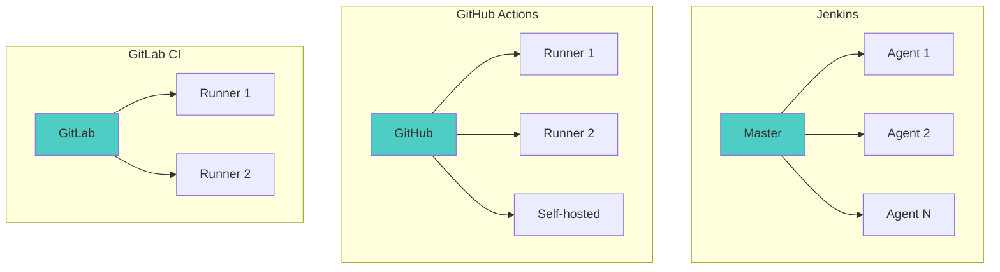
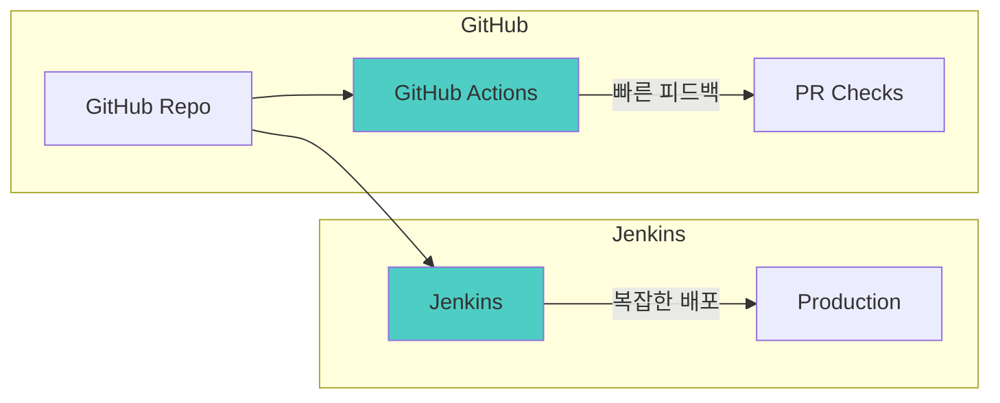

# Jenkins - 고급

> ⬅️ [[03-practice|이전: 실무]] | 🏠 [[README|목차로 돌아가기]]

---

## 1. CI/CD 도구 비교

### 주요 도구 비교표

| 항목 | Jenkins | GitHub Actions | GitLab CI | CircleCI |
|------|---------|---------------|-----------|----------|
| **타입** | Self-hosted | SaaS/Self | SaaS/Self | SaaS |
| **설정** | Jenkinsfile | YAML | .gitlab-ci.yml | YAML |
| **플러그인** | 1800+ | Marketplace | 내장 기능 | Orbs |
| **비용** | 무료 (인프라 비용) | 무료 Tier | 무료 Tier | 무료 Tier |
| **러닝커브** | 높음 | 낮음 | 중간 | 중간 |
| **확장성** | 매우 높음 | 중간 | 높음 | 중간 |

### 아키텍처 비교



---

## 2. GitHub Actions 비교

### 문법 비교

```yaml
# GitHub Actions
name: CI
on: [push, pull_request]

jobs:
  build:
    runs-on: ubuntu-latest
    steps:
      - uses: actions/checkout@v4
      - uses: actions/setup-java@v4
        with:
          java-version: '17'
          distribution: 'temurin'
      - run: mvn clean package
      - run: mvn test
```

```groovy
// Jenkins Pipeline
pipeline {
    agent any
    triggers {
        pollSCM('H/5 * * * *')
    }
    tools {
        jdk 'JDK-17'
    }
    stages {
        stage('Build') {
            steps {
                checkout scm
                sh 'mvn clean package'
            }
        }
        stage('Test') {
            steps {
                sh 'mvn test'
            }
        }
    }
}
```

### 기능 비교

| 기능 | Jenkins | GitHub Actions |
|------|---------|---------------|
| **Matrix Build** | 수동 구현 | 네이티브 지원 |
| **캐시** | 플러그인 필요 | 네이티브 지원 |
| **Secret 관리** | Credentials Plugin | GitHub Secrets |
| **Artifact** | 플러그인 필요 | 네이티브 지원 |
| **재사용** | Shared Library | Reusable Workflows |

### GitHub Actions 장점

```yaml
# Matrix Build - 다중 환경 테스트
jobs:
  test:
    strategy:
      matrix:
        os: [ubuntu-latest, windows-latest, macos-latest]
        java: [11, 17, 21]
    runs-on: ${{ matrix.os }}
    steps:
      - uses: actions/setup-java@v4
        with:
          java-version: ${{ matrix.java }}
      - run: mvn test

# 캐시 - 빌드 속도 향상
      - uses: actions/cache@v4
        with:
          path: ~/.m2
          key: ${{ runner.os }}-maven-${{ hashFiles('**/pom.xml') }}
```

---

## 3. 마이그레이션 전략

### Jenkins → GitHub Actions


### 변환 예시

```groovy
// Jenkins - 원본
pipeline {
    agent { docker { image 'node:18' } }
    environment {
        NPM_TOKEN = credentials('npm-token')
    }
    stages {
        stage('Install') {
            steps {
                sh 'npm ci'
            }
        }
        stage('Build') {
            steps {
                sh 'npm run build'
            }
        }
        stage('Publish') {
            when { branch 'main' }
            steps {
                sh 'npm publish'
            }
        }
    }
}
```

```yaml
# GitHub Actions - 변환 후
name: Build and Publish

on:
  push:
    branches: [main, develop]

jobs:
  build:
    runs-on: ubuntu-latest
    container: node:18

    steps:
      - uses: actions/checkout@v4

      - name: Cache node modules
        uses: actions/cache@v4
        with:
          path: ~/.npm
          key: ${{ runner.os }}-node-${{ hashFiles('**/package-lock.json') }}

      - name: Install
        run: npm ci

      - name: Build
        run: npm run build

      - name: Publish
        if: github.ref == 'refs/heads/main'
        run: npm publish
        env:
          NPM_TOKEN: ${{ secrets.NPM_TOKEN }}
```

### 마이그레이션 체크리스트

| 항목 | Jenkins | GitHub Actions |
|------|---------|---------------|
| Credentials | Jenkins Credentials | GitHub Secrets |
| Agent/Runner | node, docker agent | runs-on, container |
| Triggers | triggers {}, webhooks | on: push, schedule |
| Conditions | when {} | if: |
| Artifacts | archiveArtifacts | actions/upload-artifact |
| Notifications | Slack plugin | slack-action |

---

## 4. 하이브리드 전략

### Jenkins + GitHub Actions



```yaml
# GitHub Actions - PR 검증만
name: PR Check
on: [pull_request]
jobs:
  test:
    runs-on: ubuntu-latest
    steps:
      - uses: actions/checkout@v4
      - run: npm test
```

```groovy
// Jenkins - 배포 전담
pipeline {
    agent any
    triggers {
        GenericTrigger(
            genericVariables: [[key: 'ref', value: '$.ref']],
            causeString: 'GitHub webhook',
            regexpFilterExpression: '^refs/heads/main$',
            regexpFilterText: '$ref'
        )
    }
    stages {
        stage('Deploy') {
            steps {
                // 복잡한 배포 로직
            }
        }
    }
}
```

---

## 5. Jenkins X & CloudBees

### Jenkins X (Kubernetes Native)

```bash
# Jenkins X 설치
jx install

# 프로젝트 생성
jx create quickstart -l go

# 자동 생성된 파이프라인
# - 모든 PR에 Preview Environment
# - GitOps 기반 배포
# - Tekton 파이프라인
```

### CloudBees (Enterprise)

| 기능 | Open Source Jenkins | CloudBees |
|------|---------------------|-----------|
| 지원 | 커뮤니티 | 상용 지원 |
| 보안 | 기본 | 강화 (RBAC++) |
| 분석 | 제한적 | DevOptics |
| HA | 수동 구성 | 내장 |

---

## 6. 모범 사례

### Pipeline 구조화

```groovy
// vars/standardPipeline.groovy
def call(Map config) {
    pipeline {
        agent any

        stages {
            stage('Build') {
                steps {
                    buildStep(config)
                }
            }
            stage('Test') {
                steps {
                    testStep(config)
                }
            }
            stage('Deploy') {
                when { branch 'main' }
                steps {
                    deployStep(config)
                }
            }
        }

        post {
            always { cleanWs() }
            success { notifySuccess() }
            failure { notifyFailure() }
        }
    }
}

// Jenkinsfile (프로젝트)
@Library('shared-lib') _
standardPipeline(
    buildTool: 'maven',
    deployTarget: 'kubernetes'
)
```

### 모니터링

```groovy
// Prometheus 메트릭 수집
options {
    withPrometheusMetrics()
}

// 빌드 시간 추적
stage('Build') {
    steps {
        script {
            def start = System.currentTimeMillis()
            sh 'mvn package'
            def duration = System.currentTimeMillis() - start
            prometheus.gauge('build_duration_ms', duration)
        }
    }
}
```

---

## 7. 미래 전망

### 트렌드

| 트렌드 | 설명 |
|--------|------|
| **GitOps** | Git을 단일 진실 소스로 |
| **Platform Engineering** | 개발자 셀프서비스 플랫폼 |
| **AI-assisted CI** | 테스트 최적화, 장애 예측 |
| **Serverless CI** | 필요시에만 실행 |

### 권장 시나리오

| 상황 | 권장 도구 |
|------|----------|
| GitHub 프로젝트 | GitHub Actions |
| GitLab 프로젝트 | GitLab CI |
| 복잡한 워크플로우 | Jenkins |
| Kubernetes Native | Tekton, ArgoCD |
| 엔터프라이즈 | CloudBees, GitLab Ultimate |

---

## 8. 체크리스트

### 도구 선택 기준

- [ ] 팀 규모와 기술 수준 고려
- [ ] 기존 인프라 호환성 확인
- [ ] 비용 (인프라 + 라이선스) 분석
- [ ] 보안 요구사항 충족 확인
- [ ] 확장성 계획 수립

### 마이그레이션 준비

- [ ] 현재 파이프라인 인벤토리 작성
- [ ] Credentials/Secrets 목록화
- [ ] 플러그인 의존성 분석
- [ ] 병렬 운영 계획 수립
- [ ] 롤백 계획 준비

---

## References

- [GitHub Actions Documentation](https://docs.github.com/actions)
- [GitLab CI Documentation](https://docs.gitlab.com/ee/ci/)
- [Jenkins X](https://jenkins-x.io/)
- [CloudBees](https://www.cloudbees.com/)
- [Tekton Pipelines](https://tekton.dev/)
