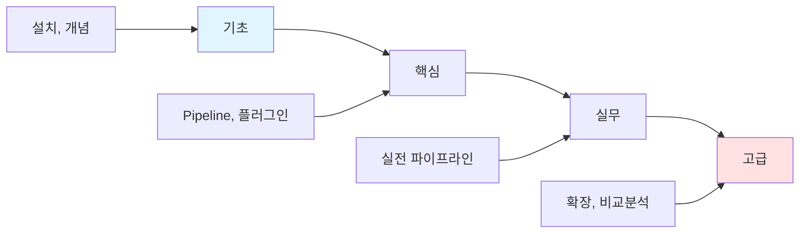
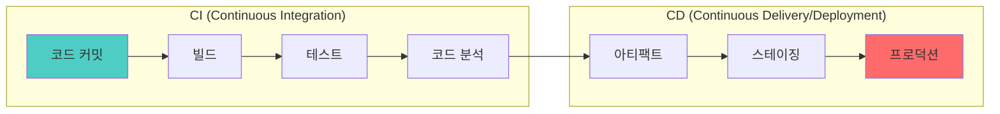

# Jenkins

> **한 줄 정의**: 오픈소스 자동화 서버로, CI/CD 파이프라인 구축의 업계 표준

## 개요



### CI/CD 파이프라인 구조



---

## 학습 경로

### 1단계: 기초 (1시간)
- [ ] [[01-basics|기초 개념]] 읽기
- [ ] Jenkins 설치 및 초기 설정
- [ ] CI/CD 기본 개념 이해

### 2단계: 핵심 (2시간)
- [ ] [[02-core|핵심 기능]] 학습
- [ ] Pipeline 문법 (Declarative vs Scripted)
- [ ] 필수 플러그인

### 3단계: 실무 (2시간)
- [ ] [[03-practice|실무 적용]] 실습
- [ ] 실전 파이프라인 구축
- [ ] Docker, Kubernetes 연동

### 4단계: 고급 (선택)
- [ ] [[04-advanced|심화 학습]]
- [ ] 다른 CI/CD 도구 비교
- [ ] 마이그레이션 전략

---

## 파일 구조

```
jenkins/
├── README.md          ← 여기 (개요 + 로드맵)
├── 01-basics.md       ← 기초 (설치, 개념)
├── 02-core.md         ← 핵심 (Pipeline, 플러그인)
├── 03-practice.md     ← 실무 (실전 파이프라인)
├── 04-advanced.md     ← 고급 (비교분석, 확장)
└── pre/               ← 기존 노트 백업
```

## 바로가기

| 단계 | 파일 | 핵심 내용 |
|------|------|----------|
| 기초 | [[01-basics]] | 설치, CI/CD 개념, 아키텍처 |
| 핵심 | [[02-core]] | Pipeline 문법, 플러그인 |
| 실무 | [[03-practice]] | 실전 파이프라인, Docker 연동 |
| 고급 | [[04-advanced]] | GitHub Actions 비교, 마이그레이션 |

---

## 빠른 시작

### Docker로 Jenkins 실행

```bash
docker run -d \
  --name jenkins \
  -p 8080:8080 \
  -p 50000:50000 \
  -v jenkins_home:/var/jenkins_home \
  jenkins/jenkins:lts
```

### 기본 Pipeline 예시

```groovy
pipeline {
    agent any
    stages {
        stage('Build') {
            steps {
                sh 'mvn clean package'
            }
        }
        stage('Test') {
            steps {
                sh 'mvn test'
            }
        }
        stage('Deploy') {
            steps {
                sh 'kubectl apply -f k8s/'
            }
        }
    }
}
```

---

## 관련 노트

- [[Docker]]
- [[Kubernetes]]
- [[GitOps]]

---

**생성일**: 2025-01-18
**상태**: 학습 중
**예상 학습 시간**: 5-6시간
