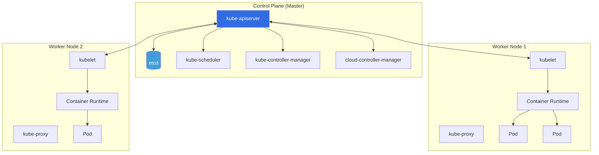
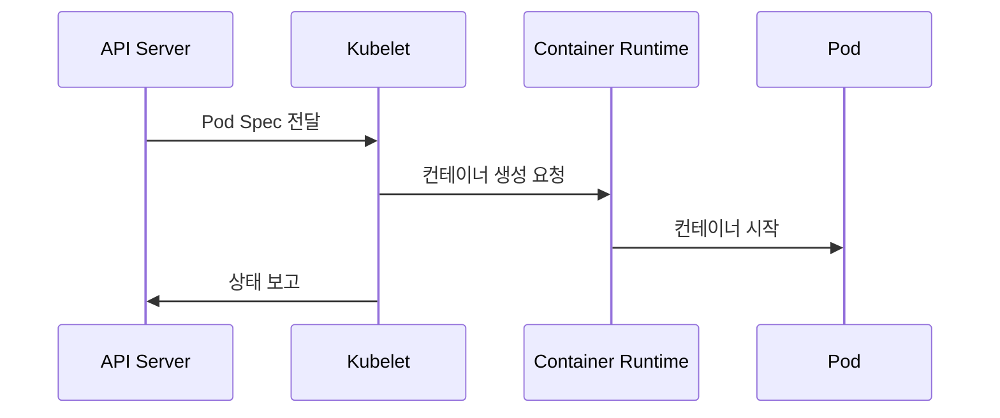
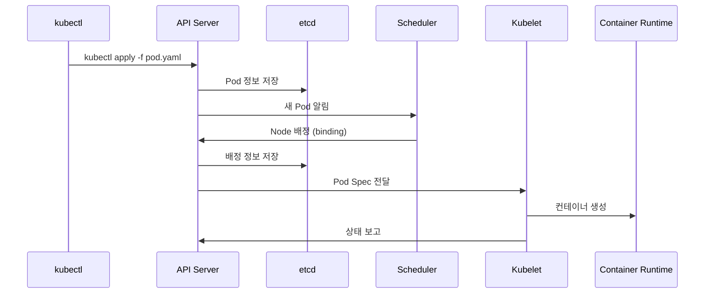

# Kubernetes - 아키텍처

> ⬅️ [[01-basics|이전: 기초]] | [[README|목차]] | ➡️ [[03-practice|다음: 실무]]

---

## 1. 전체 아키텍처

### 클러스터 구조



### 구성 요소 요약

| 구성 요소 | 위치 | 역할 |
|----------|------|------|
| kube-apiserver | Control Plane | 모든 요청의 진입점, 유일한 etcd 통신 |
| etcd | Control Plane | 클러스터 상태 저장소 |
| kube-scheduler | Control Plane | Pod를 어느 Node에 배치할지 결정 |
| kube-controller-manager | Control Plane | 컨트롤러 실행 (Deployment, ReplicaSet 등) |
| kubelet | Worker Node | Pod 생명주기 관리 |
| kube-proxy | Worker Node | 네트워크 규칙 관리 |
| Container Runtime | Worker Node | 컨테이너 실행 (containerd, CRI-O) |

---

## 2. Control Plane 상세

### kube-apiserver

> **모든 요청의 중앙 진입점**

```
kubectl → API Server → etcd
                    → Scheduler
                    → Controller Manager
                    → Kubelet
```

**역할**:
- REST API 제공
- 인증/인가 처리
- etcd와의 유일한 통신 창구
- 요청 검증 및 처리

### etcd

> **분산 키-값 저장소** (클러스터의 두뇌)

**저장 데이터**:
- 모든 클러스터 상태
- Pod, Service, ConfigMap, Secret 정보
- 리소스 버전 정보

**특징**:
- Raft 합의 알고리즘 사용
- 고가용성을 위해 홀수 개 노드 권장 (3, 5, 7)
- 백업 필수!

### kube-scheduler

> **Pod를 어느 Node에 배치할지 결정**

```
새 Pod 생성 요청
       ↓
  Scheduler가 감지
       ↓
  Node 필터링 (리소스, Affinity 등)
       ↓
  점수 계산 (최적 Node 선택)
       ↓
  API Server에 바인딩
```

**고려 요소**:
- 리소스 요청량 (CPU, Memory)
- Node Selector / Affinity
- Taints & Tolerations
- Pod Anti-Affinity

### kube-controller-manager

> **원하는 상태를 유지하는 컨트롤러들의 집합**

```
현재 상태 ≠ 원하는 상태
         ↓
   컨트롤러가 감지
         ↓
   현재 상태 → 원하는 상태로 조정
```

**주요 컨트롤러**:

| 컨트롤러 | 역할 |
|---------|------|
| **Deployment** | ReplicaSet 관리, 롤링 업데이트 |
| **ReplicaSet** | Pod 개수 유지 |
| **Node** | Node 상태 모니터링 |
| **Service Account** | 기본 계정 및 토큰 생성 |
| **Endpoints** | Service-Pod 연결 관리 |

---

## 3. Worker Node 상세

### kubelet

> **Node의 에이전트, Pod 생명주기 관리**



**역할**:
- API Server와 통신
- PodSpec에 따라 컨테이너 실행
- 컨테이너 헬스체크
- Node 상태 보고

### kube-proxy

> **네트워크 규칙 관리**

**동작 모드**:

| 모드 | 설명 |
|------|------|
| **iptables** | 기본값, iptables 규칙으로 트래픽 라우팅 |
| **IPVS** | 대규모 클러스터용, 더 효율적 |
| **userspace** | 구버전, 거의 사용 안 함 |

**Service → Pod 라우팅 예시**:
```
Client → Service IP (ClusterIP)
              ↓
         kube-proxy (iptables)
              ↓
         Pod IP (실제 컨테이너)
```

### Container Runtime

> **컨테이너 실행 엔진**

| 런타임 | 설명 |
|--------|------|
| **containerd** | 가장 많이 사용, Docker에서 분리된 런타임 |
| **CRI-O** | Kubernetes 전용 경량 런타임 |
| **Docker Engine** | K8s 1.24부터 직접 지원 중단 (containerd 사용) |

---

## 4. 통신 흐름

### Pod 생성 흐름



### Service 통신 흐름

```
외부 요청
    ↓
LoadBalancer / Ingress
    ↓
Service (ClusterIP)
    ↓
kube-proxy (iptables/IPVS)
    ↓
Pod (실제 컨테이너)
```

---

## 5. 상태 전이

### Pod Lifecycle

| 상태 | 설명 |
|------|------|
| **Pending** | 스케줄링 대기 또는 이미지 풀 중 |
| **Running** | 최소 1개 컨테이너 실행 중 |
| **Succeeded** | 모든 컨테이너 정상 종료 |
| **Failed** | 최소 1개 컨테이너 실패 종료 |
| **Unknown** | 상태 확인 불가 (Node 통신 실패) |

---

## 📖 다음 단계

> [!tip] 다음으로
> 아키텍처를 이해했다면 [[03-practice|실무 적용]]에서 kubectl로 실습하세요.

---

## References

- [Kubernetes Cluster Architecture](https://kubernetes.io/docs/concepts/architecture/)
- [Kubernetes Architecture Explained](https://devopscube.com/kubernetes-architecture-explained/)
- [Red Hat - K8s Architecture](https://www.redhat.com/en/topics/containers/kubernetes-architecture)
