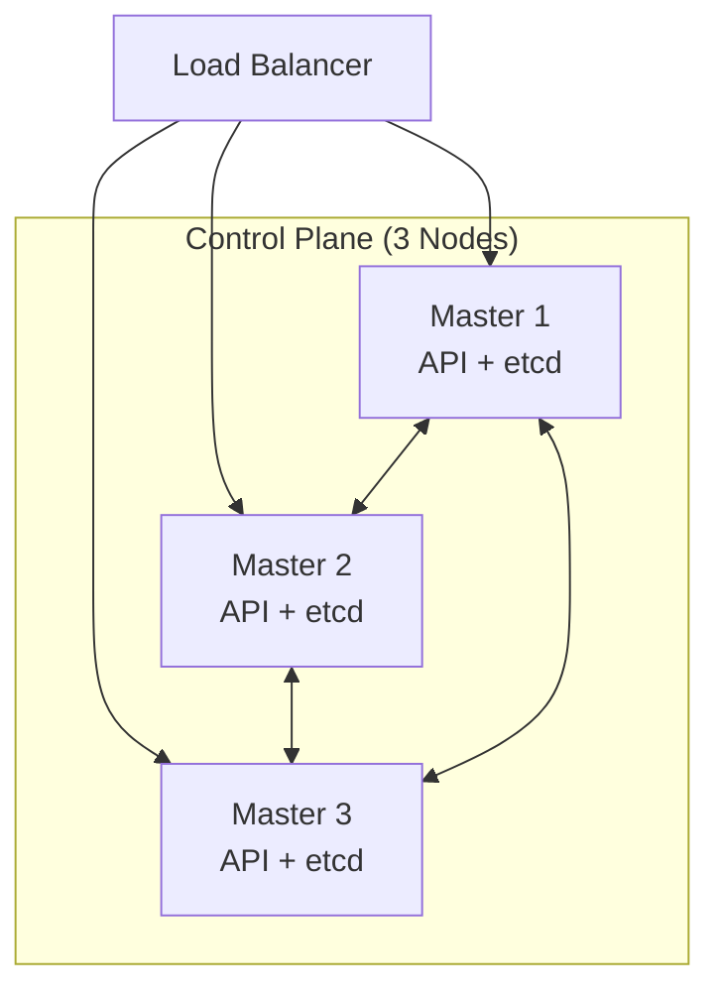

# Kubernetes - 심화

> ⬅️ [[03-practice|이전: 실무]] | [[README|목차]]

---

## 1. 고가용성 (HA)

### Control Plane HA



**핵심 설정**:

| 구성 요소 | HA 요구사항 |
|----------|------------|
| etcd | 3, 5, 7개 (홀수) |
| API Server | Load Balancer 뒤에 배치 |
| Scheduler/CM | Leader Election (자동) |

### 워크로드 HA

```yaml
# Pod Anti-Affinity로 분산 배치
spec:
  affinity:
    podAntiAffinity:
      requiredDuringSchedulingIgnoredDuringExecution:
      - labelSelector:
          matchLabels:
            app: myapp
        topologyKey: kubernetes.io/hostname
```

```yaml
# PodDisruptionBudget
apiVersion: policy/v1
kind: PodDisruptionBudget
metadata:
  name: myapp-pdb
spec:
  minAvailable: 2
  selector:
    matchLabels:
      app: myapp
```

---

## 2. 모니터링

### Prometheus + Grafana

```yaml
# Prometheus Stack (Helm)
helm repo add prometheus-community https://prometheus-community.github.io/helm-charts
helm install prometheus prometheus-community/kube-prometheus-stack
```

### 주요 메트릭

| 메트릭 | 설명 | 경고 기준 |
|--------|------|----------|
| `node_cpu_utilization` | 노드 CPU 사용률 | > 80% |
| `node_memory_utilization` | 노드 메모리 사용률 | > 85% |
| `kube_pod_container_status_restarts_total` | 컨테이너 재시작 횟수 | > 5/hour |
| `kube_deployment_status_replicas_unavailable` | 불가용 Pod 수 | > 0 |

### 알림 설정 (AlertManager)

```yaml
apiVersion: monitoring.coreos.com/v1
kind: PrometheusRule
metadata:
  name: pod-alerts
spec:
  groups:
  - name: pod.rules
    rules:
    - alert: PodCrashLooping
      expr: rate(kube_pod_container_status_restarts_total[15m]) > 0
      for: 5m
      labels:
        severity: warning
      annotations:
        summary: "Pod {{ $labels.pod }} is crash looping"
```

---

## 3. 보안

### RBAC

```yaml
# Role
apiVersion: rbac.authorization.k8s.io/v1
kind: Role
metadata:
  name: pod-reader
  namespace: default
rules:
- apiGroups: [""]
  resources: ["pods"]
  verbs: ["get", "list", "watch"]
---
# RoleBinding
apiVersion: rbac.authorization.k8s.io/v1
kind: RoleBinding
metadata:
  name: read-pods
  namespace: default
subjects:
- kind: ServiceAccount
  name: my-service-account
  namespace: default
roleRef:
  kind: Role
  name: pod-reader
  apiGroup: rbac.authorization.k8s.io
```

### Pod Security

```yaml
spec:
  securityContext:
    runAsNonRoot: true
    runAsUser: 1000
    fsGroup: 2000
  containers:
  - name: myapp
    securityContext:
      allowPrivilegeEscalation: false
      readOnlyRootFilesystem: true
      capabilities:
        drop:
        - ALL
```

### Network Policy

```yaml
apiVersion: networking.k8s.io/v1
kind: NetworkPolicy
metadata:
  name: deny-all
spec:
  podSelector: {}
  policyTypes:
  - Ingress
  - Egress
---
apiVersion: networking.k8s.io/v1
kind: NetworkPolicy
metadata:
  name: allow-frontend
spec:
  podSelector:
    matchLabels:
      app: backend
  ingress:
  - from:
    - podSelector:
        matchLabels:
          app: frontend
```

---

## 4. Helm

### 기본 명령어

```bash
# 차트 검색
helm search repo nginx

# 설치
helm install my-release bitnami/nginx

# 값 커스터마이징
helm install my-release bitnami/nginx -f values.yaml

# 업그레이드
helm upgrade my-release bitnami/nginx

# 삭제
helm uninstall my-release

# 목록
helm list
```

### 차트 생성

```bash
# 차트 생성
helm create myapp

# 구조
myapp/
├── Chart.yaml
├── values.yaml
├── templates/
│   ├── deployment.yaml
│   ├── service.yaml
│   └── _helpers.tpl
```

---

## 5. 비교 분석

### vs 대안 플랫폼

| 항목 | Kubernetes | Docker Swarm | AWS ECS |
|------|------------|--------------|---------|
| 복잡도 | 높음 | 낮음 | 중간 |
| 확장성 | 매우 높음 | 중간 | 높음 |
| 생태계 | 풍부 | 제한적 | AWS 종속 |
| 러닝커브 | 높음 | 낮음 | 중간 |
| 멀티클라우드 | ✅ | ❌ | ❌ |

### 관리형 K8s 비교

| 항목 | EKS (AWS) | GKE (GCP) | AKS (Azure) |
|------|-----------|-----------|-------------|
| Control Plane 비용 | $0.10/hr | 무료 (Autopilot 유료) | 무료 |
| 업그레이드 | 수동 | 자동 옵션 | 자동 옵션 |
| 노드 관리 | EC2 직접 | GCE/Autopilot | VM 직접 |
| 통합 | AWS 서비스 | GCP 서비스 | Azure 서비스 |

---

## 6. 프로덕션 체크리스트

### 인프라

- [ ] Control Plane HA 구성 (3+ 노드)
- [ ] etcd 백업 설정
- [ ] 클러스터 업그레이드 계획

### 워크로드

- [ ] 리소스 requests/limits 설정
- [ ] liveness/readiness Probe 설정
- [ ] PodDisruptionBudget 설정
- [ ] Pod Anti-Affinity 설정

### 보안

- [ ] RBAC 최소 권한 원칙
- [ ] Pod Security 적용
- [ ] Network Policy 적용
- [ ] Secret 관리 (Vault, Sealed Secrets)

### 모니터링

- [ ] Prometheus + Grafana 설치
- [ ] 알림 설정 (Slack, PagerDuty)
- [ ] 로그 수집 (ELK, Loki)

---

## 7. 추가 학습

### 추천 자료

- [ ] [Kubernetes The Hard Way](https://github.com/kelseyhightower/kubernetes-the-hard-way)
- [ ] [CKA 자격증](https://www.cncf.io/certification/cka/)
- [ ] [CKAD 자격증](https://www.cncf.io/certification/ckad/)

### 관련 기술

- [[Helm]]
- [[Istio]] (Service Mesh)
- [[ArgoCD]] (GitOps)
- [[Prometheus]]

---

## 📖 시리즈 완료

> [!success] 축하합니다!
> Kubernetes 시리즈를 완료했습니다.
>
> **복습 권장**:
> - [[01-basics|기초]] - Pod, Service, Deployment
> - [[02-core|아키텍처]] - Control Plane, Worker Node
> - [[03-practice|실무]] - kubectl, YAML 작성

---

## References

- [Kubernetes Production Best Practices](https://learnk8s.io/production-best-practices)
- [Kubernetes Security Best Practices](https://kubernetes.io/docs/concepts/security/)
- [CNCF Landscape](https://landscape.cncf.io/)
