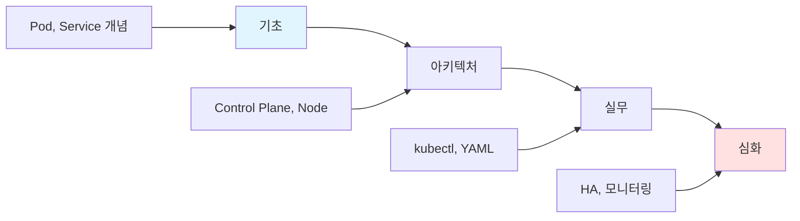
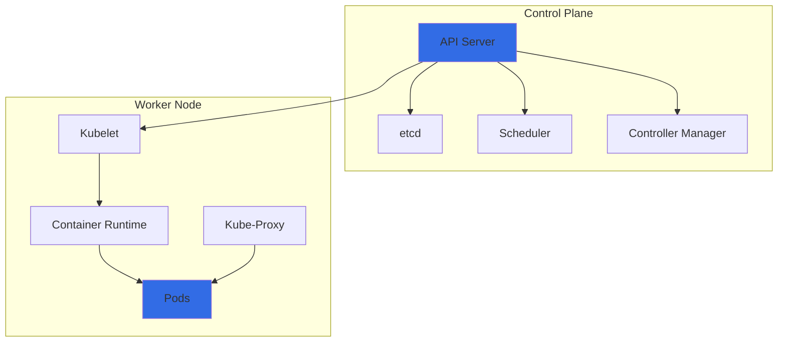

# Kubernetes

> **한 줄 정의**: 컨테이너화된 애플리케이션의 배포, 확장, 관리를 자동화하는 오픈소스 컨테이너 오케스트레이션 플랫폼

## 🎯 개요



### 핵심 구성요소



---

## 📚 학습 경로

### 1단계: 기초 (1시간)
- [ ] [[01-basics|기초 개념]] 읽기
- [ ] Pod, Service, Deployment 이해
- [ ] Kubernetes vs Docker 차이 파악

### 2단계: 아키텍처 (1.5시간)
- [ ] [[02-core|핵심 아키텍처]] 학습
- [ ] Control Plane 구성요소 이해
- [ ] Worker Node 동작 원리

### 3단계: 실무 (2시간)
- [ ] [[03-practice|실무 적용]] 실습
- [ ] kubectl 명령어 익히기
- [ ] YAML 매니페스트 작성

### 4단계: 심화 (선택)
- [ ] [[04-advanced|심화 학습]]
- [ ] 고가용성 구성
- [ ] 모니터링, 보안

---

## 🔗 파일 구조

```
kubernetes/
├── 📄 README.md          ← 여기 (개요 + 로드맵)
├── 📄 01-basics.md       ← 기초 (What/Why, 핵심 개념)
├── 📄 02-core.md         ← 아키텍처 (Control Plane, Node)
├── 📄 03-practice.md     ← 실무 (kubectl, YAML, 배포)
└── 📄 04-advanced.md     ← 심화 (HA, 보안, 모니터링)
```

## 📖 바로가기

| 단계 | 파일 | 핵심 내용 |
|------|------|----------|
| 기초 | [[01-basics]] | Pod, Service, 왜 K8s인가 |
| 아키텍처 | [[02-core]] | Control Plane, Worker Node |
| 실무 | [[03-practice]] | kubectl, YAML, Deployment |
| 심화 | [[04-advanced]] | HA, Helm, 모니터링 |

---

## ⚡ 빠른 시작

```bash
# minikube로 로컬 클러스터 시작
minikube start

# nginx 배포
kubectl create deployment nginx --image=nginx

# 서비스 노출
kubectl expose deployment nginx --port=80 --type=NodePort

# 상태 확인
kubectl get pods,svc
```

---

## 🏷️ 관련 노트

- [[Docker]]
- [[Helm]]
- [[CI-CD]]

---

**생성일**: 2025-01-18
**상태**: 학습 중
**예상 학습 시간**: 5-6시간
