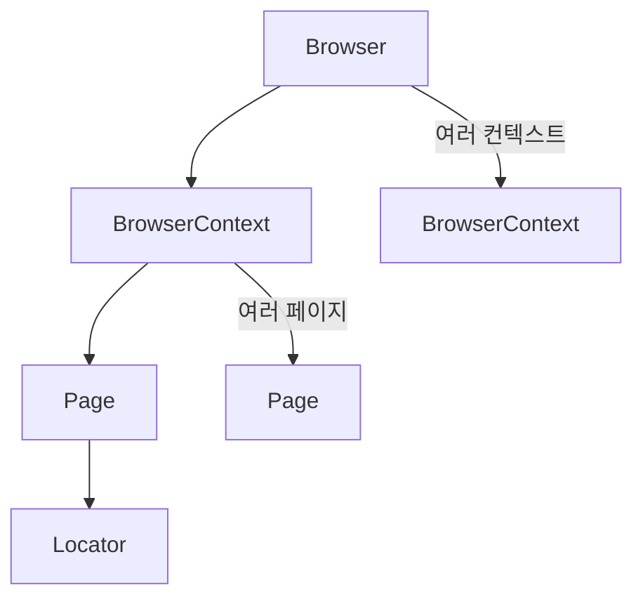

# Playwright - 개요

> [[README|목차로 돌아가기]] | [[02-ecosystem|다음: 생태계]]

---

## 1. What - Playwright란?

> **한 줄 정의**: Microsoft가 개발한 크로스 브라우저 E2E 테스트 및 웹 자동화를 위한 오픈소스 프레임워크

### 핵심 개념

- **E2E 테스트**: 실제 사용자 관점에서 애플리케이션 전체 흐름을 테스트
- **크로스 브라우저**: 하나의 코드로 Chromium, Firefox, WebKit 모두 지원
- **자동 대기(Auto-wait)**: 요소가 준비될 때까지 자동으로 기다림
- **격리된 컨텍스트**: 각 테스트가 독립적인 브라우저 컨텍스트에서 실행

### 핵심 API 구조



| 구성 요소          | 설명                                    |
| -------------- | ------------------------------------- |
| Browser        | 브라우저 인스턴스 (Chromium, Firefox, WebKit) |
| BrowserContext | 독립된 브라우저 세션 (쿠키, 스토리지 격리)             |
| Page           | 단일 탭/페이지                              |
| Locator        | 페이지 내 요소를 찾고 조작하는 핸들                  |

### 주요 용어

| 용어 | 설명 |
|------|------|
| Locator | 페이지 요소를 선택하는 추상화 객체 |
| Auto-wait | 액션 수행 전 요소가 actionable 상태가 될 때까지 자동 대기 |
| Trace | 테스트 실행 과정을 기록한 디버깅용 파일 |
| Codegen | 브라우저 조작을 녹화해 코드를 자동 생성하는 도구 |
| Fixture | 테스트에 필요한 환경/데이터를 제공하는 메커니즘 |

---

## 2. Why - 왜 Playwright인가?

### 해결하려는 문제

- 불안정한 테스트 (Flaky Tests): 타이밍 이슈로 인한 랜덤 실패
- 크로스 브라우저 호환성: 브라우저별로 다른 테스트 코드 필요
- 느린 테스트 실행: 순차 실행으로 인한 긴 테스트 시간
- 복잡한 설정: 브라우저 드라이버 관리의 어려움

### 기존 방식의 한계

| 문제      | Selenium    | Playwright        |
| ------- | ----------- | ----------------- |
| 대기 처리   | 명시적 wait 필요 | 자동 대기 (Auto-wait) |
| 브라우저 설정 | 드라이버 별도 관리  | 내장 브라우저 번들        |
| 병렬 실행   | 별도 설정 필요    | 기본 지원             |
| 네트워크 제어 | 제한적         | 강력한 네트워크 가로채기     |

---

## 3. 핵심 특징

### 장점

- **자동 대기 (Auto-wait)**: `click()`, `fill()` 등 모든 액션에서 요소가 준비될 때까지 자동 대기
- **크로스 브라우저**: Chromium, Firefox, WebKit 모두 동일 API로 지원
- **병렬 실행**: Worker 기반 병렬 테스트로 빠른 실행
- **네트워크 가로채기**: API 모킹, 요청 수정이 쉬움
- **강력한 디버깅**: UI 모드, Trace Viewer, Codegen 제공
- **다중 언어 지원**: TypeScript, JavaScript, Python, Java, C#
- **모바일 에뮬레이션**: 모바일 뷰포트, 터치 이벤트 에뮬레이션
- **격리된 테스트**: BrowserContext로 완전한 테스트 격리

### 단점

- **학습 곡선**: 새로운 Locator 개념 학습 필요
- **리소스 사용**: 실제 브라우저 실행으로 메모리 사용량 높음
- **레거시 브라우저**: IE 미지원 (IE는 공식 지원 종료됨)
- **상대적으로 신생**: Selenium 대비 짧은 역사 (생태계는 빠르게 성장 중)

---

## 4. 사용 사례

### 적합한 경우

```
새 프로젝트?
├── Yes → Playwright 추천
└── No  → 기존 테스트 프레임워크?
          ├── 없음 → Playwright 도입 검토
          └── Selenium/Cypress → 마이그레이션 ROI 검토
```

- **E2E 테스트 자동화**: 로그인, 결제 등 핵심 사용자 플로우 테스트
- **회귀 테스트**: 배포 전 주요 기능 검증
- **크로스 브라우저 테스트**: Safari(WebKit) 포함 모든 브라우저 테스트
- **시각적 회귀 테스트**: 스크린샷 비교로 UI 변경 감지
- **API 테스트**: 네트워크 가로채기로 API 응답 검증
- **웹 스크래핑**: 동적 콘텐츠 수집

### 대표적인 사용 기업

- Microsoft (개발사)
- Adobe
- Disney+
- VS Code Web

---

## 5. 지원 환경

### 브라우저

| 브라우저 | 엔진 | 비고 |
|----------|------|------|
| Chrome | Chromium | Edge도 동일 엔진 |
| Firefox | Gecko | |
| Safari | WebKit | macOS/iOS Safari 테스트 가능 |

### 언어별 지원

| 언어 | 패키지 | 비고 |
|------|--------|------|
| TypeScript/JavaScript | `@playwright/test` | 공식 추천 |
| Python | `playwright` | pip 설치 |
| Java | `playwright` | Maven/Gradle |
| C# | `Microsoft.Playwright` | NuGet |

### 플랫폼

- Windows, macOS, Linux
- Docker 지원 (공식 이미지 제공)
- CI/CD 통합 (GitHub Actions, Jenkins 등)

---

## 다음 단계

> [!tip] 다음으로
> Playwright의 개념을 이해했다면 [[02-ecosystem|생태계]]에서 관련 도구들을 살펴보세요.

---

## References

- [Playwright 공식 문서](https://playwright.dev)
- [GitHub - microsoft/playwright](https://github.com/microsoft/playwright)
- [Playwright vs Cypress vs Selenium 비교](https://playwright.dev/docs/test-components)
