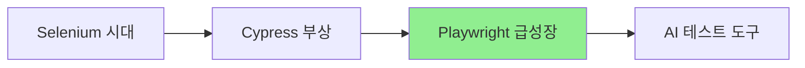

# Playwright - 생태계

> [[01-overview|이전: 개요]] | [[README|목차]] | [[03-references|다음: 참고 자료]]

---

## 1. 관련 도구 및 라이브러리

### Playwright 공식 도구

| 도구 | 설명 | 용도 |
|------|------|------|
| Playwright Test | 테스트 러너 | E2E 테스트 실행 |
| Codegen | 코드 생성기 | 브라우저 조작 녹화 -> 코드 |
| Trace Viewer | 디버깅 도구 | 테스트 실행 과정 시각화 |
| UI Mode | 대화형 테스트 | 실시간 테스트 디버깅 |
| VS Code Extension | IDE 플러그인 | 테스트 작성/실행 통합 |

### 보조 도구

| 도구 | 용도 |
|------|------|
| `playwright-lighthouse` | Lighthouse 성능 테스트 통합 |
| `playwright-axe` | 접근성(a11y) 테스트 |
| `allure-playwright` | Allure 리포트 생성 |
| `playwright-bdd` | BDD(Cucumber) 스타일 테스트 |

---

## 2. 경쟁 도구 비교

### Playwright vs Cypress vs Selenium

| 비교 항목 | Playwright | Cypress | Selenium |
|-----------|------------|---------|----------|
| **개발사** | Microsoft | Cypress.io | SeleniumHQ |
| **출시년도** | 2020 | 2017 | 2004 |
| **아키텍처** | CDP/WebSocket | 브라우저 내 실행 | WebDriver |
| **지원 언어** | TS, JS, Python, Java, C# | JavaScript/TypeScript | 모든 주요 언어 |
| **크로스 브라우저** | Chromium, Firefox, WebKit | Chromium, Firefox, WebKit | 모든 브라우저 |
| **병렬 실행** | 기본 지원 | 유료 (Dashboard) | 별도 설정 필요 |
| **자동 대기** | 기본 지원 | 기본 지원 | 명시적 wait 필요 |
| **네트워크 모킹** | 강력함 | 강력함 | 제한적 |
| **모바일 테스트** | 에뮬레이션 | 에뮬레이션 | Appium 연동 |
| **학습 곡선** | 중간 | 낮음 | 높음 |
| **커뮤니티** | 빠르게 성장 | 활발 | 가장 큼 |

### 선택 가이드

```
어떤 테스트 도구가 필요한가?

새 프로젝트 시작?
├── Yes → 언어 제약?
│         ├── JavaScript/TypeScript만 → Cypress 또는 Playwright
│         └── 다중 언어 필요 → Playwright
└── No  → 기존 Selenium 테스트 있음?
          ├── 마이그레이션 가능 → Playwright 검토
          └── 유지보수만 → Selenium 유지

크로스 브라우저 중요?
├── Safari(WebKit) 필수 → Playwright
└── Chrome 위주 → Cypress 가능

CI/CD 비용 고려?
├── 오픈소스로 해결 → Playwright (병렬 실행 무료)
└── 예산 있음 → Cypress Dashboard 검토
```

### 상세 비교

#### Playwright 선택 이유

- Safari/WebKit 테스트 필요
- 다중 언어(Python, Java 등) 지원 필요
- 무료 병렬 테스트 실행
- API 테스트와 E2E 테스트 통합
- 네트워크 가로채기 필요

#### Cypress 선택 이유

- JavaScript 생태계에 집중
- 초보자 친화적인 DX
- 실시간 리로드와 Time Travel 디버깅
- 풍부한 플러그인 생태계

#### Selenium 선택 이유

- 레거시 시스템 통합
- 다양한 프로그래밍 언어 지원
- 기존 Selenium 전문성 활용
- 오래된 브라우저 지원 필요

---

## 3. 테스트 도구 트렌드

### 2024-2025 E2E 테스트 트렌드



| 트렌드 | 설명 |
|--------|------|
| **Playwright 급성장** | GitHub Stars 급증, npm 다운로드 증가 |
| **컴포넌트 테스트** | Playwright/Cypress의 컴포넌트 테스트 지원 |
| **AI 통합** | Copilot/AI 기반 테스트 코드 생성 |
| **시각적 테스트** | Percy, Chromatic 등 시각적 회귀 테스트 |
| **API + E2E 통합** | 단일 도구로 API와 E2E 테스트 |

### npm 다운로드 추이 (참고)

| 패키지 | 주간 다운로드 (대략적 추이) |
|--------|---------------------------|
| `@playwright/test` | 꾸준히 증가 |
| `cypress` | 안정적 유지 |
| `selenium-webdriver` | 점진적 감소 |

---

## 4. Playwright 생태계 구성

### 공식 패키지

```
@playwright/test       ← 테스트 러너 (권장)
playwright             ← 코어 라이브러리
playwright-core        ← 브라우저 번들 없는 코어
```

### VS Code 통합

[Playwright Test for VS Code](https://marketplace.visualstudio.com/items?itemName=ms-playwright.playwright) 확장:

- 테스트 탐색기에서 테스트 실행
- 클릭으로 Locator 선택
- 디버깅 통합
- Codegen 통합

### CI/CD 통합

| CI 플랫폼 | 지원 방식 |
|-----------|----------|
| GitHub Actions | 공식 예제 제공 |
| GitLab CI | Docker 이미지 활용 |
| Jenkins | Node.js 환경에서 실행 |
| CircleCI | 공식 예제 제공 |
| Azure DevOps | Microsoft 지원 |

### Docker 이미지

```bash
# 공식 Playwright Docker 이미지
docker pull mcr.microsoft.com/playwright:v1.40.0-jammy

# CI에서 사용
docker run -it --rm \
  -v $(pwd):/work \
  -w /work \
  mcr.microsoft.com/playwright:v1.40.0-jammy \
  npx playwright test
```

---

## 5. 관련 기술 스택

### 프론트엔드 프레임워크 통합

| 프레임워크 | 통합 방식 |
|------------|----------|
| React | 컴포넌트 테스트 지원 |
| Vue | 컴포넌트 테스트 지원 |
| Svelte | 컴포넌트 테스트 지원 |
| Next.js | E2E 테스트 예제 제공 |

### 테스트 피라미드에서의 위치

```
        /\
       /  \     E2E (Playwright)
      /----\
     /      \   Integration
    /--------\
   /          \  Unit (Jest, Vitest)
  /____________\
```

| 테스트 종류 | 도구 예시 | Playwright 역할 |
|-------------|-----------|-----------------|
| Unit | Jest, Vitest | - |
| Integration | Testing Library | - |
| E2E | Playwright | 주요 역할 |
| Visual | Playwright + Percy | 스크린샷 비교 |

---

## 다음 단계

> [!tip] 다음으로
> 생태계를 파악했다면 [[03-references|참고 자료]]에서 학습 리소스를 확인하세요.

---

## References

- [Playwright 공식 문서](https://playwright.dev)
- [State of JS - Testing](https://stateofjs.com)
- [npm trends: playwright vs cypress](https://npmtrends.com/playwright-vs-cypress)
