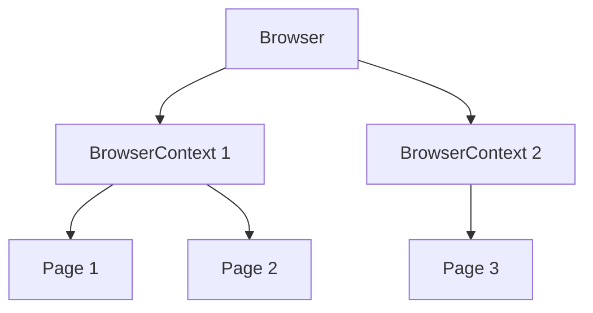

# Playwright - 페이지 조작

> [[../03-references|이전: 참고 자료]] | [[../README|목차]] | [[02-locators|다음: Locator]]

---

## 1. 기본 구조

### Browser, Context, Page 관계



| 구성 요소 | 설명 | 비유 |
|----------|------|------|
| Browser | 브라우저 인스턴스 | Chrome 앱 |
| BrowserContext | 독립된 세션 (쿠키/스토리지 격리) | 시크릿 창 |
| Page | 개별 탭 | 브라우저 탭 |

### Playwright Test에서는 자동 관리

```typescript
import { test, expect } from '@playwright/test';

test('기본 테스트', async ({ page }) => {
  // page는 자동으로 제공됨 (fixture)
  // 테스트마다 새로운 context와 page 생성
  await page.goto('https://example.com');
});
```

---

## 2. 페이지 이동

### 기본 이동

```typescript
// URL로 이동
await page.goto('https://example.com');

// 옵션과 함께 이동
await page.goto('https://example.com', {
  waitUntil: 'networkidle', // 네트워크 요청이 없을 때까지 대기
  timeout: 30000            // 30초 타임아웃
});

// 상대 경로 (baseURL 설정 시)
await page.goto('/login');
```

### waitUntil 옵션

| 옵션 | 설명 | 사용 시점 |
|------|------|----------|
| `'load'` | load 이벤트 발생 (기본값) | 일반적인 경우 |
| `'domcontentloaded'` | DOMContentLoaded 이벤트 | 빠른 확인 필요 시 |
| `'networkidle'` | 500ms 동안 네트워크 요청 없음 | SPA, 동적 콘텐츠 |
| `'commit'` | 네비게이션 시작 | 가장 빠름 |

### 뒤로/앞으로 가기

```typescript
// 뒤로 가기
await page.goBack();

// 앞으로 가기
await page.goForward();

// 새로고침
await page.reload();
```

---

## 3. 기본 액션

### 클릭

```typescript
// 기본 클릭
await page.click('button');

// Locator 사용 (권장)
await page.locator('button').click();

// 더블 클릭
await page.dblclick('button');

// 우클릭
await page.click('button', { button: 'right' });

// 클릭 옵션
await page.locator('button').click({
  modifiers: ['Shift'],  // Shift + 클릭
  position: { x: 10, y: 20 }, // 특정 위치 클릭
  force: true,  // actionability 검사 스킵 (권장하지 않음)
});
```

### 입력

```typescript
// 텍스트 입력 (기존 내용 지우고 입력)
await page.fill('input[name="email"]', 'test@example.com');

// Locator 사용 (권장)
await page.locator('input[name="email"]').fill('test@example.com');

// 한 글자씩 타이핑 (타이핑 시뮬레이션)
await page.locator('input').pressSequentially('Hello', { delay: 100 });

// 입력 필드 지우기
await page.locator('input').clear();
```

### 선택 (Select, Checkbox, Radio)

```typescript
// 드롭다운 선택
await page.selectOption('select#country', 'korea');
await page.selectOption('select#country', { label: '대한민국' });
await page.selectOption('select#country', { index: 2 });

// 다중 선택
await page.selectOption('select#colors', ['red', 'blue']);

// 체크박스
await page.locator('input[type="checkbox"]').check();
await page.locator('input[type="checkbox"]').uncheck();

// 라디오 버튼
await page.locator('input[value="option1"]').check();
```

### 파일 업로드

```typescript
// 단일 파일
await page.setInputFiles('input[type="file"]', 'path/to/file.pdf');

// 다중 파일
await page.setInputFiles('input[type="file"]', [
  'path/to/file1.pdf',
  'path/to/file2.pdf'
]);

// 파일 제거
await page.setInputFiles('input[type="file"]', []);
```

---

## 4. 대기 (Waiting)

### 자동 대기 (Auto-wait)

Playwright는 대부분의 액션에서 자동으로 대기합니다:

```typescript
// click()은 자동으로 다음을 기다림:
// - 요소가 DOM에 존재
// - 요소가 visible
// - 요소가 stable (애니메이션 완료)
// - 요소가 enabled
// - 요소가 다른 요소에 가려지지 않음
await page.locator('button').click();
```

### 명시적 대기

```typescript
// 특정 시간 대기 (권장하지 않음)
await page.waitForTimeout(1000);

// 요소 대기
await page.waitForSelector('div.loaded');

// Locator로 대기 (권장)
await page.locator('div.loaded').waitFor();
await page.locator('div.loaded').waitFor({ state: 'visible' });
await page.locator('div.loaded').waitFor({ state: 'hidden' });

// 네비게이션 대기
await page.waitForURL('**/dashboard');

// 네트워크 요청 대기
await page.waitForResponse('**/api/users');

// 로드 상태 대기
await page.waitForLoadState('networkidle');
```

### 대기 상태 옵션

| 상태 | 설명 |
|------|------|
| `'attached'` | DOM에 존재 |
| `'detached'` | DOM에서 제거됨 |
| `'visible'` | 화면에 보임 |
| `'hidden'` | 숨겨짐 또는 DOM에서 제거됨 |

---

## 5. 정보 추출

### 텍스트/속성 가져오기

```typescript
// 텍스트 콘텐츠
const text = await page.locator('h1').textContent();
const innerText = await page.locator('h1').innerText();

// 속성 값
const href = await page.locator('a').getAttribute('href');

// 입력 필드 값
const value = await page.locator('input').inputValue();

// 여러 요소의 텍스트
const texts = await page.locator('li').allTextContents();

// 요소 개수
const count = await page.locator('li').count();
```

### 요소 상태 확인

```typescript
// 가시성
const isVisible = await page.locator('button').isVisible();

// 활성화 상태
const isEnabled = await page.locator('button').isEnabled();

// 체크 상태
const isChecked = await page.locator('input[type="checkbox"]').isChecked();

// 숨김 상태
const isHidden = await page.locator('div').isHidden();
```

---

## 6. 스크린샷 및 PDF

### 스크린샷

```typescript
// 페이지 전체
await page.screenshot({ path: 'screenshot.png' });

// 전체 페이지 (스크롤 포함)
await page.screenshot({ path: 'full.png', fullPage: true });

// 특정 요소만
await page.locator('div.chart').screenshot({ path: 'chart.png' });

// Base64로 반환
const buffer = await page.screenshot();
```

### PDF 생성 (Chromium만)

```typescript
await page.pdf({
  path: 'page.pdf',
  format: 'A4',
  margin: { top: '1cm', bottom: '1cm' }
});
```

---

## 7. 키보드/마우스

### 키보드

```typescript
// 단일 키
await page.keyboard.press('Enter');
await page.keyboard.press('Tab');

// 조합 키
await page.keyboard.press('Control+C');
await page.keyboard.press('Meta+A'); // macOS Command

// 타이핑
await page.keyboard.type('Hello World');

// 키 누름/해제
await page.keyboard.down('Shift');
await page.keyboard.press('ArrowLeft');
await page.keyboard.up('Shift');
```

### 마우스

```typescript
// 이동
await page.mouse.move(100, 200);

// 클릭
await page.mouse.click(100, 200);

// 드래그
await page.mouse.move(0, 0);
await page.mouse.down();
await page.mouse.move(100, 100);
await page.mouse.up();

// 휠 스크롤
await page.mouse.wheel(0, 500);
```

---

## 8. 프레임과 팝업

### iframe 처리

```typescript
// 프레임 가져오기
const frame = page.frameLocator('iframe[name="editor"]');
await frame.locator('button').click();

// 또는
const frame = page.frame({ name: 'editor' });
await frame?.locator('button').click();
```

### 팝업/새 탭 처리

```typescript
// 새 탭 대기
const [newPage] = await Promise.all([
  page.waitForEvent('popup'),
  page.click('a[target="_blank"]')
]);
await newPage.waitForLoadState();
console.log(await newPage.title());
```

---

## 9. 실전 예제

### 로그인 흐름

```typescript
import { test, expect } from '@playwright/test';

test('로그인 테스트', async ({ page }) => {
  // 1. 로그인 페이지로 이동
  await page.goto('/login');

  // 2. 이메일/비밀번호 입력
  await page.locator('input[name="email"]').fill('user@example.com');
  await page.locator('input[name="password"]').fill('password123');

  // 3. 로그인 버튼 클릭
  await page.locator('button[type="submit"]').click();

  // 4. 대시보드로 이동 확인
  await expect(page).toHaveURL(/.*dashboard/);

  // 5. 환영 메시지 확인
  await expect(page.locator('h1')).toContainText('환영합니다');
});
```

### 폼 제출

```typescript
test('회원가입 폼 제출', async ({ page }) => {
  await page.goto('/signup');

  // 폼 입력
  await page.locator('#username').fill('newuser');
  await page.locator('#email').fill('new@example.com');
  await page.locator('#password').fill('SecurePass123!');
  await page.locator('#confirm-password').fill('SecurePass123!');

  // 약관 동의
  await page.locator('input[name="terms"]').check();

  // 제출
  await page.locator('button[type="submit"]').click();

  // 성공 확인
  await expect(page.locator('.success-message')).toBeVisible();
});
```

---

## 다음 단계

> [!tip] 다음으로
> 페이지 조작을 익혔다면 [[02-locators|Locator 전략]]에서 요소 선택 방법을 자세히 배워보세요.

---

## References

- [Playwright - Page](https://playwright.dev/docs/api/class-page)
- [Playwright - Actions](https://playwright.dev/docs/input)
- [Playwright - Auto-waiting](https://playwright.dev/docs/actionability)
