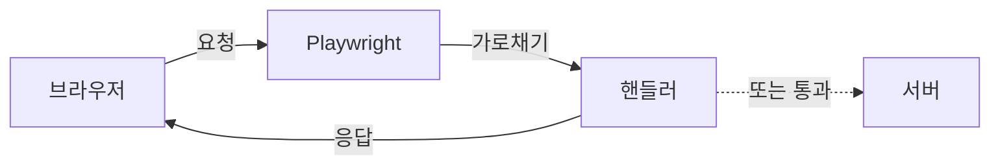

# Playwright - 네트워크 가로채기

> [[03-assertions|이전: Assertions]] | [[../README|목차]] | [[05-config|다음: 설정]]

---

## 1. 네트워크 가로채기 개요

### 용도

- **API 모킹**: 백엔드 없이 프론트엔드 테스트
- **테스트 데이터 제어**: 일관된 테스트 데이터 제공
- **에러 시뮬레이션**: 네트워크 오류, 타임아웃 테스트
- **요청 검증**: API 호출 파라미터 확인
- **성능 테스트**: 네트워크 조건 시뮬레이션

### 기본 구조



---

## 2. Route를 이용한 가로채기

### 기본 사용법

```typescript
import { test, expect } from '@playwright/test';

test('API 모킹', async ({ page }) => {
  // 라우트 설정
  await page.route('**/api/users', async route => {
    await route.fulfill({
      status: 200,
      contentType: 'application/json',
      body: JSON.stringify([
        { id: 1, name: '홍길동' },
        { id: 2, name: '김철수' }
      ])
    });
  });

  await page.goto('/users');

  // 모킹된 데이터가 표시되는지 확인
  await expect(page.locator('.user')).toHaveCount(2);
});
```

### URL 패턴 매칭

```typescript
// 글로브 패턴
await page.route('**/api/**', handler);         // 모든 API 경로
await page.route('**/api/users/*', handler);    // /api/users/1, /api/users/2 등
await page.route('**/*.{png,jpg}', handler);    // 모든 이미지

// 정규식
await page.route(/\/api\/users\/\d+/, handler); // /api/users/123 형태

// 함수 (가장 유연)
await page.route(
  url => url.pathname.startsWith('/api/'),
  handler
);
```

### route.fulfill() - 응답 생성

```typescript
await page.route('**/api/data', async route => {
  await route.fulfill({
    status: 200,
    contentType: 'application/json',
    body: JSON.stringify({ success: true }),
    headers: {
      'X-Custom-Header': 'value'
    }
  });
});

// 파일에서 응답 로드
await page.route('**/api/data', async route => {
  await route.fulfill({
    path: 'tests/mocks/data.json'
  });
});
```

### route.continue() - 요청 수정 후 전달

```typescript
await page.route('**/api/**', async route => {
  // 헤더 추가
  await route.continue({
    headers: {
      ...route.request().headers(),
      'Authorization': 'Bearer test-token'
    }
  });
});

// URL 변경
await page.route('**/api/v1/**', async route => {
  const url = route.request().url().replace('/v1/', '/v2/');
  await route.continue({ url });
});

// 메서드 변경
await page.route('**/api/users', async route => {
  if (route.request().method() === 'GET') {
    await route.continue({ method: 'POST' });
  } else {
    await route.continue();
  }
});
```

### route.abort() - 요청 차단

```typescript
// 이미지 차단 (성능 테스트용)
await page.route('**/*.{png,jpg,jpeg,gif}', route => route.abort());

// 분석 요청 차단
await page.route('**/analytics/**', route => route.abort());

// 특정 에러 코드로 차단
await page.route('**/api/fail', async route => {
  await route.abort('failed'); // 네트워크 에러
});
```

### abort 에러 타입

| 에러 | 설명 |
|------|------|
| `'aborted'` | 요청 중단 |
| `'accessdenied'` | 접근 거부 |
| `'addressunreachable'` | 주소 도달 불가 |
| `'blockedbyclient'` | 클라이언트에서 차단 |
| `'connectionaborted'` | 연결 중단 |
| `'connectionclosed'` | 연결 종료 |
| `'connectionfailed'` | 연결 실패 |
| `'connectionrefused'` | 연결 거부 |
| `'timedout'` | 타임아웃 |

---

## 3. 요청/응답 대기 및 검증

### waitForRequest

```typescript
// 요청 대기
const requestPromise = page.waitForRequest('**/api/users');
await page.getByRole('button', { name: '사용자 목록' }).click();
const request = await requestPromise;

// 요청 검증
expect(request.method()).toBe('GET');
expect(request.headers()['authorization']).toBeTruthy();
```

### waitForResponse

```typescript
// 응답 대기
const responsePromise = page.waitForResponse('**/api/users');
await page.getByRole('button', { name: '저장' }).click();
const response = await responsePromise;

// 응답 검증
expect(response.status()).toBe(200);
const data = await response.json();
expect(data.success).toBe(true);
```

### 조건부 대기

```typescript
// 특정 조건의 응답 대기
const response = await page.waitForResponse(
  response =>
    response.url().includes('/api/users') &&
    response.status() === 200
);

// POST 요청만 대기
const request = await page.waitForRequest(
  request =>
    request.url().includes('/api/submit') &&
    request.method() === 'POST'
);
```

---

## 4. HAR 파일 활용

### HAR 기록

```typescript
// playwright.config.ts
export default defineConfig({
  use: {
    // 모든 요청을 HAR로 기록
    recordHar: { path: 'tests/network.har' }
  }
});
```

```bash
# CLI로 HAR 기록
npx playwright open --save-har=network.har https://example.com
```

### HAR 재생

```typescript
test('HAR 파일로 네트워크 모킹', async ({ page }) => {
  // HAR 파일에서 응답 재생
  await page.routeFromHAR('tests/fixtures/api.har', {
    url: '**/api/**'
  });

  await page.goto('/dashboard');
  // HAR에 기록된 응답으로 테스트
});
```

---

## 5. 네트워크 조건 시뮬레이션

### 느린 네트워크

```typescript
test('느린 네트워크에서 로딩 표시', async ({ page }) => {
  // 2초 지연
  await page.route('**/api/**', async route => {
    await new Promise(resolve => setTimeout(resolve, 2000));
    await route.continue();
  });

  await page.goto('/data');

  // 로딩 인디케이터 표시 확인
  await expect(page.locator('.loading')).toBeVisible();

  // 데이터 로드 완료 대기
  await expect(page.locator('.data')).toBeVisible();
});
```

### 오프라인 시뮬레이션

```typescript
test('오프라인 상태 처리', async ({ page, context }) => {
  await page.goto('/dashboard');

  // 오프라인 모드 설정
  await context.setOffline(true);

  // 새로고침 시도
  await page.reload().catch(() => {});

  // 오프라인 메시지 확인
  await expect(page.locator('.offline-message')).toBeVisible();
});
```

---

## 6. API 테스트 (request fixture)

### 직접 API 호출

```typescript
import { test, expect } from '@playwright/test';

test('API 직접 테스트', async ({ request }) => {
  // GET 요청
  const response = await request.get('/api/users');
  expect(response.status()).toBe(200);

  const users = await response.json();
  expect(users.length).toBeGreaterThan(0);
});

test('POST 요청 테스트', async ({ request }) => {
  const response = await request.post('/api/users', {
    data: {
      name: '홍길동',
      email: 'hong@example.com'
    }
  });

  expect(response.status()).toBe(201);
  const user = await response.json();
  expect(user.id).toBeDefined();
});
```

### 인증이 필요한 API

```typescript
test.describe('인증된 API 테스트', () => {
  let token: string;

  test.beforeAll(async ({ request }) => {
    // 로그인하여 토큰 획득
    const response = await request.post('/api/login', {
      data: { username: 'admin', password: 'password' }
    });
    const data = await response.json();
    token = data.token;
  });

  test('보호된 리소스 접근', async ({ request }) => {
    const response = await request.get('/api/protected', {
      headers: {
        'Authorization': `Bearer ${token}`
      }
    });

    expect(response.status()).toBe(200);
  });
});
```

---

## 7. 실전 예제

### 로그인 API 모킹

```typescript
test('로그인 성공 시나리오', async ({ page }) => {
  await page.route('**/api/login', async route => {
    const request = route.request();
    const body = request.postDataJSON();

    if (body.email === 'user@example.com' && body.password === 'correct') {
      await route.fulfill({
        status: 200,
        contentType: 'application/json',
        body: JSON.stringify({
          token: 'mock-jwt-token',
          user: { id: 1, name: '테스트 사용자' }
        })
      });
    } else {
      await route.fulfill({
        status: 401,
        contentType: 'application/json',
        body: JSON.stringify({ error: '인증 실패' })
      });
    }
  });

  await page.goto('/login');
  await page.getByLabel('이메일').fill('user@example.com');
  await page.getByLabel('비밀번호').fill('correct');
  await page.getByRole('button', { name: '로그인' }).click();

  await expect(page).toHaveURL(/.*dashboard/);
});
```

### 에러 응답 테스트

```typescript
test('서버 에러 처리', async ({ page }) => {
  await page.route('**/api/data', async route => {
    await route.fulfill({
      status: 500,
      contentType: 'application/json',
      body: JSON.stringify({ error: '서버 오류' })
    });
  });

  await page.goto('/data');

  await expect(page.locator('.error-message')).toContainText('서버 오류');
  await expect(page.getByRole('button', { name: '다시 시도' })).toBeVisible();
});
```

### 페이지네이션 모킹

```typescript
test('페이지네이션', async ({ page }) => {
  let currentPage = 1;

  await page.route('**/api/items*', async route => {
    const url = new URL(route.request().url());
    currentPage = parseInt(url.searchParams.get('page') || '1');

    const items = Array.from({ length: 10 }, (_, i) => ({
      id: (currentPage - 1) * 10 + i + 1,
      name: `항목 ${(currentPage - 1) * 10 + i + 1}`
    }));

    await route.fulfill({
      status: 200,
      contentType: 'application/json',
      body: JSON.stringify({
        items,
        totalPages: 5,
        currentPage
      })
    });
  });

  await page.goto('/items');

  // 첫 페이지 확인
  await expect(page.locator('.item')).toHaveCount(10);
  await expect(page.locator('.item').first()).toContainText('항목 1');

  // 두 번째 페이지로 이동
  await page.getByRole('button', { name: '다음' }).click();
  await expect(page.locator('.item').first()).toContainText('항목 11');
});
```

---

## 8. Best Practices

### DO - 좋은 패턴

```typescript
// 1. 테스트 데이터 일관성 유지
const mockUsers = [
  { id: 1, name: '홍길동' },
  { id: 2, name: '김철수' }
];
await page.route('**/api/users', route =>
  route.fulfill({ body: JSON.stringify(mockUsers) })
);

// 2. 공통 모킹 함수 분리
async function mockAuthenticatedUser(page: Page) {
  await page.route('**/api/me', route =>
    route.fulfill({
      body: JSON.stringify({ id: 1, name: '테스트 사용자' })
    })
  );
}

// 3. HAR 파일 활용
await page.routeFromHAR('fixtures/api.har');
```

### DON'T - 피해야 할 패턴

```typescript
// 1. 실제 API에 의존하는 테스트 (불안정)
await page.goto('/dashboard'); // 실제 API 호출

// 2. 하드코딩된 지연
await new Promise(r => setTimeout(r, 5000));

// 3. 모든 네트워크 차단 (필요한 것만)
await page.route('**/*', route => route.abort());
```

---

## 다음 단계

> [!tip] 다음으로
> 네트워크 가로채기를 익혔다면 [[05-config|테스트 설정]]에서 프로젝트 구성을 배워보세요.

---

## References

- [Playwright - Network](https://playwright.dev/docs/network)
- [Playwright - Mock APIs](https://playwright.dev/docs/mock)
- [Playwright - API Testing](https://playwright.dev/docs/api-testing)
