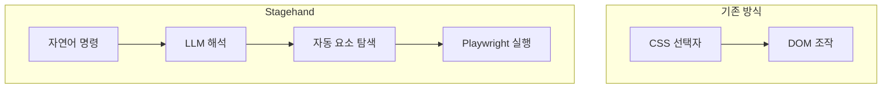

# Stagehand - 개요

> [[README|목차로 돌아가기]] | [[02-ecosystem|다음: 생태계]]

---

## 1. What - 개념 정의

> **한 줄 정의**: Browserbase에서 개발한 AI 기반 웹 브라우저 자동화 프레임워크로, 자연어 명령으로 브라우저를 조작한다.

### 핵심 개념

Stagehand는 전통적인 CSS 선택자/XPath 기반 자동화의 한계를 AI로 해결합니다.



- **자연어 기반**: `"로그인 버튼 클릭"` 같은 자연어로 명령
- **LLM 통합**: OpenAI, Anthropic 등 다양한 LLM 지원
- **Playwright 기반**: 안정적인 브라우저 자동화 엔진 사용
- **TypeScript 우선**: 타입 안전성과 IDE 지원

### 주요 용어

| 용어 | 설명 |
|------|------|
| `act()` | 자연어 명령으로 브라우저 액션 수행 |
| `extract()` | 페이지에서 구조화된 데이터 추출 |
| `observe()` | 페이지 상태를 관찰하고 가능한 액션 목록 반환 |
| `Agent` | 자율적으로 목표를 달성하는 AI 에이전트 |
| `Browserbase` | Stagehand를 개발한 클라우드 브라우저 플랫폼 |

---

## 2. Why - 등장 배경

### 해결하려는 문제

1. **선택자 유지보수 지옥**: UI 변경 시 CSS 선택자가 깨지는 문제
2. **복잡한 DOM 구조**: 동적 웹앱의 복잡한 요소 탐색
3. **높은 진입 장벽**: Selenium/Playwright 학습 곡선
4. **반복적인 코드**: 비슷한 패턴의 자동화 코드 반복 작성

### 기존 방식의 한계

| 문제 | 기존 방식 | Stagehand |
|------|----------|-----------|
| 요소 선택 | CSS/XPath 수동 작성 | 자연어로 설명 |
| UI 변경 대응 | 선택자 수정 필요 | AI가 자동 적응 |
| 코드 복잡도 | 높음 | 낮음 |
| 학습 곡선 | 가파름 | 완만함 |
| 디버깅 | 어려움 | 자연어 로그 |

### 예시: 로그인 자동화 비교

**Playwright (기존)**
```typescript
await page.locator('#username').fill('user@example.com');
await page.locator('#password').fill('password123');
await page.locator('button[type="submit"]').click();
await page.waitForSelector('.dashboard');
```

**Stagehand**
```typescript
await stagehand.act({ action: "이메일에 user@example.com 입력" });
await stagehand.act({ action: "비밀번호에 password123 입력" });
await stagehand.act({ action: "로그인 버튼 클릭" });
```

---

## 3. 핵심 특징

### 장점

- **낮은 진입 장벽**: 프로그래밍 경험 없이도 자동화 가능
- **유지보수 용이**: UI 변경에 강건함
- **빠른 프로토타이핑**: 아이디어를 빠르게 자동화로 구현
- **타입 안전성**: TypeScript 기반 스키마 검증
- **유연한 LLM 선택**: OpenAI, Anthropic 등 선택 가능
- **Playwright 호환**: 기존 Playwright 코드와 함께 사용 가능

### 단점

- **LLM 비용**: API 호출 비용 발생
- **실행 속도**: LLM 추론 시간으로 인한 지연
- **비결정적 동작**: 같은 명령도 다른 결과 가능
- **복잡한 로직 한계**: 조건 분기 등은 코드 필요
- **디버깅 어려움**: AI 판단 과정 불투명

### 적합한 사용 사례

| 적합 | 부적합 |
|------|--------|
| 웹 스크래핑 | 고성능 대량 크롤링 |
| E2E 테스트 프로토타입 | 프로덕션 CI/CD 테스트 |
| RPA 자동화 | 밀리초 단위 정확도 필요 |
| 데이터 수집 | 실시간 처리 |
| 빠른 PoC | 결정적 동작 필수 |

---

## 4. 핵심 API 미리보기

### act() - 액션 수행

```typescript
// 클릭
await stagehand.act({ action: "로그인 버튼 클릭" });

// 입력
await stagehand.act({ action: "검색창에 'AI automation' 입력" });

// 복합 액션
await stagehand.act({ action: "첫 번째 상품을 장바구니에 추가" });
```

### extract() - 데이터 추출

```typescript
const data = await stagehand.extract({
  instruction: "상품 목록에서 이름과 가격 추출",
  schema: z.object({
    products: z.array(z.object({
      name: z.string(),
      price: z.number()
    }))
  })
});
```

### observe() - 페이지 관찰

```typescript
const actions = await stagehand.observe();
// 결과: ["검색 버튼 클릭", "로그인 링크 클릭", "메뉴 열기", ...]
```

---

## 다음 단계

> [!tip] 다음으로
> 개요를 이해했다면 [[02-ecosystem|생태계]]에서 관련 기술과 비교를 확인하세요.

---

## References

- [Stagehand 공식 문서](https://docs.stagehand.dev)
- [GitHub 저장소](https://github.com/browserbase/stagehand)
- [Browserbase 홈페이지](https://browserbase.com)
