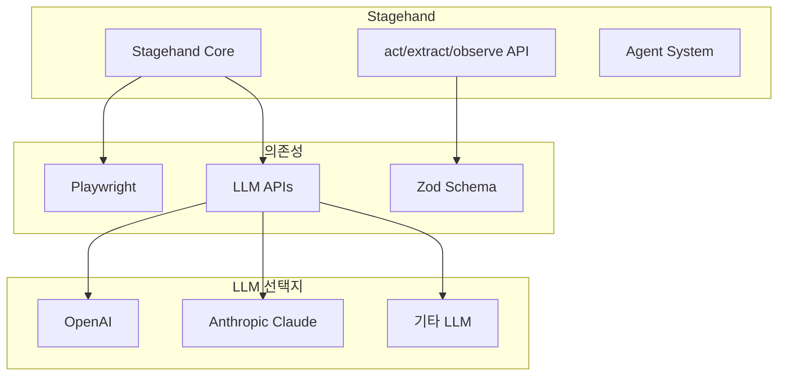
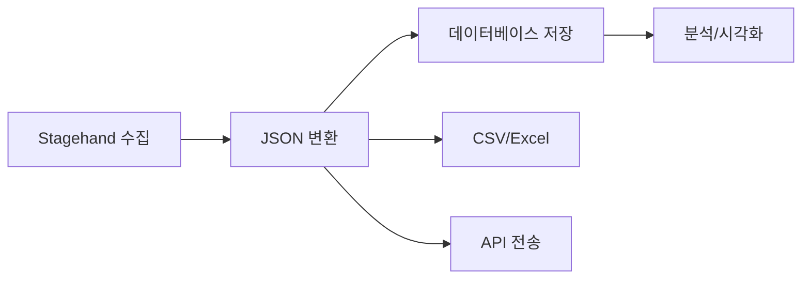

# Stagehand - 생태계

> [[01-overview|이전: 개요]] | [[README|목차]] | [[03-references|다음: 참고자료]]

---

## 1. 기술 스택

### Stagehand 구성 요소



### 핵심 의존성

| 기술 | 역할 | 버전 요구사항 |
|------|------|--------------|
| Node.js | 런타임 | 18+ |
| TypeScript | 언어 | 5.0+ |
| Playwright | 브라우저 자동화 엔진 | 최신 |
| Zod | 스키마 검증 | 3.x |
| LLM API | AI 추론 | OpenAI/Anthropic |

---

## 2. 관련 기술 비교

### 브라우저 자동화 도구 비교

| 항목 | Stagehand | Playwright | Puppeteer | Selenium |
|------|-----------|------------|-----------|----------|
| **접근 방식** | AI + 자연어 | API 기반 | API 기반 | WebDriver |
| **학습 곡선** | 낮음 | 중간 | 중간 | 높음 |
| **유지보수** | 쉬움 | 보통 | 보통 | 어려움 |
| **실행 속도** | 느림 | 빠름 | 빠름 | 보통 |
| **브라우저 지원** | Chromium | 모든 브라우저 | Chromium/Firefox | 모든 브라우저 |
| **언어** | TypeScript | 다양 | JS/TS | 다양 |
| **비용** | LLM 비용 | 무료 | 무료 | 무료 |

### AI 기반 자동화 도구 비교

| 항목 | Stagehand | Skyvern | AgentQL |
|------|-----------|---------|---------|
| **개발사** | Browserbase | Skyvern AI | AgentQL |
| **오픈소스** | O | O | X |
| **특징** | 범용 자동화 | 워크플로우 특화 | 쿼리 기반 |
| **Agent 지원** | O | O | X |
| **LLM 선택** | 자유 | 자유 | 제한적 |

### 선택 가이드

```
빠른 프로토타이핑이 필요?
├── Yes → Stagehand
└── No
    ├── 프로덕션 E2E 테스트?
    │   └── Yes → Playwright
    └── 대규모 크롤링?
        └── Yes → Puppeteer/Playwright
```

---

## 3. 통합 가능한 기술

### LLM 제공자

| 제공자 | 모델 예시 | 특징 |
|--------|----------|------|
| **OpenAI** | GPT-4, GPT-4o | 가장 널리 사용 |
| **Anthropic** | Claude 3 | 긴 컨텍스트, 안정성 |
| **Google** | Gemini | 멀티모달 |
| **로컬 LLM** | Ollama + Llama | 비용 없음, 프라이버시 |

### Browserbase 통합

Stagehand는 Browserbase의 클라우드 브라우저와 네이티브 통합됩니다.

```typescript
const stagehand = new Stagehand({
  env: "BROWSERBASE",  // 클라우드 브라우저 사용
  apiKey: process.env.BROWSERBASE_API_KEY
});
```

**Browserbase 장점:**
- 인프라 관리 불필요
- 병렬 세션 확장
- 프록시/캡차 우회 내장
- 세션 녹화/디버깅

### 데이터 처리 파이프라인



---

## 4. 트렌드와 전망

### AI 기반 자동화 트렌드

1. **자연어 인터페이스**: 코딩 없는 자동화 확산
2. **에이전트 시스템**: 자율적 작업 수행 AI
3. **멀티모달 입력**: 스크린샷 기반 자동화
4. **로우코드/노코드**: 비개발자도 자동화 가능

### Stagehand 로드맵 (예상)

| 시기 | 예상 기능 |
|------|----------|
| 2026 Q1 | Agent 기능 고도화 |
| 2026 Q2 | 더 많은 LLM 지원 |
| 2026 H2 | 노코드 UI 도구 |

### 경쟁 환경

```
AI 브라우저 자동화 시장
├── 오픈소스
│   ├── Stagehand (Browserbase)
│   └── Skyvern
├── 상용
│   ├── AgentQL
│   └── 기타 RPA 도구
└── 빅테크
    └── Google/MS의 AI 자동화 시도
```

---

## 5. 함께 학습하면 좋은 기술

### 필수 선행 지식

- [ ] **TypeScript 기초**: 타입 시스템 이해
- [ ] **async/await**: 비동기 프로그래밍
- [ ] **Playwright 기초**: 브라우저 자동화 개념

### 연계 학습 추천

| 기술 | 이유 |
|------|------|
| [[playwright]] | Stagehand 하위 레이어 이해 |
| [[zod]] | 스키마 정의 활용 |
| [[openai-api]] | LLM 연동 심화 |
| [[web-scraping]] | 데이터 수집 패턴 |

---

## 다음 단계

> [!tip] 다음으로
> 생태계를 파악했다면 [[03-references|참고자료]]에서 학습 자료를 확인하세요.

---

## References

- [Stagehand GitHub](https://github.com/browserbase/stagehand)
- [Playwright 공식 문서](https://playwright.dev)
- [Browserbase 블로그](https://browserbase.com/blog)
