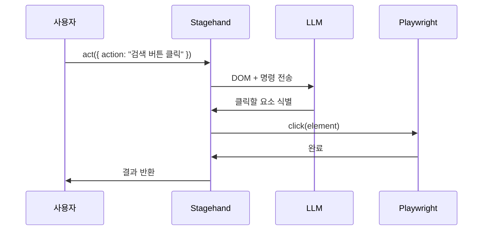

# Stagehand - act() 자연어 액션

> [[01-setup|이전: 초기 설정]] | [[README|목차]] | [[03-extract|다음: extract()]]

---

## 1. act() 개요

### 정의

`act()`는 자연어 명령으로 브라우저 액션을 수행하는 핵심 메서드입니다.

```typescript
await stagehand.act({ action: "로그인 버튼을 클릭해줘" });
```

### 동작 원리



---

## 2. 기본 사용법

### 기본 문법

```typescript
const result = await stagehand.act({
  action: "수행할 액션을 자연어로 설명"
});
```

### 반환값

```typescript
interface ActResult {
  success: boolean;      // 성공 여부
  message?: string;      // 결과 메시지
  action?: string;       // 수행된 액션
}
```

---

## 3. 액션 유형별 예시

### 클릭

```typescript
// 버튼 클릭
await stagehand.act({ action: "로그인 버튼 클릭" });

// 링크 클릭
await stagehand.act({ action: "'회원가입' 링크 클릭" });

// 메뉴 클릭
await stagehand.act({ action: "설정 메뉴 열기" });

// 특정 요소 클릭
await stagehand.act({ action: "첫 번째 상품 이미지 클릭" });
```

### 텍스트 입력

```typescript
// 단순 입력
await stagehand.act({ action: "검색창에 'Stagehand' 입력" });

// 이메일 입력
await stagehand.act({ action: "이메일 필드에 user@example.com 입력" });

// 여러 필드 입력
await stagehand.act({ action: "사용자명에 'john', 비밀번호에 'secret123' 입력" });
```

### 선택/토글

```typescript
// 드롭다운 선택
await stagehand.act({ action: "국가 선택에서 '대한민국' 선택" });

// 체크박스
await stagehand.act({ action: "이용약관 동의 체크박스 선택" });

// 라디오 버튼
await stagehand.act({ action: "신용카드 결제 옵션 선택" });
```

### 스크롤/이동

```typescript
// 스크롤
await stagehand.act({ action: "페이지 맨 아래로 스크롤" });

// 특정 영역으로 스크롤
await stagehand.act({ action: "댓글 섹션이 보이도록 스크롤" });
```

### 복합 액션

```typescript
// 여러 단계를 한 번에
await stagehand.act({
  action: "검색창에 'AI automation'을 입력하고 검색 버튼 클릭"
});

// 조건부 액션
await stagehand.act({
  action: "팝업이 있으면 닫기 버튼 클릭"
});
```

---

## 4. 고급 옵션

### 전체 옵션

```typescript
const result = await stagehand.act({
  action: "검색 버튼 클릭",
  modelName: "gpt-4o",           // 특정 모델 사용
  useVision: true,               // 비전 모델 사용
  variables: {                   // 변수 대입
    searchQuery: "Stagehand"
  },
  domSettleTimeoutMs: 5000       // DOM 안정화 대기
});
```

### 변수 사용

```typescript
// 동적 값 삽입
const userEmail = "user@example.com";
const userPassword = "secure123";

await stagehand.act({
  action: "이메일에 {{email}} 입력하고 비밀번호에 {{password}} 입력",
  variables: {
    email: userEmail,
    password: userPassword
  }
});
```

### 비전 모드

```typescript
// 스크린샷 기반 요소 탐색
await stagehand.act({
  action: "빨간색 '구매' 버튼 클릭",
  useVision: true
});
```

---

## 5. 실전 예시

### 로그인 자동화

```typescript
async function login(email: string, password: string) {
  await stagehand.page.goto("https://example.com/login");

  await stagehand.act({
    action: "이메일 필드에 {{email}} 입력",
    variables: { email }
  });

  await stagehand.act({
    action: "비밀번호 필드에 {{password}} 입력",
    variables: { password }
  });

  await stagehand.act({ action: "로그인 버튼 클릭" });

  // 로그인 완료 대기
  await stagehand.page.waitForURL("**/dashboard");
}
```

### 검색 자동화

```typescript
async function searchProducts(query: string) {
  await stagehand.act({
    action: "검색창에 {{query}} 입력 후 검색",
    variables: { query }
  });

  await stagehand.act({ action: "가격순으로 정렬" });
}
```

### 폼 작성

```typescript
async function fillContactForm(data: ContactData) {
  await stagehand.act({
    action: "이름에 {{name}}, 이메일에 {{email}}, 메시지에 {{message}} 입력",
    variables: data
  });

  await stagehand.act({ action: "전송 버튼 클릭" });
}
```

---

## 6. Best Practices

### DO - 좋은 패턴

```typescript
// 명확하고 구체적인 지시
await stagehand.act({ action: "상단 네비게이션의 '로그인' 버튼 클릭" });

// 변수 활용으로 재사용성 확보
await stagehand.act({
  action: "{{fieldName}}에 {{value}} 입력",
  variables: { fieldName: "이메일", value: email }
});

// 단계별 분리
await stagehand.act({ action: "이메일 입력" });
await stagehand.act({ action: "비밀번호 입력" });
await stagehand.act({ action: "로그인 버튼 클릭" });
```

### DON'T - 피해야 할 패턴

```typescript
// 너무 모호한 지시
await stagehand.act({ action: "클릭" });  // 무엇을?

// 너무 복잡한 한 번의 명령
await stagehand.act({
  action: "로그인하고 설정 가서 알림 끄고 저장하고 로그아웃"
});

// CSS 선택자 사용 (불필요)
await stagehand.act({ action: "#submit-btn 클릭" });
```

---

## 7. 트러블슈팅

### 자주 발생하는 문제

| 문제 | 원인 | 해결 |
|------|------|------|
| 요소를 찾지 못함 | 명령이 모호함 | 더 구체적으로 설명 |
| 잘못된 요소 클릭 | 비슷한 요소 여러 개 | 위치/색상 등 추가 설명 |
| 타임아웃 | 페이지 로딩 중 | 대기 시간 증가 |
| 입력 안됨 | 필드가 비활성화 | 선행 조건 확인 |

### 디버깅 팁

```typescript
// verbose 모드로 상세 로그 확인
const stagehand = new Stagehand({
  verbose: 2  // 상세 로그
});

// 실행 전 페이지 상태 확인
const screenshot = await stagehand.page.screenshot();

// 가능한 액션 먼저 확인
const actions = await stagehand.observe();
console.log("가능한 액션:", actions);
```

### 재시도 패턴

```typescript
async function actWithRetry(action: string, maxRetries = 3) {
  for (let i = 0; i < maxRetries; i++) {
    try {
      const result = await stagehand.act({ action });
      if (result.success) return result;
    } catch (error) {
      console.log(`시도 ${i + 1} 실패, 재시도...`);
      await new Promise(r => setTimeout(r, 1000));
    }
  }
  throw new Error(`${maxRetries}회 시도 후 실패: ${action}`);
}
```

---

## 8. act() vs Playwright 비교

| 상황 | act() 사용 | Playwright 직접 사용 |
|------|-----------|---------------------|
| 동적 UI | O | 선택자 깨질 수 있음 |
| 정확한 타이밍 필요 | X | O |
| 빠른 프로토타이핑 | O | X |
| 성능 중요 | X | O |
| 결정적 동작 필요 | X | O |

### 혼합 사용 예시

```typescript
// Stagehand의 page는 Playwright Page
const page = stagehand.page;

// 정확한 작업은 Playwright로
await page.goto("https://example.com");
await page.waitForLoadState("networkidle");

// 복잡한 UI 조작은 act()로
await stagehand.act({ action: "동적으로 생성된 모달에서 확인 클릭" });

// 다시 Playwright로
await page.screenshot({ path: "result.png" });
```

---

## 다음 단계

> [!tip] 다음으로
> act()를 익혔다면 [[03-extract|extract()]]에서 데이터 추출을 배워보세요.

---

## References

- [Stagehand 공식 문서 - act()](https://docs.stagehand.dev)
- [API Reference](https://github.com/browserbase/stagehand)
