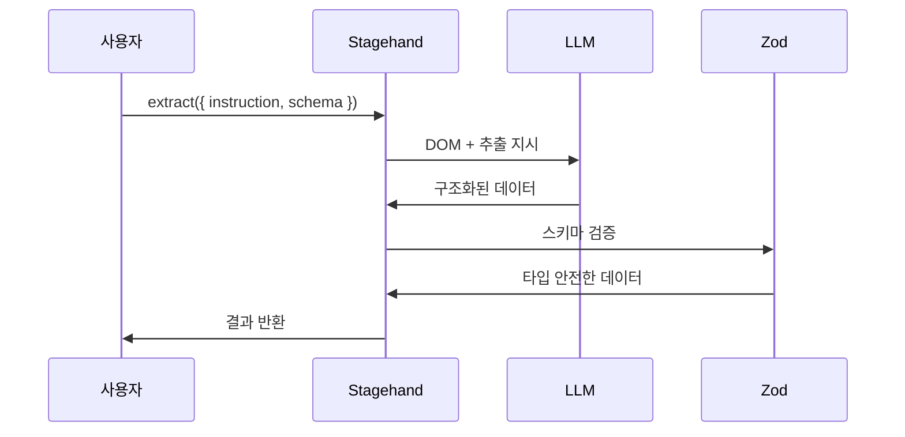

# Stagehand - extract() 데이터 추출

> [[02-act|이전: act()]] | [[README|목차]] | [[04-observe|다음: observe()]]

---

## 1. extract() 개요

### 정의

`extract()`는 웹 페이지에서 구조화된 데이터를 추출하는 메서드입니다. Zod 스키마를 사용해 타입 안전한 데이터를 반환합니다.

```typescript
const data = await stagehand.extract({
  instruction: "상품 목록의 이름과 가격 추출",
  schema: z.object({
    products: z.array(z.object({
      name: z.string(),
      price: z.number()
    }))
  })
});
```

### 동작 원리



---

## 2. Zod 스키마 기초

### Zod란?

Zod는 TypeScript 우선 스키마 검증 라이브러리입니다. Stagehand에서 추출할 데이터의 구조를 정의합니다.

### 기본 타입

```typescript
import { z } from "zod";

// 기본 타입
z.string()              // 문자열
z.number()              // 숫자
z.boolean()             // 불린
z.null()                // null
z.undefined()           // undefined

// 배열
z.array(z.string())     // string[]

// 객체
z.object({
  name: z.string(),
  age: z.number()
})
```

### 유용한 메서드

```typescript
// 선택적 필드
z.string().optional()          // string | undefined

// 기본값
z.number().default(0)          // 없으면 0

// nullable
z.string().nullable()          // string | null

// 설명 추가 (LLM 힌트)
z.string().describe("상품명")

// 열거형
z.enum(["small", "medium", "large"])
```

---

## 3. 기본 사용법

### 단순 데이터 추출

```typescript
// 단일 값 추출
const result = await stagehand.extract({
  instruction: "페이지 제목 추출",
  schema: z.object({
    title: z.string().describe("페이지의 메인 제목")
  })
});

console.log(result.title);  // "Welcome to Example"
```

### 목록 추출

```typescript
// 배열 데이터 추출
const result = await stagehand.extract({
  instruction: "모든 뉴스 헤드라인 추출",
  schema: z.object({
    headlines: z.array(z.string()).describe("뉴스 제목 목록")
  })
});

console.log(result.headlines);
// ["뉴스 1", "뉴스 2", "뉴스 3"]
```

### 복잡한 구조 추출

```typescript
// 중첩 객체
const result = await stagehand.extract({
  instruction: "상품 상세 정보 추출",
  schema: z.object({
    product: z.object({
      name: z.string().describe("상품명"),
      price: z.number().describe("가격 (숫자만)"),
      rating: z.number().optional().describe("평점"),
      inStock: z.boolean().describe("재고 여부"),
      specs: z.object({
        color: z.string(),
        size: z.string()
      }).optional()
    })
  })
});
```

---

## 4. 실전 스키마 패턴

### 상품 목록 스크래핑

```typescript
const ProductSchema = z.object({
  products: z.array(z.object({
    name: z.string().describe("상품명"),
    price: z.number().describe("가격 (원화, 숫자만)"),
    originalPrice: z.number().optional().describe("정가"),
    discount: z.string().optional().describe("할인율"),
    rating: z.number().optional().describe("평점 (5점 만점)"),
    reviewCount: z.number().optional().describe("리뷰 수"),
    imageUrl: z.string().optional().describe("상품 이미지 URL"),
    link: z.string().optional().describe("상품 상세 링크")
  }))
});

const result = await stagehand.extract({
  instruction: "검색 결과의 모든 상품 정보 추출",
  schema: ProductSchema
});
```

### 기사/콘텐츠 추출

```typescript
const ArticleSchema = z.object({
  title: z.string().describe("기사 제목"),
  author: z.string().optional().describe("작성자"),
  publishedAt: z.string().optional().describe("발행일"),
  content: z.string().describe("본문 내용"),
  tags: z.array(z.string()).optional().describe("태그 목록"),
  relatedArticles: z.array(z.object({
    title: z.string(),
    url: z.string()
  })).optional()
});
```

### 테이블 데이터 추출

```typescript
const TableSchema = z.object({
  headers: z.array(z.string()).describe("테이블 헤더"),
  rows: z.array(z.object({
    columns: z.array(z.string())
  })).describe("테이블 행 데이터")
});

// 또는 구체적인 구조
const PriceTableSchema = z.object({
  prices: z.array(z.object({
    plan: z.string().describe("요금제 이름"),
    monthlyPrice: z.number().describe("월 가격"),
    features: z.array(z.string()).describe("포함 기능")
  }))
});
```

### 연락처 정보 추출

```typescript
const ContactSchema = z.object({
  contacts: z.array(z.object({
    name: z.string(),
    email: z.string().optional(),
    phone: z.string().optional(),
    position: z.string().optional(),
    company: z.string().optional()
  }))
});
```

---

## 5. 고급 옵션

### 전체 옵션

```typescript
const result = await stagehand.extract({
  instruction: "상품 정보 추출",
  schema: ProductSchema,
  modelName: "gpt-4o",           // 특정 모델 사용
  useVision: true,               // 비전 모드
  domSettleTimeoutMs: 3000       // DOM 안정화 대기
});
```

### describe()로 정확도 높이기

```typescript
// describe() 없이
z.object({
  price: z.number()
})

// describe()로 명확하게
z.object({
  price: z.number().describe("원화 가격, 콤마 제외한 숫자만. 예: 15000")
})
```

---

## 6. 실전 예시

### 뉴스 사이트 스크래핑

```typescript
async function scrapeNews(url: string) {
  await stagehand.page.goto(url);

  const result = await stagehand.extract({
    instruction: "메인 페이지의 모든 뉴스 기사 추출",
    schema: z.object({
      articles: z.array(z.object({
        title: z.string().describe("기사 제목"),
        summary: z.string().optional().describe("요약"),
        category: z.string().optional().describe("카테고리"),
        timestamp: z.string().optional().describe("게시 시간"),
        url: z.string().optional().describe("기사 링크")
      }))
    })
  });

  return result.articles;
}
```

### 가격 비교

```typescript
async function comparePrices(productName: string, sites: string[]) {
  const results = [];

  for (const site of sites) {
    await stagehand.page.goto(site);
    await stagehand.act({
      action: `검색창에 '${productName}' 검색`
    });

    const data = await stagehand.extract({
      instruction: "검색 결과 첫 번째 상품의 가격 정보",
      schema: z.object({
        name: z.string(),
        price: z.number(),
        seller: z.string().optional()
      })
    });

    results.push({ site, ...data });
  }

  return results;
}
```

### 프로필 정보 수집

```typescript
async function extractProfile(profileUrl: string) {
  await stagehand.page.goto(profileUrl);

  return await stagehand.extract({
    instruction: "프로필 페이지에서 모든 정보 추출",
    schema: z.object({
      name: z.string(),
      bio: z.string().optional(),
      location: z.string().optional(),
      website: z.string().optional(),
      socialLinks: z.array(z.object({
        platform: z.string(),
        url: z.string()
      })).optional(),
      stats: z.object({
        followers: z.number().optional(),
        following: z.number().optional(),
        posts: z.number().optional()
      }).optional()
    })
  });
}
```

---

## 7. Best Practices

### DO - 좋은 패턴

```typescript
// 명확한 describe() 사용
z.number().describe("가격 (원화, 숫자만, 예: 15000)")

// 적절한 optional() 사용
z.object({
  required: z.string(),
  optional: z.string().optional()
})

// 구체적인 instruction
const result = await stagehand.extract({
  instruction: "검색 결과 페이지에서 상위 10개 상품의 이름, 가격, 평점 추출",
  schema: ProductSchema
});
```

### DON'T - 피해야 할 패턴

```typescript
// 너무 복잡한 스키마 (분할 권장)
z.object({
  // 수십 개의 필드...
})

// 모호한 instruction
stagehand.extract({
  instruction: "데이터 추출",
  schema: z.object({})
})

// 타입 불일치
z.number().describe("가격")  // "10,000원" 문자열이 올 수 있음
// 대신: z.string().describe("가격 (문자열 그대로)")
```

---

## 8. 트러블슈팅

### 자주 발생하는 문제

| 문제 | 원인 | 해결 |
|------|------|------|
| 빈 배열 반환 | 요소가 동적 로딩 | 대기 시간 추가 |
| 타입 오류 | 스키마와 실제 데이터 불일치 | optional() 또는 타입 조정 |
| 부분 데이터만 추출 | instruction이 불명확 | 더 구체적으로 작성 |
| null 반환 | 요소가 없음 | nullable() 사용 |

### 디버깅 팁

```typescript
// 1. 먼저 observe()로 페이지 상태 확인
const observations = await stagehand.observe();
console.log("페이지 상태:", observations);

// 2. 느슨한 스키마로 먼저 테스트
const loose = await stagehand.extract({
  instruction: "모든 텍스트 콘텐츠",
  schema: z.object({
    content: z.any()
  })
});
console.log("원본 데이터:", loose);

// 3. 점진적으로 스키마 구체화
```

---

## 9. act()와 extract() 조합

### 페이지네이션 처리

```typescript
async function scrapeAllPages() {
  const allProducts = [];

  while (true) {
    // 현재 페이지 데이터 추출
    const result = await stagehand.extract({
      instruction: "현재 페이지의 모든 상품",
      schema: ProductSchema
    });

    allProducts.push(...result.products);

    // 다음 페이지 이동
    try {
      await stagehand.act({ action: "다음 페이지 버튼 클릭" });
      await stagehand.page.waitForLoadState("networkidle");
    } catch {
      break;  // 다음 페이지 없음
    }
  }

  return allProducts;
}
```

---

## 다음 단계

> [!tip] 다음으로
> extract()를 익혔다면 [[04-observe|observe()]]에서 페이지 관찰을 배워보세요.

---

## References

- [Stagehand 공식 문서 - extract()](https://docs.stagehand.dev)
- [Zod 공식 문서](https://zod.dev)
