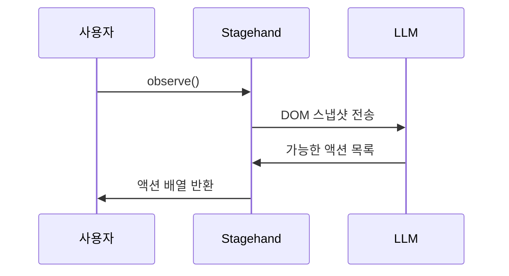

# Stagehand - observe() 페이지 관찰

> [[03-extract|이전: extract()]] | [[README|목차]] | [[05-caching|다음: 캐싱]]

---

## 1. observe() 개요

### 정의

`observe()`는 현재 페이지에서 수행 가능한 액션들을 식별하고 반환하는 메서드입니다. AI가 페이지를 "보고" 무엇이 가능한지 알려줍니다.

```typescript
const actions = await stagehand.observe();
// ["로그인 버튼 클릭", "검색창에 입력", "메뉴 열기", ...]
```

### 동작 원리



### 사용 목적

- **탐색**: 페이지에서 무엇이 가능한지 파악
- **디버깅**: act() 실패 시 원인 분석
- **동적 워크플로우**: 상황에 따른 조건부 처리
- **Agent 지원**: 자율 에이전트의 판단 근거

---

## 2. 기본 사용법

### 단순 호출

```typescript
// 현재 페이지의 모든 가능한 액션
const actions = await stagehand.observe();

console.log(actions);
// 출력 예시:
// [
//   { action: "검색 아이콘 클릭", selector: "..." },
//   { action: "로그인 링크 클릭", selector: "..." },
//   { action: "검색창에 텍스트 입력", selector: "..." },
//   { action: "언어 선택 드롭다운 열기", selector: "..." }
// ]
```

### 반환 타입

```typescript
interface ObserveResult {
  action: string;      // 수행 가능한 액션 설명
  selector?: string;   // 해당 요소의 선택자 (내부용)
  element?: any;       // 요소 정보
}

// observe()는 ObserveResult[] 반환
```

---

## 3. 고급 옵션

### 특정 관찰 지시

```typescript
// 특정 유형의 액션만 관찰
const loginActions = await stagehand.observe({
  instruction: "로그인 관련 액션만 찾아줘"
});

// 특정 영역 관찰
const navActions = await stagehand.observe({
  instruction: "상단 네비게이션 바에서 가능한 액션"
});
```

### 비전 모드

```typescript
// 스크린샷 기반 관찰 (더 정확할 수 있음)
const actions = await stagehand.observe({
  useVision: true
});
```

### 전체 옵션

```typescript
const actions = await stagehand.observe({
  instruction: "폼 입력 관련 액션",
  useVision: true,
  modelName: "gpt-4o"
});
```

---

## 4. 실전 활용 패턴

### 디버깅: act() 실패 분석

```typescript
async function debugAction(action: string) {
  try {
    await stagehand.act({ action });
  } catch (error) {
    console.log("액션 실패:", action);

    // 페이지에서 가능한 액션 확인
    const available = await stagehand.observe();
    console.log("가능한 액션들:");
    available.forEach(a => console.log(" -", a.action));

    // 유사한 액션 찾기
    const similar = available.filter(a =>
      a.action.toLowerCase().includes(action.toLowerCase().split(" ")[0])
    );
    if (similar.length > 0) {
      console.log("유사한 액션:", similar);
    }
  }
}
```

### 동적 워크플로우

```typescript
async function handlePage() {
  const actions = await stagehand.observe();

  // 팝업 확인
  const hasPopup = actions.some(a =>
    a.action.includes("닫기") || a.action.includes("close")
  );
  if (hasPopup) {
    await stagehand.act({ action: "팝업 닫기" });
  }

  // 로그인 필요 여부 확인
  const needsLogin = actions.some(a =>
    a.action.includes("로그인")
  );
  if (needsLogin) {
    await login();
  }

  // 다음 단계 진행
  await stagehand.act({ action: "메인 콘텐츠로 이동" });
}
```

### 탐색 모드

```typescript
async function exploreSite(startUrl: string, maxDepth = 3) {
  const visited = new Set<string>();
  const toVisit = [{ url: startUrl, depth: 0 }];

  while (toVisit.length > 0) {
    const { url, depth } = toVisit.shift()!;

    if (depth > maxDepth || visited.has(url)) continue;
    visited.add(url);

    await stagehand.page.goto(url);

    // 현재 페이지에서 가능한 액션 관찰
    const actions = await stagehand.observe({
      instruction: "클릭 가능한 링크들"
    });

    console.log(`[${depth}] ${url}:`);
    actions.forEach(a => console.log("  -", a.action));

    // 링크 수집 (선택적)
    // ...
  }
}
```

### 조건부 흐름 제어

```typescript
async function checkout() {
  const actions = await stagehand.observe();

  // 장바구니 상태에 따른 분기
  if (actions.some(a => a.action.includes("장바구니가 비어있음"))) {
    console.log("장바구니에 상품이 없습니다.");
    return { success: false, reason: "empty_cart" };
  }

  if (actions.some(a => a.action.includes("결제하기"))) {
    await stagehand.act({ action: "결제하기 버튼 클릭" });
  }

  // 결제 방법 선택
  const paymentOptions = await stagehand.observe({
    instruction: "결제 방법 옵션들"
  });
  console.log("결제 방법:", paymentOptions.map(a => a.action));

  return { success: true };
}
```

---

## 5. observe() + act() + extract() 조합

### 완전한 자동화 흐름

```typescript
async function intelligentScrape(url: string) {
  await stagehand.page.goto(url);

  // 1. 페이지 상태 관찰
  const actions = await stagehand.observe();
  console.log("페이지 분석 완료, 가능한 액션:", actions.length);

  // 2. 쿠키/팝업 처리
  const cookieAction = actions.find(a =>
    a.action.includes("쿠키") || a.action.includes("동의")
  );
  if (cookieAction) {
    await stagehand.act({ action: cookieAction.action });
  }

  // 3. 필요시 로그인
  const loginAction = actions.find(a => a.action.includes("로그인"));
  if (loginAction) {
    await performLogin();
  }

  // 4. 데이터 추출
  const data = await stagehand.extract({
    instruction: "메인 콘텐츠 추출",
    schema: ContentSchema
  });

  // 5. 페이지네이션 확인
  const nextPage = actions.find(a =>
    a.action.includes("다음") || a.action.includes("next")
  );

  return { data, hasNextPage: !!nextPage };
}
```

### 상태 기반 워크플로우

```typescript
type PageState = "login" | "dashboard" | "product" | "checkout" | "unknown";

async function detectPageState(): Promise<PageState> {
  const actions = await stagehand.observe();
  const actionTexts = actions.map(a => a.action.toLowerCase());

  if (actionTexts.some(a => a.includes("로그인") && a.includes("입력"))) {
    return "login";
  }
  if (actionTexts.some(a => a.includes("대시보드") || a.includes("설정"))) {
    return "dashboard";
  }
  if (actionTexts.some(a => a.includes("장바구니에 추가"))) {
    return "product";
  }
  if (actionTexts.some(a => a.includes("결제") || a.includes("주문"))) {
    return "checkout";
  }

  return "unknown";
}

async function handleByState() {
  const state = await detectPageState();

  switch (state) {
    case "login":
      await login();
      break;
    case "product":
      await addToCart();
      break;
    case "checkout":
      await completeOrder();
      break;
    default:
      console.log("알 수 없는 페이지 상태");
  }
}
```

---

## 6. Best Practices

### DO - 좋은 패턴

```typescript
// 구체적인 instruction 사용
await stagehand.observe({
  instruction: "상단 메뉴에서 클릭 가능한 항목들"
});

// act() 전 사전 확인
const actions = await stagehand.observe();
if (actions.some(a => a.action.includes("원하는 액션"))) {
  await stagehand.act({ action: "원하는 액션" });
}

// 결과 캐싱 (같은 페이지에서)
const cachedActions = await stagehand.observe();
// 여러 번 사용
```

### DON'T - 피해야 할 패턴

```typescript
// 과도한 호출 (비용/시간 낭비)
for (const action of actionsToPerform) {
  await stagehand.observe();  // 매번 호출 불필요
  await stagehand.act({ action });
}

// observe() 결과 무시하고 act() 시도
await stagehand.act({ action: "확실하지 않은 액션" });  // 실패 가능
```

---

## 7. 트러블슈팅

### 자주 발생하는 문제

| 문제 | 원인 | 해결 |
|------|------|------|
| 빈 배열 반환 | 페이지 미로드 | waitForLoadState() 추가 |
| 너무 많은 결과 | 구체적 지시 없음 | instruction 추가 |
| 원하는 액션 없음 | 요소가 숨김/동적 | 스크롤/대기 후 재시도 |

### 디버깅

```typescript
// 상세 관찰
const actions = await stagehand.observe({
  instruction: "모든 클릭 가능한 요소",
  useVision: true
});

console.log("총 액션 수:", actions.length);
actions.forEach((a, i) => {
  console.log(`${i + 1}. ${a.action}`);
});

// 스크린샷과 함께 확인
await stagehand.page.screenshot({ path: "debug.png" });
```

---

## 8. observe() 활용 사례 정리

| 상황 | 활용 방법 |
|------|----------|
| act() 디버깅 | 실패 시 가능한 액션 확인 |
| 동적 페이지 | 상태에 따른 분기 처리 |
| 탐색 | 사이트 구조 파악 |
| Agent | 다음 액션 결정 근거 |
| 테스트 | 페이지 상태 검증 |

---

## 다음 단계

> [!tip] 다음으로
> observe()를 익혔다면 [[05-caching|캐싱]]에서 성능 최적화를 배워보세요.

---

## References

- [Stagehand 공식 문서 - observe()](https://docs.stagehand.dev)
- [API Reference](https://github.com/browserbase/stagehand)
