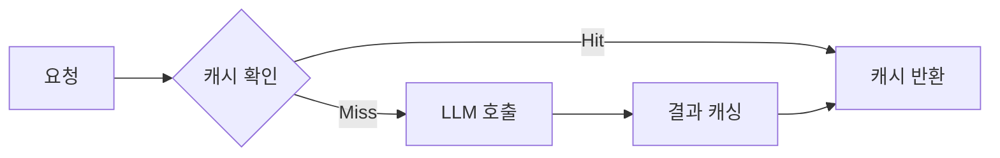

# Stagehand - 캐싱과 성능 최적화

> [[04-observe|이전: observe()]] | [[README|목차]] | [[06-agent|다음: Agent]]

---

## 1. 캐싱 개요

### 왜 캐싱이 필요한가?

Stagehand는 매 API 호출마다 LLM을 사용하므로:
- **비용**: API 호출당 비용 발생
- **지연**: LLM 추론 시간 (수 초)
- **할당량**: API 호출 제한

캐싱으로 동일한 요청의 반복 호출을 방지합니다.



---

## 2. Stagehand 캐싱 설정

### 기본 캐싱 활성화

```typescript
const stagehand = new Stagehand({
  enableCaching: true,  // 캐싱 활성화
  // ...기타 옵션
});
```

### 캐싱 동작 방식

| 대상 | 캐시 키 | 효과 |
|------|---------|------|
| DOM 분석 | 페이지 URL + DOM 해시 | 동일 페이지 재분석 방지 |
| 요소 탐색 | action + DOM 상태 | 같은 액션 반복 최적화 |
| 스키마 추출 | instruction + schema + DOM | 동일 추출 캐싱 |

---

## 3. 성능 최적화 전략

### 3.1 LLM 호출 최소화

#### 배치 처리

```typescript
// Bad: 개별 호출
for (const item of items) {
  await stagehand.act({ action: `${item} 클릭` });
}

// Good: 한 번에 처리 (가능한 경우)
await stagehand.act({
  action: `다음 항목들을 순서대로 클릭: ${items.join(", ")}`
});
```

#### observe() 결과 재사용

```typescript
// Bad: 매번 호출
if ((await stagehand.observe()).some(a => a.action.includes("로그인"))) {
  // ...
}
if ((await stagehand.observe()).some(a => a.action.includes("메뉴"))) {
  // ...
}

// Good: 한 번 호출 후 재사용
const actions = await stagehand.observe();
if (actions.some(a => a.action.includes("로그인"))) {
  // ...
}
if (actions.some(a => a.action.includes("메뉴"))) {
  // ...
}
```

### 3.2 Playwright 직접 사용

명확한 작업은 Playwright API를 직접 사용합니다.

```typescript
// LLM 필요 없는 작업은 Playwright로
await stagehand.page.goto("https://example.com");
await stagehand.page.waitForLoadState("networkidle");
await stagehand.page.screenshot({ path: "screenshot.png" });

// LLM이 필요한 작업만 Stagehand로
await stagehand.act({ action: "동적으로 생성된 로그인 버튼 클릭" });
```

### 3.3 선택적 비전 모드

```typescript
// 비전 모드는 더 느리고 비용 높음
// 필요한 경우만 사용

// 텍스트 기반으로 충분한 경우
await stagehand.act({ action: "'로그인' 버튼 클릭" });

// 시각적 구분이 필요한 경우만
await stagehand.act({
  action: "빨간색 삭제 아이콘 클릭",
  useVision: true
});
```

### 3.4 적절한 모델 선택

```typescript
// 간단한 작업: 가벼운 모델
await stagehand.act({
  action: "제출 버튼 클릭",
  modelName: "gpt-4o-mini"  // 빠르고 저렴
});

// 복잡한 작업: 강력한 모델
await stagehand.extract({
  instruction: "복잡한 테이블에서 조건부 데이터 추출",
  schema: ComplexSchema,
  modelName: "gpt-4o"  // 더 정확
});
```

---

## 4. 대기 시간 최적화

### 페이지 로딩 대기

```typescript
// 네트워크 안정화 대기
await stagehand.page.waitForLoadState("networkidle");

// DOM 변화 대기
await stagehand.page.waitForSelector(".dynamic-content");

// 커스텀 대기
await stagehand.page.waitForFunction(() => {
  return document.querySelectorAll(".item").length > 0;
});
```

### 타임아웃 조정

```typescript
// 전역 타임아웃
const stagehand = new Stagehand({
  domSettleTimeoutMs: 5000  // DOM 안정화 대기 시간
});

// 개별 작업 타임아웃
await stagehand.page.waitForSelector(".element", {
  timeout: 10000
});
```

---

## 5. 리소스 관리

### 브라우저 리소스

```typescript
// 이미지 로딩 차단 (스크래핑 시)
await stagehand.page.route("**/*.{png,jpg,jpeg,gif,svg}", route => {
  route.abort();
});

// 불필요한 요청 차단
await stagehand.page.route("**/analytics/**", route => route.abort());
await stagehand.page.route("**/ads/**", route => route.abort());
```

### 메모리 관리

```typescript
async function processPages(urls: string[]) {
  for (const url of urls) {
    await stagehand.page.goto(url);

    // 작업 수행
    const data = await stagehand.extract({...});

    // 페이지 정리 (선택적)
    await stagehand.page.evaluate(() => {
      // 불필요한 DOM 요소 제거
    });
  }
}
```

---

## 6. 병렬 처리

### 주의사항

Stagehand 인스턴스는 단일 브라우저를 제어하므로, 진정한 병렬 처리에는 여러 인스턴스가 필요합니다.

### 여러 인스턴스 사용

```typescript
async function parallelScrape(urls: string[]) {
  const instances = await Promise.all(
    urls.map(async (url) => {
      const stagehand = new Stagehand({
        enableCaching: true,
        headless: true
      });
      await stagehand.init();
      return { stagehand, url };
    })
  );

  try {
    const results = await Promise.all(
      instances.map(async ({ stagehand, url }) => {
        await stagehand.page.goto(url);
        return stagehand.extract({
          instruction: "데이터 추출",
          schema: DataSchema
        });
      })
    );
    return results;
  } finally {
    // 모든 인스턴스 정리
    await Promise.all(instances.map(i => i.stagehand.close()));
  }
}
```

### Browserbase로 확장

```typescript
// 클라우드 브라우저로 확장성 확보
const stagehand = new Stagehand({
  env: "BROWSERBASE",
  apiKey: process.env.BROWSERBASE_API_KEY,
  projectId: process.env.BROWSERBASE_PROJECT_ID
});
```

---

## 7. 모니터링과 로깅

### 성능 측정

```typescript
async function measurePerformance() {
  const start = Date.now();

  await stagehand.act({ action: "버튼 클릭" });

  const elapsed = Date.now() - start;
  console.log(`act() 소요 시간: ${elapsed}ms`);
}
```

### 상세 로깅

```typescript
const stagehand = new Stagehand({
  verbose: 2,  // 상세 로그
});

// 커스텀 로깅
const originalAct = stagehand.act.bind(stagehand);
stagehand.act = async (options) => {
  console.log(`[ACT] ${options.action}`);
  const start = Date.now();
  const result = await originalAct(options);
  console.log(`[ACT] 완료: ${Date.now() - start}ms`);
  return result;
};
```

---

## 8. 최적화 체크리스트

### 설정

- [ ] `enableCaching: true` 설정
- [ ] 적절한 `verbose` 레벨 설정
- [ ] 헤드리스 모드 사용 (프로덕션)

### 코드 패턴

- [ ] observe() 결과 재사용
- [ ] 명확한 작업은 Playwright 직접 사용
- [ ] 배치 처리 적용
- [ ] 적절한 모델 선택

### 리소스

- [ ] 불필요한 리소스 로딩 차단
- [ ] 타임아웃 적절히 설정
- [ ] 브라우저 인스턴스 정리

---

## 9. 비용 최적화 팁

| 방법 | 절감 효과 |
|------|----------|
| 캐싱 활성화 | 동일 요청 100% 절감 |
| 경량 모델 사용 | 50-70% 비용 절감 |
| Playwright 혼용 | LLM 호출 횟수 감소 |
| 비전 모드 최소화 | 토큰 사용량 감소 |

---

## 다음 단계

> [!tip] 다음으로
> 캐싱을 설정했다면 [[06-agent|Agent]]에서 자율 에이전트를 배워보세요.

---

## References

- [Stagehand 공식 문서 - Configuration](https://docs.stagehand.dev)
- [Playwright Performance](https://playwright.dev/docs/api/class-page)
