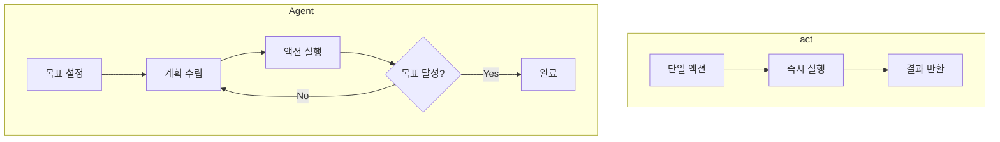

# Stagehand - Agent (자율 에이전트)

> [[05-caching|이전: 캐싱]] | [[README|목차]] | [[../05-projects|다음: 프로젝트]]

---

## 1. Agent 개요

### 정의

Stagehand Agent는 고수준 목표를 받아 **자율적으로** 브라우저를 조작하여 목표를 달성하는 AI 에이전트입니다.

```typescript
const agent = stagehand.agent({
  provider: "openai",
  model: "computer-use-preview"
});

await agent.execute("Amazon에서 MacBook Pro를 검색하고 가장 저렴한 옵션을 찾아줘");
```

### act()와 Agent 차이



| 구분 | act() | Agent |
|------|-------|-------|
| 입력 | 단일 액션 | 고수준 목표 |
| 제어 | 사용자 | AI 자율 |
| 실행 | 1회 | 여러 단계 |
| 판단 | 없음 | 상황 분석/결정 |

---

## 2. Agent 시작하기

### 기본 설정

```typescript
import { Stagehand } from "@browserbasehq/stagehand";

const stagehand = new Stagehand({
  env: "LOCAL",
  modelName: "gpt-4o",
  modelClientOptions: {
    apiKey: process.env.OPENAI_API_KEY
  }
});

await stagehand.init();

// Agent 생성
const agent = stagehand.agent({
  provider: "openai",
  model: "computer-use-preview"  // 또는 다른 지원 모델
});
```

### 기본 사용

```typescript
// 목표 실행
const result = await agent.execute(
  "Google에서 'Stagehand browser automation'을 검색하고 첫 번째 결과의 제목을 알려줘"
);

console.log(result);
```

---

## 3. Agent 옵션

### 전체 옵션

```typescript
const agent = stagehand.agent({
  provider: "openai",            // LLM 제공자
  model: "computer-use-preview", // 모델명
  instructions: "항상 한국어로 응답해줘",  // 시스템 지시
  maxSteps: 20,                  // 최대 단계 수
  timeout: 60000                 // 타임아웃 (ms)
});
```

### 제공자별 설정

```typescript
// OpenAI
const agent = stagehand.agent({
  provider: "openai",
  model: "computer-use-preview"
});

// Anthropic
const agent = stagehand.agent({
  provider: "anthropic",
  model: "claude-3-opus-20240229"
});
```

---

## 4. 실전 예시

### 쇼핑 자동화

```typescript
async function findBestDeal(product: string) {
  await stagehand.init();

  const agent = stagehand.agent({
    provider: "openai",
    model: "computer-use-preview",
    instructions: `
      당신은 쇼핑 도우미입니다.
      - 항상 가격을 비교하세요
      - 배송비를 고려하세요
      - 리뷰 평점을 확인하세요
    `
  });

  const result = await agent.execute(`
    쿠팡에서 "${product}"를 검색하고:
    1. 상위 5개 상품의 가격과 평점을 확인
    2. 가성비가 가장 좋은 상품 추천
    3. 해당 상품의 상세 정보 요약
  `);

  return result;
}
```

### 정보 수집

```typescript
async function researchTopic(topic: string) {
  const agent = stagehand.agent({
    provider: "openai",
    model: "computer-use-preview",
    instructions: "신뢰할 수 있는 소스만 사용하세요."
  });

  const result = await agent.execute(`
    "${topic}"에 대해 조사해줘:
    1. Wikipedia에서 기본 개념 확인
    2. 최신 뉴스 2-3개 확인
    3. 핵심 내용 요약
  `);

  return result;
}
```

### 양식 작성

```typescript
async function fillApplication(data: ApplicationData) {
  const agent = stagehand.agent({
    provider: "openai",
    model: "computer-use-preview"
  });

  await stagehand.page.goto("https://example.com/apply");

  const result = await agent.execute(`
    지원서 양식을 작성해줘:
    - 이름: ${data.name}
    - 이메일: ${data.email}
    - 경력: ${data.experience}
    모든 필수 항목을 채우고 제출 전 확인 페이지까지만 진행해줘.
  `);

  return result;
}
```

### 모니터링

```typescript
async function monitorPrice(productUrl: string, targetPrice: number) {
  const agent = stagehand.agent({
    provider: "openai",
    model: "computer-use-preview"
  });

  await stagehand.page.goto(productUrl);

  const result = await agent.execute(`
    이 상품의 현재 가격을 확인해줘.
    ${targetPrice}원 이하면 "ALERT"를, 아니면 현재 가격을 알려줘.
  `);

  return result;
}
```

---

## 5. Agent 제어

### 단계별 실행

```typescript
// 한 단계씩 실행
const iterator = agent.executeSteps(
  "Gmail에서 읽지 않은 메일 3개를 확인해줘"
);

for await (const step of iterator) {
  console.log("현재 단계:", step.action);
  console.log("상태:", step.status);

  // 필요시 중단
  if (shouldStop(step)) {
    break;
  }
}
```

### 중간 결과 확인

```typescript
const agent = stagehand.agent({
  provider: "openai",
  model: "computer-use-preview",
  onStep: (step) => {
    console.log(`[Step ${step.number}] ${step.action}`);

    // 스크린샷 저장
    stagehand.page.screenshot({
      path: `step-${step.number}.png`
    });
  }
});
```

---

## 6. Best Practices

### DO - 좋은 패턴

```typescript
// 명확한 목표 설정
await agent.execute(`
  목표: Netflix 계정 설정 페이지에서 자막 언어를 한국어로 변경
  단계:
  1. 프로필 선택
  2. 계정 설정 진입
  3. 자막 설정 찾기
  4. 한국어 선택 및 저장
`);

// 제약 조건 명시
const agent = stagehand.agent({
  instructions: `
    - 결제는 절대 진행하지 마세요
    - 개인정보 입력 시 확인을 요청하세요
    - 오류 발생 시 즉시 중단하세요
  `
});

// 단계 제한
const agent = stagehand.agent({
  maxSteps: 10  // 무한 루프 방지
});
```

### DON'T - 피해야 할 패턴

```typescript
// 모호한 목표
await agent.execute("뭔가 찾아줘");

// 위험한 작업 위임
await agent.execute("내 계정에서 모든 데이터 삭제");

// 무제한 실행
const agent = stagehand.agent({
  maxSteps: 999999  // 위험
});
```

---

## 7. 안전 고려사항

### 권한 제한

```typescript
const agent = stagehand.agent({
  instructions: `
    금지된 작업:
    - 결제 진행
    - 계정 삭제
    - 비밀번호 변경
    - 외부 링크 클릭

    이러한 작업이 필요하면 사용자에게 알리고 중단하세요.
  `
});
```

### 모니터링

```typescript
// 모든 단계 로깅
const agent = stagehand.agent({
  onStep: async (step) => {
    // 감사 로그 저장
    await logToAudit({
      timestamp: new Date(),
      action: step.action,
      url: await stagehand.page.url()
    });

    // 위험 감지
    if (isDangerous(step.action)) {
      throw new Error("위험한 작업 감지");
    }
  }
});
```

### 수동 확인 지점

```typescript
const agent = stagehand.agent({
  onStep: async (step) => {
    // 중요 작업 전 확인
    if (step.action.includes("삭제") || step.action.includes("제출")) {
      const confirmed = await promptUser(`"${step.action}" 실행할까요?`);
      if (!confirmed) {
        throw new Error("사용자가 취소함");
      }
    }
  }
});
```

---

## 8. Agent vs act() 선택 가이드

```
작업 유형 확인
├── 단순 반복 작업?
│   └── Yes → act() 사용
├── 판단이 필요한 작업?
│   └── Yes → Agent 사용
├── 여러 단계 연결 필요?
│   └── Yes → Agent 또는 act() 체이닝
└── 예측 불가능한 UI?
    └── Yes → Agent 사용
```

| 상황 | 추천 |
|------|------|
| 로그인 자동화 | act() |
| 가격 비교 후 결정 | Agent |
| 폼 작성 | act() |
| 복잡한 검색/탐색 | Agent |
| 데이터 추출 | extract() |

---

## 9. 트러블슈팅

### 자주 발생하는 문제

| 문제 | 원인 | 해결 |
|------|------|------|
| 무한 루프 | 목표 불명확 | maxSteps 설정, 목표 구체화 |
| 잘못된 판단 | 컨텍스트 부족 | instructions 상세화 |
| 타임아웃 | 작업 복잡도 | timeout 증가, 단계 분할 |
| 예상치 못한 행동 | 모호한 지시 | 제약 조건 명시 |

---

## 다음 단계

> [!tip] 다음으로
> Agent를 익혔다면 [[../05-projects|프로젝트]]에서 실전 예제를 확인하세요.

---

## References

- [Stagehand 공식 문서 - Agent](https://docs.stagehand.dev)
- [AI Agent 패턴](https://github.com/browserbase/stagehand)
