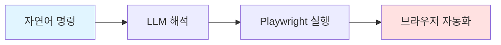

# Stagehand

> **한 줄 정의**: AI 기반 자연어 명령으로 웹 브라우저를 자동화하는 오픈소스 프레임워크

## 개요

Stagehand는 Browserbase에서 개발한 AI 기반 브라우저 자동화 프레임워크입니다. 기존 CSS 선택자나 XPath 대신 **자연어 명령**으로 브라우저를 제어할 수 있어, 웹 자동화의 진입 장벽을 크게 낮춰줍니다.



---

## Quick Start

### 설치

```bash
npm install @browserbasehq/stagehand
```

### 기본 사용

```typescript
import { Stagehand } from "@browserbasehq/stagehand";

const stagehand = new Stagehand();
await stagehand.init();

// 자연어로 브라우저 조작
await stagehand.page.goto("https://google.com");
await stagehand.act({ action: "검색창에 'Stagehand'를 입력하고 검색 버튼 클릭" });

// 데이터 추출
const results = await stagehand.extract({
  instruction: "검색 결과 제목들을 추출해줘",
  schema: z.object({
    titles: z.array(z.string())
  })
});

await stagehand.close();
```

---

## 학습 경로

### 1단계: 기초 이해 (30분)
- [ ] [[01-overview|개요]] - 핵심 개념과 장단점 파악
- [ ] [[02-ecosystem|생태계]] - 관련 기술 비교

### 2단계: 환경 구성 (30분)
- [ ] [[04-learning/01-setup|초기 설정]] - 프로젝트 세팅

### 3단계: 핵심 API 학습 (2시간)
- [ ] [[04-learning/02-act|act()]] - 자연어 액션
- [ ] [[04-learning/03-extract|extract()]] - 데이터 추출
- [ ] [[04-learning/04-observe|observe()]] - 페이지 관찰

### 4단계: 심화 학습 (1시간)
- [ ] [[04-learning/05-caching|캐싱]] - 성능 최적화
- [ ] [[04-learning/06-agent|Agent]] - 자율 에이전트

### 5단계: 실전 적용 (선택)
- [ ] [[05-projects|프로젝트]] - 실전 예제와 Best Practices
- [ ] [[cheatsheet|치트시트]] - 빠른 참조

---

## 파일 구조

```
stagehand-study/
├── README.md              ← 여기 (목차 + Quick Start)
├── 01-overview.md         ← 핵심 개념, 장단점
├── 02-ecosystem.md        ← 관련 기술 비교
├── 03-references.md       ← 공식 문서, 학습 자료
├── 04-learning/
│   ├── 01-setup.md        ← 초기 설정
│   ├── 02-act.md          ← act() 자연어 액션
│   ├── 03-extract.md      ← extract() 데이터 추출
│   ├── 04-observe.md      ← observe() 페이지 관찰
│   ├── 05-caching.md      ← 캐싱과 성능 최적화
│   └── 06-agent.md        ← Stagehand Agent
├── 05-projects.md         ← 실전 프로젝트
└── cheatsheet.md          ← 빠른 참조
```

## 바로가기

| 단계 | 파일 | 설명 |
|------|------|------|
| 개요 | [[01-overview]] | 핵심 개념, 장단점, 사용 사례 |
| 생태계 | [[02-ecosystem]] | 관련 기술 비교, 트렌드 |
| 참고자료 | [[03-references]] | 공식 문서, 커뮤니티 |
| 설정 | [[04-learning/01-setup]] | 프로젝트 초기 설정 |
| act() | [[04-learning/02-act]] | 자연어 액션 실행 |
| extract() | [[04-learning/03-extract]] | 데이터 추출 |
| observe() | [[04-learning/04-observe]] | 페이지 관찰 |
| 캐싱 | [[04-learning/05-caching]] | 성능 최적화 |
| Agent | [[04-learning/06-agent]] | 자율 에이전트 |
| 프로젝트 | [[05-projects]] | 실전 예제 |
| 치트시트 | [[cheatsheet]] | 빠른 참조 |

---

## 관련 노트

- [[playwright]]
- [[puppeteer]]
- [[selenium]]
- [[web-scraping]]

---

**생성일**: 2026-02-02
**상태**: 학습 중
